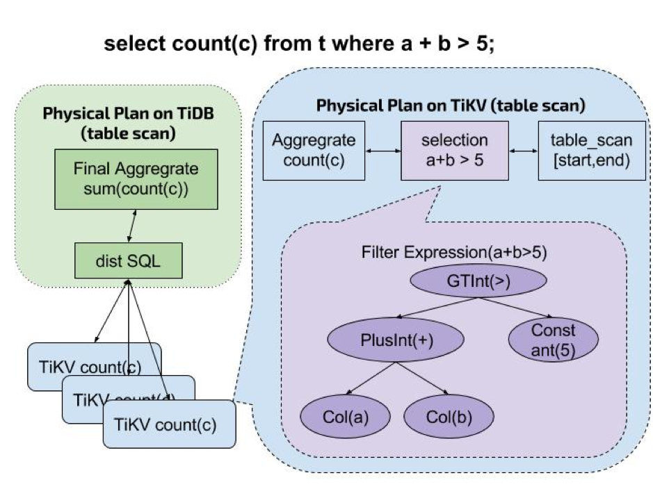
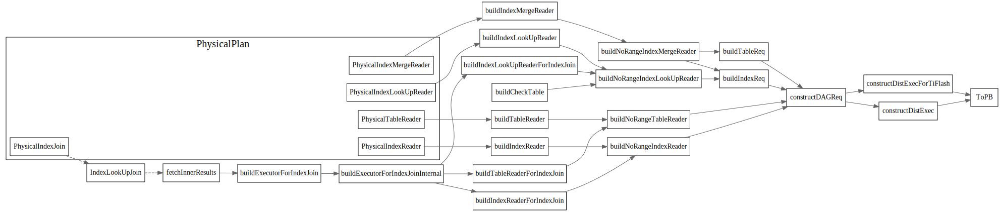

# Coprocessor

[TiKV 源码解析系列文章（十四）Coprocessor 概览](https://pingcap.com/blog-cn/tikv-source-code-reading-14/)
中介绍了TiKV端的Coprocessor, 相关信息摘抄如下：


TiKV Coprocessor 处理的读请求目前主要分类三种：

* DAG：执行物理算子，为 SQL 计算出中间结果，从而减少 TiDB 的计算和网络开销。这个是绝大多数场景下 Coprocessor 执行的任务。
* Analyze：分析表数据，统计、采样表数据信息，持久化后被 TiDB 的优化器采用。
* CheckSum：对表数据进行校验，用于导入数据后一致性校验。




### DAGRequest

以下结构由tipb 中Proto自动生成, 这些Executor将在TiKV端执行。


### PhysicalPlan.ToPB
PhysicalPlan有ToPB方法，用来生成tipb Executor
```go
// PhysicalPlan is a tree of the physical operators.
type PhysicalPlan interface {
	Plan

	// attach2Task makes the current physical plan as the father of task's physicalPlan and updates the cost of
	// current task. If the child's task is cop task, some operator may close this task and return a new rootTask.
	attach2Task(...task) task

	// ToPB converts physical plan to tipb executor.
	ToPB(ctx sessionctx.Context, storeType kv.StoreType) (*tipb.Executor, error)
}
```

调用ToPB流程



physical plan 的toPB方法，可以看到基本TableScan和IndexScan是作为叶子节点的.
其他的比如PhysicalLimit, PhyscialTopN, PhyscialSelection 都用child executor.


# 参考
1. [MPP and SMP in TiDB](https://github.com/pingcap/blog-cn/blob/master/mpp-smp-tidb.md)
2. [TiKV 源码解析系列文章（十四）Coprocessor 概览](https://pingcap.com/blog-cn/tikv-source-code-reading-14/)
