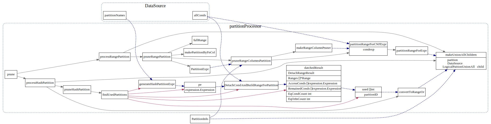

# Logical Optimize

<!-- toc -->

## Logical Plan

DataSource在query plan tree中是叶子节点，表示数据来源，在Logical Plan Optimize中，查询过滤条件
会尽量向叶子节点下推。

下推的过滤条件conds，首先被用于分区剪枝(根据partion expr相关的cond剪枝)，
然后primary key相关的cond会被抽出来，转换成为TiKV层Range。

最后其他无法抽离出来的cond被下推到TiKV层, 由TiKV层coprocessor来处理。

### struct DataSource

`DataSource` 中的`tableInfo`字段包含了table的一些元信息，比如
tableId, indices之类的。

``possibleAccessPaths``表示该DataSource的所有
可能访问路径，比如TableScan 或者扫描某个index等。

``TblColHists`` 用来Estimate符合条件的RowCount,  从而估算对应physical plan的cost.


```go
// DataSource represents a tableScan without condition push down.
type DataSource struct {
	logicalSchemaProducer

	astIndexHints []*ast.IndexHint
	IndexHints    []indexHintInfo
	table         table.Table
	tableInfo     *model.TableInfo
	Columns       []*model.ColumnInfo
	DBName        model.CIStr

	TableAsName *model.CIStr
	// indexMergeHints are the hint for indexmerge.
	indexMergeHints []indexHintInfo
	// pushedDownConds are the conditions that will be pushed down to coprocessor.
	pushedDownConds []expression.Expression
	// allConds contains all the filters on this table. For now it's maintained
	// in predicate push down and used only in partition pruning.
	allConds []expression.Expression

	statisticTable *statistics.Table
	tableStats     *property.StatsInfo

	// possibleAccessPaths stores all the possible access path for physical plan, including table scan.
	possibleAccessPaths []*util.AccessPath

	// The data source may be a partition, rather than a real table.
	isPartition     bool
	physicalTableID int64
	partitionNames  []model.CIStr

	// handleCol represents the handle column for the datasource, either the
	// int primary key column or extra handle column.
	//handleCol *expression.Column
	handleCols HandleCols
	// TblCols contains the original columns of table before being pruned, and it
	// is used for estimating table scan cost.
	TblCols []*expression.Column
	// commonHandleCols and commonHandleLens save the info of primary key which is the clustered index.
	commonHandleCols []*expression.Column
	commonHandleLens []int
	// TblColHists contains the Histogram of all original table columns,
	// it is converted from statisticTable, and used for IO/network cost estimating.
	TblColHists *statistics.HistColl
	// preferStoreType means the DataSource is enforced to which storage.
	preferStoreType int
	// preferPartitions store the map, the key represents store type, the value represents the partition name list.
	preferPartitions map[int][]model.CIStr
}
```
### AccessPath
AccessPath 表示我们访问一个table路径，是基于单索引，还是使用多索引, 或者去扫描整个表，其定义如下,
在逻辑优化阶段的paritionProcessor中会生成DataSource的所有possiableAccessPath

```go
type AccessPath struct {
	Index          *model.IndexInfo
	FullIdxCols    []*expression.Column
	FullIdxColLens []int
	IdxCols        []*expression.Column
	IdxColLens     []int
	Ranges         []*ranger.Range
	// CountAfterAccess is the row count after we apply range seek and before we use other filter to filter data.
	// For index merge path, CountAfterAccess is the row count after partial paths and before we apply table filters.
	CountAfterAccess float64
	// CountAfterIndex is the row count after we apply filters on index and before we apply the table filters.
	CountAfterIndex float64
	AccessConds     []expression.Expression
	EqCondCount     int
	EqOrInCondCount int
	IndexFilters    []expression.Expression
	TableFilters    []expression.Expression
	// PartialIndexPaths store all index access paths.
	// If there are extra filters, store them in TableFilters.
	PartialIndexPaths []*AccessPath

	StoreType kv.StoreType

	IsDNFCond bool

	// IsTiFlashGlobalRead indicates whether this path is a remote read path for tiflash
	IsTiFlashGlobalRead bool

	// IsIntHandlePath indicates whether this path is table path.
	IsIntHandlePath    bool
	IsCommonHandlePath bool
	// Forced means this path is generated by `use/force index()`.
	Forced bool
}
```


## partitionProcessor

逻辑优化partitionProcessor会计算出Datasource的possibleAccessPath
prune时候，会参照datasource 的allconds


```go
var optRuleList = []logicalOptRule{
	&partitionProcessor{},
}
// partitionProcessor rewrites the ast for table partition.
//
// create table t (id int) partition by range (id)
//   (partition p1 values less than (10),
//    partition p2 values less than (20),
//    partition p3 values less than (30))
//
// select * from t is equal to
// select * from (union all
//      select * from p1 where id < 10
//      select * from p2 where id < 20
//      select * from p3 where id < 30)
//
// partitionProcessor is here because it's easier to prune partition after predicate push down.
```

首先处理分区，然后会根据hints: IndexHints, indexMergeHints, preferStoreType 以及
Table自己的Index(在getPossibleAccessPath中会遍历TableInfo.Indices), 组合列举出所有的accessPath.
最后会去掉违反IsolationRead的path.

### 分区剪枝

```go
func (s *partitionProcessor) prune(ds *DataSource) (LogicalPlan, error) {
	pi := ds.tableInfo.GetPartitionInfo()
	if pi == nil {
		return ds, nil
	}
	// Try to locate partition directly for hash partition.
	if pi.Type == model.PartitionTypeHash {
		return s.processHashPartition(ds, pi)
	}
	if pi.Type == model.PartitionTypeRange {
		return s.processRangePartition(ds, pi)
	}

	// We haven't implement partition by list and so on.
	return s.makeUnionAllChildren(ds, pi, fullRange(len(pi.Definitions)))
}
```
TiDB中分区主要有Range和Hash两种,一下文字摘自[book.tidb.io](https://book.tidb.io/session4/chapter6/partition-table-info.html)

#### Range分区

>Range 分区是指将数据行按分区表达式计算的值都落在给定的范围内。
>在 Range 分区中，你必须为每个分区指定值的范围，并且不能有重叠，
>通过使用 VALUES LESS THAN 操作进行定义。目前只支持单列的 Range 分区表。


#### Hash分区

>Hash 分区主要用于保证数据均匀地分散到一定数量的分区里面。
>在 Hash 分区中，你只需要指定分区的数量。
>使用 Hash 分区时，需要在 CREATE TABLE 后面添加 
>PARTITION BY HASH (expr) PARTITIONS num ，
>其中：expr 是一个返回整数的表达式，它可以是一个列名，
>但这一列的类型必须整数类型；num 是一个正整数，表示将表划分为多少个分区。

prune parition 调用图

每个partition 会生成一个新的DataSource,
然后用LogicalPartitionUnionAll最为父节点，把这些Datasource Union起来。 




### 生成所有可能的AccessPath

对于每个Partition对应的Datasource


## PredicatePushDown

谓词下推优化，最终会生成datasource的pushDownCondition 字段

```go
func (ds *DataSource) PredicatePushDown(predicates []expression.Expression) ([]expression.Expression, LogicalPlan) {
	ds.allConds = predicates
	ds.pushedDownConds, predicates = expression.PushDownExprs(ds.ctx.GetSessionVars().StmtCtx, predicates, ds.ctx.GetClient(), kv.UnSpecified)
	return predicates, ds
}
```
### AccessConds: KvRange

pushedDownConds 中的primary key column 相关的过滤条件会被分离出来 
作为AccessConds, 其他Column的cond留作TableFilter.

```go
// deriveTablePathStats will fulfill the information that the AccessPath need.
// And it will check whether the primary key is covered only by point query.
// isIm indicates whether this function is called to generate the partial path for IndexMerge.
func (ds *DataSource) deriveTablePathStats(path *util.AccessPath, conds []expression.Expression, isIm bool) (bool, error) {

  //...
  //pkcol为primary key的column
	path.AccessConds, path.TableFilters = ranger.DetachCondsForColumn(ds.ctx, conds, pkCol)

  //...
	path.Ranges, err = ranger.BuildTableRange(path.AccessConds, sc, pkCol.RetType)
}
```

AccessConds会被转换为Ranges，然后在`PhysicalTableScan.ToPB`转为KvRange

```go
// ToPB implements PhysicalPlan ToPB interface.
func (p *PhysicalTableScan) ToPB(ctx sessionctx.Context, storeType kv.StoreType) (*tipb.Executor, error) {
    //...
		ranges := distsql.TableRangesToKVRanges(tsExec.TableId, p.Ranges, nil)
		for _, keyRange := range ranges {
      //...
			tsExec.Ranges = append(tsExec.Ranges, tipb.KeyRange{Low: keyRange.StartKey, High: keyRange.EndKey})
		}
}
```

TableRange转为KVRange主要是把tableId encode进去.
```go
func TablesRangesToKVRanges(tids []int64, ranges []*ranger.Range, fb *statistics.QueryFeedback) []kv.KeyRange {
//...
		for _, tid := range tids {
			startKey := tablecodec.EncodeRowKey(tid, low)
			endKey := tablecodec.EncodeRowKey(tid, high)
			krs = append(krs, kv.KeyRange{StartKey: startKey, EndKey: endKey})
//..
}
```
### TableFilters: PhysicalSelection

TableFilters 则会被转成PhysicalSelection，并且在ToPB调用时候，被下推到TiKV层。
下图中的tipb则为发送到TiKV的GRPC请求.


