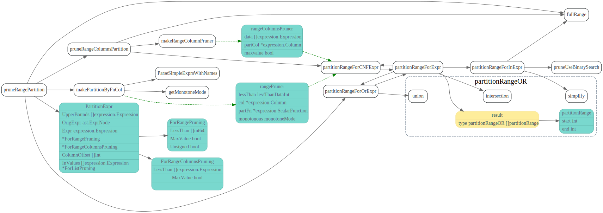

# partitionProcessor

<!-- toc -->


## partitionProcessor


逻辑优化partitionProcessor会计算出Datasource的possibleAccessPath
prune时候，会参照datasource 的allconds


```go
var optRuleList = []logicalOptRule{
	&partitionProcessor{},
}
// partitionProcessor rewrites the ast for table partition.
//
// create table t (id int) partition by range (id)
//   (partition p1 values less than (10),
//    partition p2 values less than (20),
//    partition p3 values less than (30))
//
// select * from t is equal to
// select * from (union all
//      select * from p1 where id < 10
//      select * from p2 where id < 20
//      select * from p3 where id < 30)
//
// partitionProcessor is here because it's easier to prune partition after predicate push down.
```

首先处理分区，然后会根据hints: IndexHints, indexMergeHints, preferStoreType 以及
Table自己的Index(在getPossibleAccessPath中会遍历TableInfo.Indices), 组合列举出所有的accessPath.
最后会去掉违反IsolationRead的path.

### pruneRangePartition

```sql
REATE TABLE employees (
    id INT NOT NULL,
    fname VARCHAR(30),
    lname VARCHAR(30),
    hired DATE NOT NULL DEFAULT '1970-01-01',
    separated DATE NOT NULL DEFAULT '9999-12-31',
    job_code INT NOT NULL,
    store_id INT NOT NULL
)

PARTITION BY RANGE (store_id) (
    PARTITION p0 VALUES LESS THAN (6),
    PARTITION p1 VALUES LESS THAN (11),
    PARTITION p2 VALUES LESS THAN (16),
    PARTITION p3 VALUES LESS THAN (21)
);
```

> The optimizer can prune partitions through WHERE conditions in the following two scenarios:
> 
> partition_column = constant
> partition_column IN (constant1, constant2, ..., constantN)




### pruneHashPartition

```sql
CREATE TABLE employees (
    id INT NOT NULL,
    fname VARCHAR(30),
    lname VARCHAR(30),
    hired DATE NOT NULL DEFAULT '1970-01-01',
    separated DATE NOT NULL DEFAULT '9999-12-31',
    job_code INT,
    store_id INT
)

PARTITION BY HASH(store_id)
PARTITIONS 4;
```


### pruneListPartition

```sql
CREATE TABLE employees (
    id INT NOT NULL,
    fname VARCHAR(30),
    lname VARCHAR(30),
    hired DATE NOT NULL DEFAULT '1970-01-01',
    separated DATE NOT NULL DEFAULT '9999-12-31',
    job_code INT,
    store_id INT
)
PARTITION BY LIST(store_id) (
    PARTITION pNorth VALUES IN (3,5,6,9,17),
    PARTITION pEast VALUES IN (1,2,10,11,19,20),
    PARTITION pWest VALUES IN (4,12,13,14,18),
    PARTITION pCentral VALUES IN (7,8,15,16)
);
```


### makeUnionAllChildren

对于每个Partition对应的Datasource, 生成所有可能的AccessPath


## 参考

1. [揭秘 TiDB 新优化器：Cascades Planner 原理解析](https://pingcap.com/blog-cn/tidb-cascades-planner/)

# Trash

## 分区剪枝

```go
func (s *partitionProcessor) prune(ds *DataSource) (LogicalPlan, error) {
	pi := ds.tableInfo.GetPartitionInfo()
	if pi == nil {
		return ds, nil
	}
	// Try to locate partition directly for hash partition.
	if pi.Type == model.PartitionTypeHash {
		return s.processHashPartition(ds, pi)
	}
	if pi.Type == model.PartitionTypeRange {
		return s.processRangePartition(ds, pi)
	}

	// We haven't implement partition by list and so on.
	return s.makeUnionAllChildren(ds, pi, fullRange(len(pi.Definitions)))
}
```
TiDB中分区主要有Range和Hash两种,一下文字摘自[book.tidb.io](https://book.tidb.io/session4/chapter6/partition-table-info.html)

### Range分区

>Range 分区是指将数据行按分区表达式计算的值都落在给定的范围内。
>在 Range 分区中，你必须为每个分区指定值的范围，并且不能有重叠，
>通过使用 VALUES LESS THAN 操作进行定义。目前只支持单列的 Range 分区表。


### Hash分区

>Hash 分区主要用于保证数据均匀地分散到一定数量的分区里面。
>在 Hash 分区中，你只需要指定分区的数量。
>使用 Hash 分区时，需要在 CREATE TABLE 后面添加 
>PARTITION BY HASH (expr) PARTITIONS num ，
>其中：expr 是一个返回整数的表达式，它可以是一个列名，
>但这一列的类型必须整数类型；num 是一个正整数，表示将表划分为多少个分区。

prune parition 调用图

每个partition 会生成一个新的DataSource,
然后用LogicalPartitionUnionAll最为父节点，把这些Datasource Union起来。 


