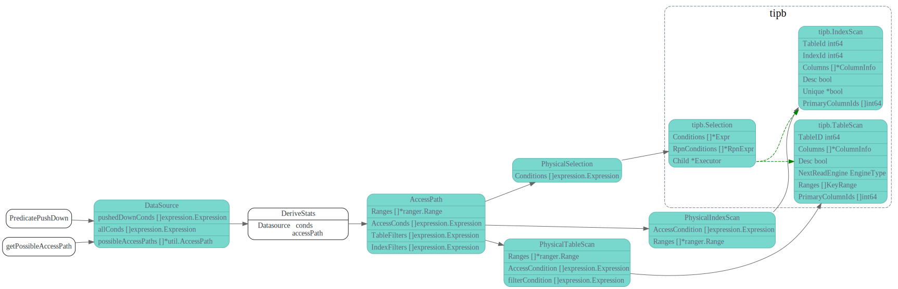
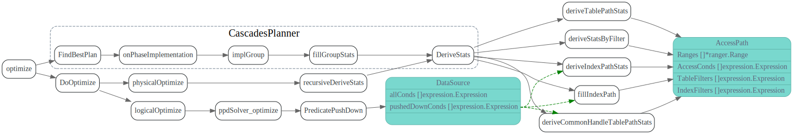
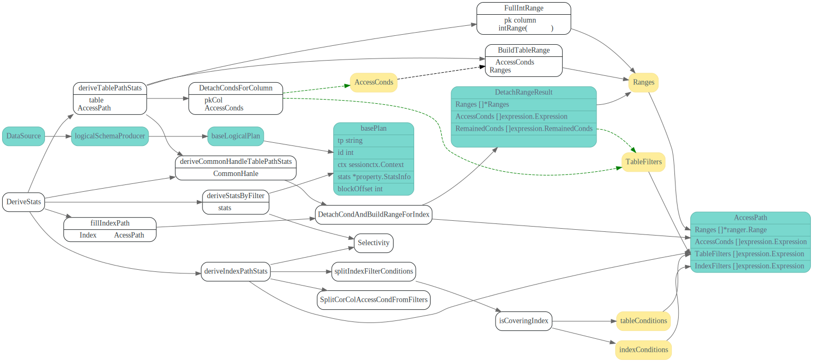

# PredicatePushDown
<!-- toc -->

PredicatePushDown 整个数据流程如下：



## PredicatePushDown
```go
func (ds *DataSource) PredicatePushDown(predicates []expression.Expression) ([]expression.Expression, LogicalPlan) {
	ds.allConds = predicates
	ds.pushedDownConds, predicates = expression.PushDownExprs(ds.ctx.GetSessionVars().StmtCtx, predicates, ds.ctx.GetClient(), kv.UnSpecified)
	return predicates, ds
}
```



## DeriveStats

在`DeriveStats`中把pushedDownConds derive到每个AccessPath上
```go
func (ds *DataSource) DeriveStats(childStats []*property.StatsInfo, selfSchema *expression.Schema, childSchema []*expression.Schema, colGroups [][]*expression.Column) (*property.StatsInfo, error) {
//...
	for _, path := range ds.possibleAccessPaths {
		if path.IsTablePath() {
			continue
		}
		err := ds.fillIndexPath(path, ds.pushedDownConds)
    //...
	}
	ds.stats = ds.deriveStatsByFilter(ds.pushedDownConds, ds.possibleAccessPaths)
	for _, path := range ds.possibleAccessPaths {
		if path.IsTablePath() {
			noIntervalRanges, err := ds.deriveTablePathStats(path, ds.pushedDownConds, false)
      //...
    }
    //...
		noIntervalRanges := ds.deriveIndexPathStats(path, ds.pushedDownConds, false)
    // ...
}
```




### deriveTablePathStats

pushedDownConds 中的primary key column 相关的过滤条件会被分离出来 
作为AccessConds, 其他Column的cond留作TableFilter.

```go
// deriveTablePathStats will fulfill the information that the AccessPath need.
// And it will check whether the primary key is covered only by point query.
// isIm indicates whether this function is called to generate the partial path for IndexMerge.
func (ds *DataSource) deriveTablePathStats(path *util.AccessPath, conds []expression.Expression, isIm bool) (bool, error) {

  //...
  //pkcol为primary key的column
	path.AccessConds, path.TableFilters = ranger.DetachCondsForColumn(ds.ctx, conds, pkCol)

  //...
	path.Ranges, err = ranger.BuildTableRange(path.AccessConds, sc, pkCol.RetType)
}
```
## AccessPath 后续处理
上面得到的AccessPath的Ranges 最终会被转换为KVRanges，用来表示去TiKV层去扫哪些数据，
TableFilters/IndexFilters 将会最终下推到TiKV层, 作为TiPB.Selection 在TiKV层提提前过滤

### TableRangesToKVRanges

在`PhysicalTableScan.ToPB`转为KvRange

```go
// ToPB implements PhysicalPlan ToPB interface.
func (p *PhysicalTableScan) ToPB(ctx sessionctx.Context, storeType kv.StoreType) (*tipb.Executor, error) {
    //...
		ranges := distsql.TableRangesToKVRanges(tsExec.TableId, p.Ranges, nil)
		for _, keyRange := range ranges {
      //...
			tsExec.Ranges = append(tsExec.Ranges, tipb.KeyRange{Low: keyRange.StartKey, High: keyRange.EndKey})
		}
}
```

TableRange转为KVRange主要是把tableId encode进去.
```go
func TableRangesToKVRanges(tids []int64, ranges []*ranger.Range, fb *statistics.QueryFeedback) []kv.KeyRange {
//...
		for _, tid := range tids {
			startKey := tablecodec.EncodeRowKey(tid, low)
			endKey := tablecodec.EncodeRowKey(tid, high)
			krs = append(krs, kv.KeyRange{StartKey: startKey, EndKey: endKey})
//..
}
```
### TableFilters转换为Tipb.Selection

TableFilters 则会被转成PhysicalSelection，并且在ToPB调用时候，被下推到TiKV层。
下图中的tipb则为发送到TiKV的GRPC请求.


