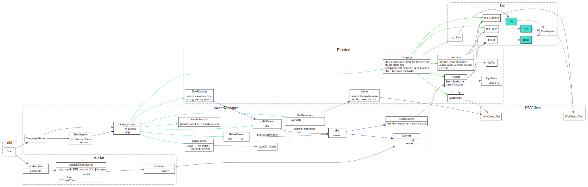

# Schema Modification

<!-- toc -->

## DDL 处理流程

TiDB ddl 请求处理请求流程如下图所示(摘自[TiDB 源码阅读系列文章（十七）DDL 源码解析](https://pingcap.com/blog-cn/tidb-source-code-reading-17/))

每个tidb server都会起一个ddl worker，但只有一个节点的
ddl worker会被选为owner。

## Owner 选举

TiDB 在同一时刻，只允许一个节点执行 DDL 操作。用户可以把多个 DDL 请求发给任何 TiDB 节点，但是所有的 DDL 请求在 TiDB 内部是由 owner 节点的 worker 串行执行的。
* worker：每个节点都有一个 worker 用来处理 DDL 操作。
* owner：整个集群中只有一个节点能当选 owner，每个节点都可能当选这个角色。当选 owner 后的节点 worker 才有处理 DDL 操作的权利。owner 节点的产生是用 Etcd 的选举功能从多个 TiDB 节点选举出 owner 节点。owner 是有任期的，owner 会主动维护自己的任期，即续约。当 owner 节点宕机后，其他节点可以通过 Etcd 感知到并且选举出新的 owner。

## handleDDLJobQueue

owner节点的ddl worker 从ddl job queue 中取job
执行job, 调用`Meta.go` 中定义的`CreateDatabase`等接口
修改存储在TiKV中的schema。

其他TiDB server收到ddl 请求，只用把这个请求转ddl job 放入ddl job queue中
即可。

owner 节点的ddl worker handleDDLJobQueue 主要调用关系如下图所示：

1. [TiDB 源码阅读系列文章（十七）DDL 源码解析](https://pingcap.com/blog-cn/tidb-source-code-reading-17/)
2. [TiDB 的异步 schema 变更实现](https://github.com/ngaut/builddatabase/blob/master/f1/schema-change-implement.md)
3. [TiDB 异步Schema 变更优化](http://zimulala.github.io/2017/12/24/optimize/)
