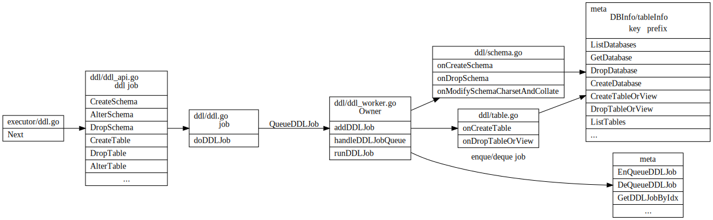
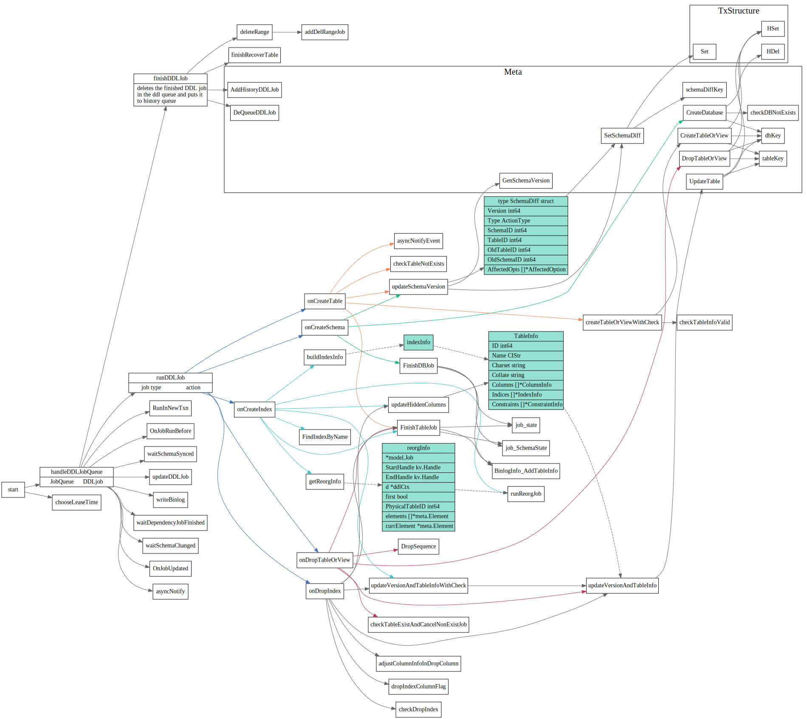

# DDL

本文主要描述TiDB在分布式场景下支持无锁schema变更。

Schema 信息会存储在TiKV中，每个TiDB server内存中也会有个Schema信息。

<!-- toc -->

## Schema

### Schema in TiKV

Schema在kv中的存储形式如下
```go
//meta/meta.go // Meta structure:
//	NextGlobalID -> int64
//	SchemaVersion -> int64
//	DBs -> {
//		DB:1 -> db meta data []byte
//		DB:2 -> db meta data []byte
//	}
//	DB:1 -> {
//		Table:1 -> table meta data []byte
//		Table:2 -> table meta data []byte
//		TID:1 -> int64
//		TID:2 -> int64
//	}
//
```

TiDB `meta/meta.go`模块封装了对存储在TiKV中schema进行的操作，在ddl owner节点在
`runDDLJobs`时候，会调用meta的方法, 来修改schema。
TiDB `loadSchemaInLoop` 中也会用到meta方法来加载schema.

模块层次之间调用如下图所示:


```go
// Meta is for handling meta information in a transaction.
type Meta struct {
	txn        *structure.TxStructure
	StartTS    uint64 // StartTS is the txn's start TS.
	jobListKey JobListKeyType
}

// TxStructure supports some simple data structures like string, hash, list, etc... and
// you can use these in a transaction.
type TxStructure struct {
	reader     kv.Retriever
	readWriter kv.RetrieverMutator
	prefix     []byte
}

// RetrieverMutator is the interface that groups Retriever and Mutator interfaces.
type RetrieverMutator interface {
	Retriever
	Mutator
}

// Getter is the interface for the Get method.
type Getter interface {
	// Get gets the value for key k from kv store.
	// If corresponding kv pair does not exist, it returns nil and ErrNotExist.
	Get(ctx context.Context, k Key) ([]byte, error)
}
// Retriever is the interface wraps the basic Get and Seek methods.
type Retriever interface {
	Getter
	// Iter creates an Iterator positioned on the first entry that k <= entry's key.
	// If such entry is not found, it returns an invalid Iterator with no error.
	// It yields only keys that < upperBound. If upperBound is nil, it means the upperBound is unbounded.
	// The Iterator must be Closed after use.
	Iter(k Key, upperBound Key) (Iterator, error)

	// IterReverse creates a reversed Iterator positioned on the first entry which key is less than k.
	// The returned iterator will iterate from greater key to smaller key.
	// If k is nil, the returned iterator will be positioned at the last key.
	// TODO: Add lower bound limit
	IterReverse(k Key) (Iterator, error)
}

// Mutator is the interface wraps the basic Set and Delete methods.
type Mutator interface {
	// Set sets the value for key k as v into kv store.
	// v must NOT be nil or empty, otherwise it returns ErrCannotSetNilValue.
	Set(k Key, v []byte) error
	// Delete removes the entry for key k from kv store.
	Delete(k Key) error
}
```

### Schema in TiDB

TiDB 使用Schema来将关系数据库中的table/index等映射到TiKV的kv存储中。
Schema本身也是以kv的形式保存在TiKV中的。 TiDB是无状态的，而且在TiDB内存 
中也加载这一份Schema, 在TiDB server中infoSchema在内存中结构如下


### Schema Modification

TiDB ddl 请求处理请求流程如下图所示(摘自[TiDB 源码阅读系列文章（十七）DDL 源码解析](https://pingcap.com/blog-cn/tidb-source-code-reading-17/))


每个tidb server都会起一个ddl worker，但只有一个节点的
ddl worker会被选为owner。

owner节点的ddl worker 从ddl job queue 中取job
执行job, 调用`Meta.go` 中定义的`CreateDatabase`等接口
修改存储在TiKV中的schema。

其他TiDB server收到ddl 请求，只用把这个请求转ddl job 放入ddl job queue中
即可。




问题：每个tidb server是怎么更新自己内存中的schema 信息的？
怎么知道内存中的schema已经过期了的？

owner 节点的ddl worker handleDDLJobQueue 主要调用关系如下图所示：




### TiDB load schema

TiDB每隔lease/2 就会去Tikv中去reload schema, 首先会检查版本号，如果tikv中版本号和TiDB
中版本一致的话，就不用继续加载了。否则，`tryLoadSchemaDiffs`先尝试加载schemaDiff, 如果不行的话，
调用`fetchAllSchemasWithTables`会加载所有的schema


## Online Schema Change

### Schema state


### DDL Job

TiDB 在同一时刻，只允许一个节点执行 DDL 操作。用户可以把多个 DDL 请求发给任何 TiDB 节点，但是所有的 DDL 请求在 TiDB 内部是由 owner 节点的 worker 串行执行的。
* worker：每个节点都有一个 worker 用来处理 DDL 操作。
* owner：整个集群中只有一个节点能当选 owner，每个节点都可能当选这个角色。当选 owner 后的节点 worker 才有处理 DDL 操作的权利。owner 节点的产生是用 Etcd 的选举功能从多个 TiDB 节点选举出 owner 节点。owner 是有任期的，owner 会主动维护自己的任期，即续约。当 owner 节点宕机后，其他节点可以通过 Etcd 感知到并且选举出新的 owner。

以上内容摘自[4](https://pingcap.com/blog-cn/tidb-source-code-reading-17/)


1. [TiDB 源码阅读系列文章（十七）DDL 源码解析](https://pingcap.com/blog-cn/tidb-source-code-reading-17/)
2. [TiDB 的异步 schema 变更实现](https://github.com/ngaut/builddatabase/blob/master/f1/schema-change-implement.md)
3. [异步 schema 变更](https://github.com/ngaut/builddatabase/blob/master/f1/schema-change.md)
