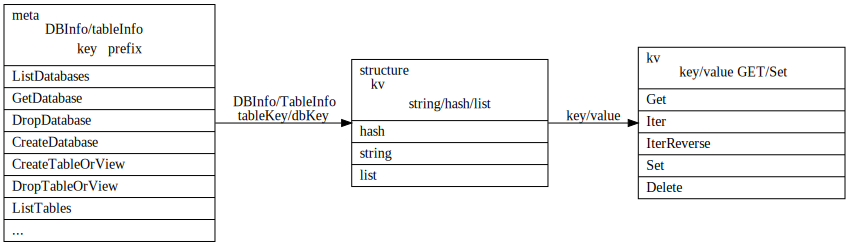
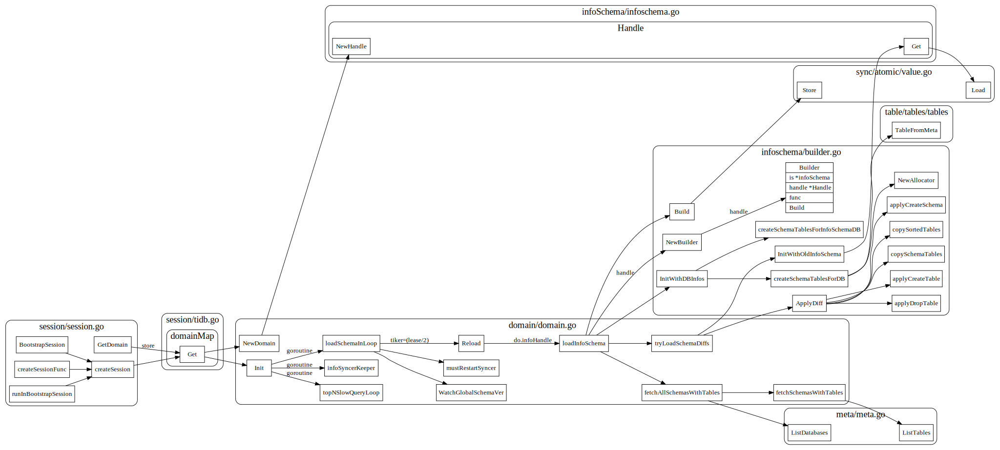

# TiDB Schema

## schema 作用


### TiDB中的映射
```sql
CREATE TABLE User {
	ID int,
	Name varchar(20),
	Role varchar(20),
	Age int,
	PRIMARY KEY (ID),
	Key idxAge (age)
};
```
映射为如下的kv

```
Key: tablePrefix{tableID}_recordPrefixSep{rowID}
Value: [col1, col2, col3, col4]
```

对于index数据映射如下:
```
Key: tablePrefix{tableID}_indexPrefixSep{indexID}_indexedColumnsValue
Value: rowID
```

unique index 数据映射如下:

```
Key: tablePrefix{tableID}_indexPrefixSep{indexID}_indexedColumnsValue_rowID
Value: null
```

涉及模块说明[tidb源码概览](https://pingcap.com/blog-cn/tidb-source-code-reading-2/)

1. infoschema:  SQL 元信息管理模块，另外对于 Information Schema 的操作，都会访问这里
2. meta:  利用 structure 包提供的功能，管理存储引擎中存储的 SQL 元信息，infoschema/DDL 利用这个模块访问或者修改 SQL 元信息
3. model: SQL 元信息数据结构，包括 DBInfo / TableInfo / ColumnInfo / IndexInfo 等
4. structure: 在 Transactional KV API 上定义的一层结构化 API，提供 List/Queue/HashMap 等结构

### Shema 数据结构

TiDB 使用Schema来将关系数据库中的table/index等映射到TiKV的kv存储中。 Schema本身也是以kv的形式保存在TiKV中的。
TiDB是无状态的，而且在TiDB内存中也加载这一份Schema。所以存在schema异步更新的问题。


## Schema 存储/加载/修改

Schema在kv中的存储形式如下
```go
// Meta structure:
//	NextGlobalID -> int64
//	SchemaVersion -> int64
//	DBs -> {
//		DB:1 -> db meta data []byte
//		DB:2 -> db meta data []byte
//	}
//	DB:1 -> {
//		Table:1 -> table meta data []byte
//		Table:2 -> table meta data []byte
//		TID:1 -> int64
//		TID:2 -> int64
//	}
//
```




### schema 加载





## schema 修改

DDL（Data Definition Language): statements are used to define the database structure or schema.
DDL statements create, modify, and remove database objects such as tables, indexes, and users. 

创建/修改/删除 schema逻辑如下:


### Schema state

online schema change

### DDL Job

TiDB 在同一时刻，只允许一个节点执行 DDL 操作。用户可以把多个 DDL 请求发给任何 TiDB 节点，但是所有的 DDL 请求在 TiDB 内部是由 owner 节点的 worker 串行执行的。
* worker：每个节点都有一个 worker 用来处理 DDL 操作。
* owner：整个集群中只有一个节点能当选 owner，每个节点都可能当选这个角色。当选 owner 后的节点 worker 才有处理 DDL 操作的权利。owner 节点的产生是用 Etcd 的选举功能从多个 TiDB 节点选举出 owner 节点。owner 是有任期的，owner 会主动维护自己的任期，即续约。当 owner 节点宕机后，其他节点可以通过 Etcd 感知到并且选举出新的 owner。

以上内容摘自[4](https://pingcap.com/blog-cn/tidb-source-code-reading-17/)

#### JobQueue

#### Owner election


1. [TiDB 源码阅读系列文章（十七）DDL 源码解析](https://pingcap.com/blog-cn/tidb-source-code-reading-17/)
2. [TiDB 的异步 schema 变更实现](https://github.com/ngaut/builddatabase/blob/master/f1/schema-change-implement.md)
3. [异步 schema 变更](https://github.com/ngaut/builddatabase/blob/master/f1/schema-change.md)
4. [TiDB 源码阅读系列文章（十七）DDL 源码解析](https://pingcap.com/blog-cn/tidb-source-code-reading-17/)
