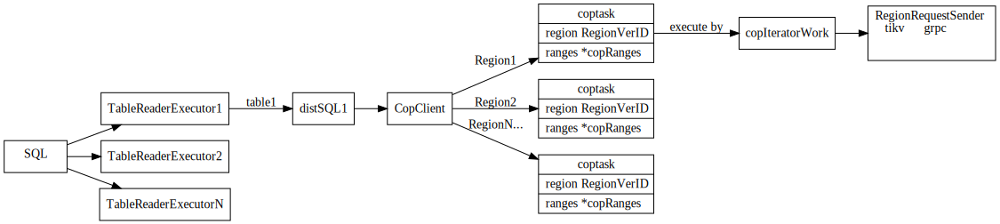
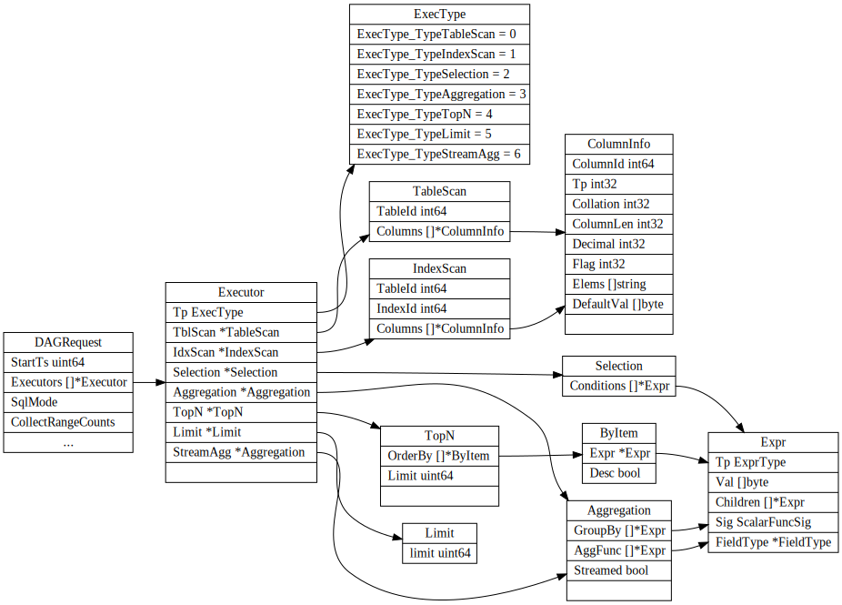
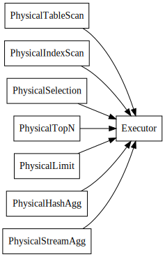

# distSql
最上层的 SQL 语句可能会包含 JOIN，SUBQUERY 等复杂算子，涉及很多的表，而 distsql 只涉及到单个表的数据。一个 distsql 请求会涉及到多个 region，我们要对涉及到的每一个 region 执行一次 coprocessor 请求。
所以它们的关系是这样的，一个 SQL 语句包含多个 distsql 请求，一个 distsql 请求包含多个 coprocessor 请求。 [1](https://pingcap.com/blog-cn/tidb-source-code-reading-19/)

## TableReaderExecutor

TableReaderExecutor sends DAG request and reads table data from kv layer.

## CopClient

## SelectDAG

PhysicalPlan toPB

# ref
[MPP and SMP in TiDB](https://github.com/pingcap/blog-cn/blob/master/mpp-smp-tidb.md)
[TiKV 源码解析系列文章（十四）Coprocessor 概览](https://pingcap.com/blog-cn/tikv-source-code-reading-14/)
