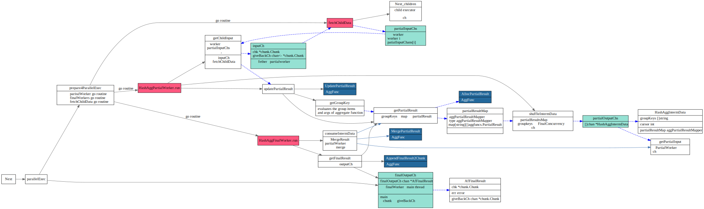
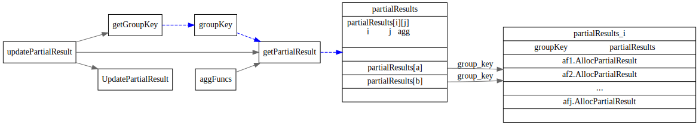
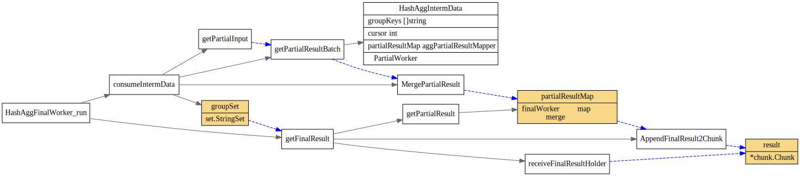

# HashAgg

<!-- toc -->

## buildHashAgg

## HashAggExec

HashAggExec 主要有如下几种gorotine, 他们之间通过ch来协作，每个go routine 主要功能如下

* `fetchChildData` 负责从child Exec中读取chunk数据
* `HashAggPartialWorker` 处理`fetchChildData`的输出数据，调用AggFunc的`UpdatePartialResult`, 做一个预处理.
* `HashAggFinalWorker` 处理`HashAggPartialWorker`的输出数据，调用AggFunc的`MergePartialResult`
和`AppendFinalResult2Chunk`, 输出最终结果到finalOutputCh中
* `HashAggExec.Next` 从finalOutputCh中获取最后结果，输出给上层调用者。

### getGroupKey

### updatePartialResult

### consumeIntermData

