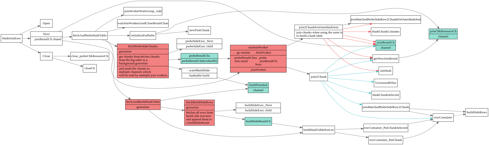

# Hash Join

<!-- toc -->

## HashJoinExec struct 

[TiDB 源码阅读系列文章（九）Hash Join](https://pingcap.com/blog-cn/tidb-source-code-reading-9/)

HashJoin整体流程如下，主要有三个4个goroutine, 几个goroutine之间通过channel 来协作.

* `fetchBuildSideRows`读取buildSides表中数据, 放入`buildSideResultCh`中
* `fetchAndBuildHashTable` 根据buildSide表中数据, 创建hashRowContainer
* `fetchProbeSideChunks`: 读取probeSide表数据, 放入`probeResultChs`中
* `runJoinWorker` 多个joinWorker并发执行，从`probeResultChs`读取probe数据，然后和rowContainer做匹配, 并将结果放入joinResultCh中

 

## fetchAndBuildHashTable

读取buildSideExec中所有数据，然后写入hasRowContainer中
如果内存不够，会写到磁盘上

## fetchProbeSideChunks

fetchProbeSideChunks get chunks from fetches chunks from the big table in a background goroutine
 and sends the chunks to multiple channels which will be read by multiple join workers.

## runJoinWorker

`HashJoinExec.Next`会启动多个runJoinWorker来做hashJoin,

每个runJoinWorker会从`probeResultChs` chan中去取要Probe的数据
然后做Join,最后写到joinResultCh中，由`HashJoinExec.Next`接受，
返回给上层调用者。

## join2Chunk

join2Chunk负责将probeResult和inner table做Join

