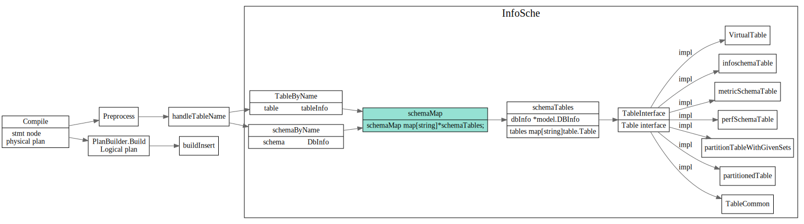
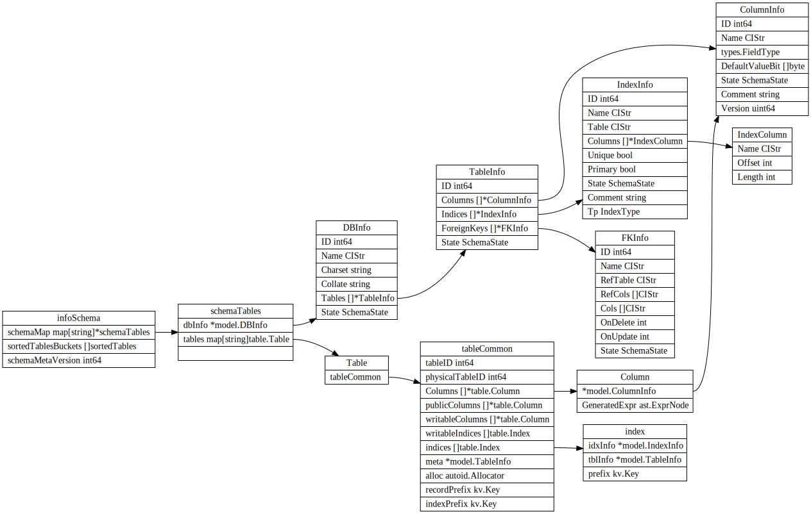
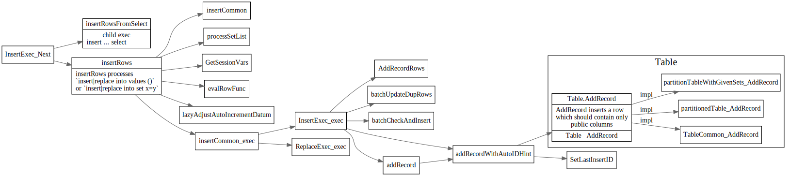

# Insert 语句

<!-- toc -->
## InsertStmt

### Parse
parser.y 将insert语句解析为InsertStmt

```yacc
TableName:
	Identifier
	{
		$$ = &ast.TableName{Name: model.NewCIStr($1)}
	}
|	Identifier '.' Identifier
	{
		$$ = &ast.TableName{Schema: model.NewCIStr($1), Name: model.NewCIStr($3)}
	}

InsertIntoStmt:
	"INSERT" TableOptimizerHints PriorityOpt IgnoreOptional IntoOpt TableName PartitionNameListOpt InsertValues OnDuplicateKeyUpdate
	{
		x := $8.(*ast.InsertStmt)
		x.Priority = $3.(mysql.PriorityEnum)
		x.IgnoreErr = $4.(bool)
		// Wraps many layers here so that it can be processed the same way as select statement.
		ts := &ast.TableSource{Source: $6.(*ast.TableName)}
		x.Table = &ast.TableRefsClause{TableRefs: &ast.Join{Left: ts}}
		if $9 != nil {
			x.OnDuplicate = $9.([]*ast.Assignment)
		}
		if $2 != nil {
			x.TableHints = $2.([]*ast.TableOptimizerHint)
		}
		x.PartitionNames = $7.([]model.CIStr)
		$$ = x
	}
```
解析后的InsertStmt结构如下
```go
// InsertStmt is a statement to insert new rows into an existing table.
// See https://dev.mysql.com/doc/refman/5.7/en/insert.html
type InsertStmt struct {
	dmlNode

	IsReplace   bool
	IgnoreErr   bool
	Table       *TableRefsClause
	Columns     []*ColumnName
	Lists       [][]ExprNode
	Setlist     []*Assignment
	Priority    mysql.PriorityEnum
	OnDuplicate []*Assignment
	Select      ResultSetNode
	// TableHints represents the table level Optimizer Hint for join type.
	TableHints     []*TableOptimizerHint
	PartitionNames []model.CIStr
}
```
### Preprocess

使用preprocess函数补全table的info信息, 找到要插入table.




schema 在tidb server内存中信息如下：




### PlanBuilder.buildInsert


## InsertExec

数据结构定义如下


```go
// InsertExec represents an insert executor.
type InsertExec struct {
	*InsertValues
	OnDuplicate    []*expression.Assignment
	evalBuffer4Dup chunk.MutRow
	curInsertVals  chunk.MutRow
	row4Update     []types.Datum

	Priority mysql.PriorityEnum
}

// InsertValues is the data to insert.
type InsertValues struct {
	baseExecutor

	rowCount       uint64
	curBatchCnt    uint64
	maxRowsInBatch uint64
	lastInsertID   uint64

	SelectExec Executor

	Table   table.Table
	Columns []*ast.ColumnName
	Lists   [][]expression.Expression
	SetList []*expression.Assignment

	GenExprs []expression.Expression

	insertColumns []*table.Column

	// colDefaultVals is used to store casted default value.
	// Because not every insert statement needs colDefaultVals, so we will init the buffer lazily.
	colDefaultVals  []defaultVal
	evalBuffer      chunk.MutRow
	evalBufferTypes []*types.FieldType

	allAssignmentsAreConstant bool

	hasRefCols     bool
	hasExtraHandle bool

	// Fill the autoID lazily to datum. This is used for being compatible with JDBC using getGeneratedKeys().
	// `insert|replace values` can guarantee consecutive autoID in a batch.
	// Other statements like `insert select from` don't guarantee consecutive autoID.
	// https://dev.mysql.com/doc/refman/8.0/en/innodb-auto-increment-handling.html
	lazyFillAutoID bool
	memTracker     *memory.Tracker

	stats *InsertRuntimeStat
}

type baseExecutor struct {
	ctx           sessionctx.Context
	id            int
	schema        *expression.Schema // output schema
	initCap       int
	maxChunkSize  int
	children      []Executor
	retFieldTypes []*types.FieldType
	runtimeStats  *execdetails.BasicRuntimeStats
}
```

### Next

最终会调用Table.AddRecord 接口向表中插入记录



## Table AddRecord

### allocHandleIDs

### encode key/value

pingcap的博客[三篇文章了解 TiDB 技术内幕 - 说计算](https://pingcap.com/blog-cn/tidb-internal-2/),
中介绍了row/index的key value编码方式：


TiDB 对每个表分配一个 TableID，每一个索引都会分配一个 IndexID，每一行分配一个 RowID（如果表有整数型的 Primary Key，那么会用 Primary Key 的值当做 RowID），其中 TableID 在整个集群内唯一，IndexID/RowID 在表内唯一，这些 ID 都是 int64 类型。

row key/value 编码如下:
```
Key: tablePrefix{tableID}_recordPrefixSep{rowID}
Value: [col1, col2, col3, col4]
```

index的key编码如下:
```
Key: tablePrefix{tableID}_indexPrefixSep{indexID}_indexedColumnsValue
Value: rowID
```


## KV

### Transaction
最终commit时候，首先将MemBuffer转为mutation,
最后提交到tikv。


commit 的被调用流程如下，

