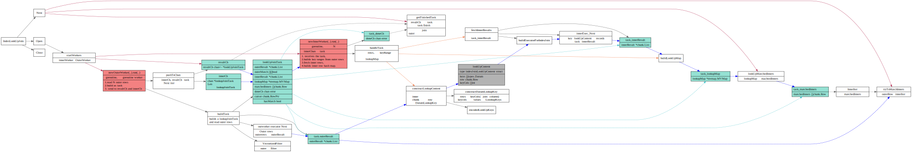
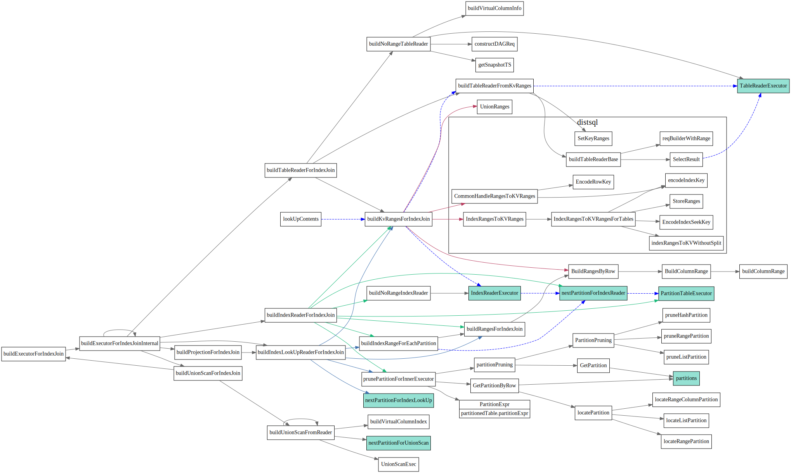

# Join

<!-- toc -->

## Join算法

### nest loop join
`nest loop join`, 遍历取外表R中一条记录r, 然后遍历inner表S每条记录和r做join。
对于外表中的每一条记录，都需要对Inner表做一次全表扫描。复杂度为O`(M * N)`

```
algorithm nested_loop_join is
    for each tuple r in R do
        for each tuple s in S do
            if r and s satisfy the join condition then
                yield tuple <r,s>
```
### Block nest loop join
### index join

`index join` inner表中对于要join的attribute由了索引, 可以使用索引
来避免对inner表的全表扫描, 复杂度为`O(M * log N)`

```
algorithm index_join is
    for each tuple r in R do
        for each tuple s in S in the index lookup do
            yield tuple <r,s>
```

### sort merge join
### Hash join

## Logical Optimize

### join reorder

## Physical Optimize


* PhysicalIndexHashJoin
* PhysicalIndexJoin
* PhysicalMergeJoin
* PhysicalBroadCastJoin

### cost

## Executors

### MergeJoinExec

参考资料
1. [TiDB 源码阅读系列文章（十五）Sort Merge Join](https://pingcap.com/blog-cn/tidb-source-code-reading-15/)

> Sort Merge Join (SMJ)，定义可以看 wikipedia。简单说来就是将 Join 的两个表，首先根据连接属性进行排序，然后进行一次扫描归并, 进而就可以得出最后的结果。这个算法最大的消耗在于对内外表数据进行排序，而当连接列为索引列时，我们可以利用索引的有序性避免排序带来的消耗, 所以通常在查询优化器中，连接列为索引列的情况下可以考虑选择使用 SMJ。


首先使用vecGroupCheck分别将innner chunk和outerchunk 分为相同groupkey的组


### HashJoinExec


[TiDB 源码阅读系列文章（九）Hash Join](https://pingcap.com/blog-cn/tidb-source-code-reading-9/)

```go
// step 1. fetch data from build side child and build a hash table;
// step 2. fetch data from probe child in a background goroutine and probe the hash table in multiple join workers.
```
 

### IndexLookUpJoin

参考资料
1. [TiDB 源码阅读系列文章（十一）Index Lookup Join](https://pingcap.com/blog-cn/tidb-source-code-reading-11/)
2. [wikipedia: Nested_loop_join](https://en.wikipedia.org/wiki/Nested_loop_join)


根据[TiDB 源码阅读系列文章（十一）Index Lookup Join](https://pingcap.com/blog-cn/tidb-source-code-reading-11/)中介绍，其实现思路主要如下：

1. 从 Outer 表中取一批数据，设为 B；
2. 通过 Join Key 以及 B 中的数据构造 Inner 表取值范围，只读取对应取值范围的数据，设为 S；
3. 对 B 中的每一行数据，与 S 中的每一条数据执行 Join 操作并输出结果；
4. 重复步骤 1，2，3，直至遍历完 Outer 表中的所有数据。


```go
// IndexLookUpJoin employs one outer worker and N innerWorkers to execute concurrently.
// It preserves the order of the outer table and support batch lookup.
//
// The execution flow is very similar to IndexLookUpReader:
// 1. outerWorker read N outer rows, build a task and send it to result channel and inner worker channel.
// 2. The innerWorker receives the task, builds key ranges from outer rows and fetch inner rows, builds inner row hash map.
// 3. main thread receives the task, waits for inner worker finish handling the task.
// 4. main thread join each outer row by look up the inner rows hash map in the task.

type IndexLookUpJoin struct {
	baseExecutor

	resultCh   <-chan *lookUpJoinTask
	cancelFunc context.CancelFunc
	workerWg   *sync.WaitGroup

	outerCtx outerCtx
	innerCtx innerCtx

	task       *lookUpJoinTask
	joinResult *chunk.Chunk
	innerIter  chunk.Iterator

	joiner      joiner
	isOuterJoin bool

	requiredRows int64

	indexRanges   []*ranger.Range
	keyOff2IdxOff []int
	innerPtrBytes [][]byte

	// lastColHelper store the information for last col if there's complicated filter like col > x_col and col < x_col + 100.
	lastColHelper *plannercore.ColWithCmpFuncManager

	memTracker *memory.Tracker // track memory usage.

	stats *indexLookUpJoinRuntimeStats
}
```

实现要点如下：
1. outerWorker 只有一个, 负责从outer executor中读取一个batch数据，建立lookUpJoinTask然后放入innerCh和resultCh中
2. innerCh将由inner worker来consume, 在innser worker处理完这个task之后，才会标记该task为done
3. resultCh 将由executor的Next来consume, executor的Next从resultCh取出一个task之后，会一直等到这个task 为done，然后去做join
这样保证了结果顺序和outer表中顺序一致。
4. inner worker可以有N个，inner worker会去innser表根据index查找在这个batch 范围内的inner executor数据, 最后建立lookupMap, 在executor.Next中match时候会用到该map



buildExecutorForIndexJoin


