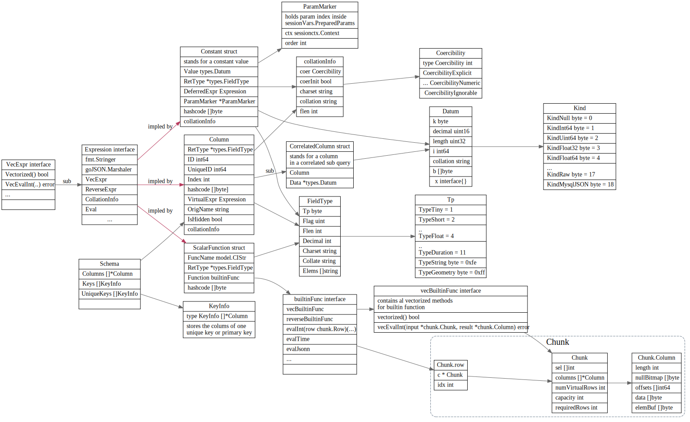
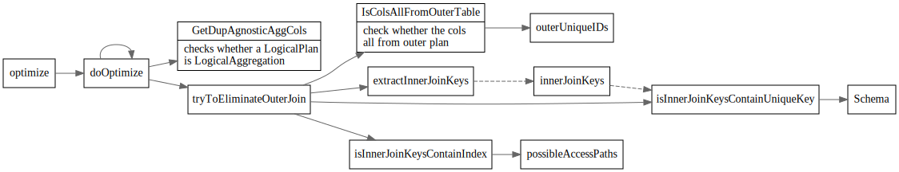
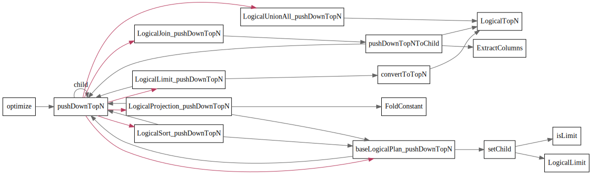

# LogicalPlan Optimize


<!-- toc -->

## LogicalPlan

列举下都有哪些logical plan


#### Schema

```go
// Schema stands for the row schema and unique key information get from input.
type Schema struct {
	Columns []*Column
	Keys    []KeyInfo
}
```

#### Expression



### DataSource

```go
type DataSource struct {
	logicalSchemaProducer

	astIndexHints []*ast.IndexHint
	IndexHints    []indexHintInfo
	table         table.Table
	tableInfo     *model.TableInfo
	Columns       []*model.ColumnInfo
	DBName        model.CIStr

	TableAsName *model.CIStr
	// indexMergeHints are the hint for indexmerge.
	indexMergeHints []indexHintInfo
	// pushedDownConds are the conditions that will be pushed down to coprocessor.
	pushedDownConds []expression.Expression
	// allConds contains all the filters on this table. For now it's maintained
	// in predicate push down and used only in partition pruning.
	allConds []expression.Expression

	statisticTable *statistics.Table
	tableStats     *property.StatsInfo

	// possibleAccessPaths stores all the possible access path for physical plan, including table scan.
	possibleAccessPaths []*util.AccessPath

	// The data source may be a partition, rather than a real table.
	isPartition     bool
	physicalTableID int64
	partitionNames  []model.CIStr

	// handleCol represents the handle column for the datasource, either the
	// int primary key column or extra handle column.
	//handleCol *expression.Column
	handleCols HandleCols
	// TblCols contains the original columns of table before being pruned, and it
	// is used for estimating table scan cost.
	TblCols []*expression.Column
	// commonHandleCols and commonHandleLens save the info of primary key which is the clustered index.
	commonHandleCols []*expression.Column
	commonHandleLens []int
	// TblColHists contains the Histogram of all original table columns,
	// it is converted from statisticTable, and used for IO/network cost estimating.
	TblColHists *statistics.HistColl
	// preferStoreType means the DataSource is enforced to which storage.
	preferStoreType int
	// preferPartitions store the map, the key represents store type, the value represents the partition name list.
	preferPartitions map[int][]model.CIStr
}
```

1. DataSource 这个就是数据源，也就是表，select * from t 里面的 t。
2. Selection 选择，例如 select xxx from t where xx = 5 里面的 where 过滤条件。
3. Projection 投影， select c from t 里面的取 c 列是投影操作。
4. Join 连接， select xx from t1, t2 where t1.c = t2.c 就是把 t1 t2 两个表做 Join。

哪些Logical plan 可能有多个child ?
感觉也就join/union/interset


## 优化规则

 基于规则的优化
logicalOptimize

```go
var optRuleList = []logicalOptRule{
    &gcSubstituter{},
    &columnPruner{},
    &buildKeySolver{},
    &decorrelateSolver{},
    &aggregationEliminator{},
    &projectionEliminator{},
    &maxMinEliminator{},
    &ppdSolver{},
    &outerJoinEliminator{},
    &partitionProcessor{},
    &aggregationPushDownSolver{},
    &pushDownTopNOptimizer{},
    &joinReOrderSolver{},
    &columnPruner{}, // column pruning again at last, note it will mess up the results of buildKeySolver
}
```


### 列裁剪

列裁剪的思想是这样的：对于用不上的列，没有必要读取它们的数据，无谓的浪费 IO 资源。比如说表 t 里面有 a b c d 四列。

### 构建节点属性(buildKeySolver)

LogicalPlan的`BuildKeyInfo`和MaxOneRow接口

```go
	// BuildKeyInfo will collect the information of unique keys into schema.
	// Because this method is also used in cascades planner, we cannot use
	// things like `p.schema` or `p.children` inside it. We should use the `selfSchema`
	// and `childSchema` instead.
	BuildKeyInfo(selfSchema *expression.Schema, childSchema []*expression.Schema)

	// MaxOneRow means whether this operator only returns max one row.
	MaxOneRow() bool

	// Get the schema.
	Schema() *expression.Schema
```

buildKeySolver 会构建MaxOneRow属性和unique key属性，在后面的优化器, 比如聚合消除中会用到。


### decorrelateSolver

decorrelateSolver tries to convert apply plan to join plan.


### 最大最小消除(maxMinEliminator)

最大最小消除，会对 Min/Max 语句进行改写。


### 投影消除 (projectionEliminator)

影消除可以把不必要的 Projection 算子消除掉


### 谓词下推(ppdSolver)

谓词下推将查询语句中的过滤表达式计算尽可能下推到距离数据源最近的地方，以尽早完成数据的过滤，进而显著地减少数据传输或计算的开销。

`PredicatePushDown`是LogicalPlan的一个接口， predicates 表示要添加的过滤条件。函数返回值是无法下推的条件，以及生成的新 plan。

```
	// PredicatePushDown pushes down the predicates in the where/on/having clauses as deeply as possible.
	// It will accept a predicate that is an expression slice, and return the expressions that can't be pushed.
	// Because it might change the root if the having clause exists, we need to return a plan that represents a new root.
	PredicatePushDown([]expression.Expression) ([]expression.Expression, LogicalPlan)
```

`baseLogicalPlan`实现了公共基本实现，调用child的PredictPushDown, child返回的不能下推的expression会新创建一个SelectPlan.

```go
// PredicatePushDown implements LogicalPlan interface.
func (p *baseLogicalPlan) PredicatePushDown(predicates []expression.Expression) ([]expression.Expression, LogicalPlan) {
	if len(p.children) == 0 {
		return predicates, p.self
	}
	child := p.children[0]
	rest, newChild := child.PredicatePushDown(predicates)
	addSelection(p.self, newChild, rest, 0)
	return nil, p.self
}
```


假设 t1 和 t2 都是 100 条数据。如果把 t1 和 t2 两个表做笛卡尔积了再过滤，我们要处理 10000 条数据，而如果能先做过滤条件，那么数据量就会大量减少。谓词下推会尽量把过滤条件，推到靠近叶子节点，从而减少数据访问，节省计算开销。这就是谓词下推的作用。

谓词下推不能推过 MaxOneRow 和 Limit 节点。因为先 Limit N 行，然后再做 Selection 操作，跟先做 Selection 操作，再 Limit N 行得到的结果是不一样的。比如数据是 1 到 100，先 Limit 10 再 Select 大于 5，得到的是 5 到 10，而先做 Selection 再做 Limit 得到的是 5 到 15。MaxOneRow 也是同理，跟 Limit 1 效果一样。

DataSource是叶子节点, 会直接把过滤条件加入到 CopTask 里面。最后会通过 coprocessor 推给 TiKV 去做。


### 聚合消除(aggregationEliminator)


聚合合消除会检查 SQL 查询中 Group By 语句所使用的列是否具有唯一性属性. 

如果满足，则会将执行计划中相应的 LogicalAggregation 算子替换为 LogicalProjection 算子。

这里的逻辑是当聚合函数按照具有唯一性属性的一列或多列分组时，下层算子输出的每一行都是一个单独的分组. 
这时就可以将聚合函数展开成具体的参数列或者包含参数列的普通函数表达式。


```go
// tryToEliminateAggregation will eliminate aggregation grouped by unique key.
// e.g. select min(b) from t group by a. If a is a unique key, then this sql is equal to `select b from t group by a`.
// For count(expr), sum(expr), avg(expr), count(distinct expr, [expr...]) we may need to rewrite the expr. Details are shown below.
// If we can eliminate agg successful, we return a projection. Else we return a nil pointer.
```


### 外连接消除(outerJoinEliminator)

这里外连接消除指的是将整个连接操作从查询中移除。
外连接消除需要满足一定条件：

* 条件 1 : LogicalJoin 的父亲算子只会用到 LogicalJoin 的 outer plan 所输出的列
* 条件 2 :
  * 条件 2.1 : LogicalJoin 中的 join key 在 inner plan 的输出结果中满足唯一性属性
  * 条件 2.2 : LogicalJoin 的父亲算子会对输入的记录去重

```go
// tryToEliminateOuterJoin will eliminate outer join plan base on the following rules
// 1. outer join elimination: For example left outer join, if the parent only use the
//    columns from left table and the join key of right table(the inner table) is a unique
//    key of the right table. the left outer join can be eliminated.
// 2. outer join elimination with duplicate agnostic aggregate functions: For example left outer join.
//    If the parent only use the columns from left table with 'distinct' label. The left outer join can
//    be eliminated.
```



### 子查询优化/去相关

```sql
-- 非相关子查询
select * from t1 where t1.a > (select t2.a from t2 limit 1);
-- 相关子查询
select * from t1 where t1.a > (select t2.a from t2 where t2.b > t1.b limit 1);
```

#### 子查询展开

即直接执行子查询获得结果，再利用这个结果改写原本包含子查询的表达式

#### 子查询转为 Join

```sql
-- 包含IN(subquery)的查询
select * from t1 where t1.a in (select t2.a from t2);

-- 改写为inner join
select t1.* from t1 inner join (select distinct(t2.a) as a from t2) as sub on t1.a = sub.a;

-- 如果 t2.a 满足唯一性属性，根据上面介绍的聚合消除规则，查询会被进一步改写成：
select t1.* from t1 inner join t2 on t1.a = t2.a;
```


展开子查询需要一次性将 t2 的全部数据从 TiKV 返回到 TiDB 中缓存，并作为 t1 扫描的过滤条件；如果将子查询转化为 inner join 的 inner plan ，我们可以更灵活地对 t2 选择访问方式，比如我们可以对 join 选择 IndexLookUpJoin 实现方式

### aggPushDown


### partitionProcessor

```go

// partitionProcessor rewrites the ast for table partition.
//
// create table t (id int) partition by range (id)
//   (partition p1 values less than (10),
//    partition p2 values less than (20),
//    partition p3 values less than (30))
//
// select * from t is equal to
// select * from (union all
//      select * from p1 where id < 10
//      select * from p2 where id < 20
//      select * from p3 where id < 30)
//

```


### pushDownTopNOptimizer

TODO: 解释这块主要干了啥, TOPN 怎么push下去了的。

```go
	// pushDownTopN will push down the topN or limit operator during logical optimization.
	pushDownTopN(topN *LogicalTopN) LogicalPlan
```



### joinReOrderSolver


#### greedySolver
```go
// solve reorders the join nodes in the group based on a greedy algorithm.
//
// For each node having a join equal condition with the current join tree in
// the group, calculate the cumulative join cost of that node and the join
// tree, choose the node with the smallest cumulative cost to join with the
// current join tree.
//
// cumulative join cost = CumCount(lhs) + CumCount(rhs) + RowCount(join)
//   For base node, its CumCount equals to the sum of the count of its subtree.
//   See baseNodeCumCost for more details.
// TODO: this formula can be changed to real physical cost in future.
//
// For the nodes and join trees which don't have a join equal condition to
// connect them, we make a bushy join tree to do the cartesian joins finally.
```

#### joinReorderDPSolver 

## 参考文献

1. [TiDB 源码阅读系列文章（七）基于规则的优化](https://pingcap.com/blog-cn/tidb-source-code-reading-7/)
2. [TiDB 源码阅读系列文章（二十一）基于规则的优化 II](https://pingcap.com/blog-cn/tidb-source-code-reading-21/)
3. [TiDB 文档子查询相关的优化](https://docs.pingcap.com/zh/tidb/stable/subquery-optimization)
4. [An Introduction to Join Ordering](https://www.cockroachlabs.com/blog/join-ordering-pt1/)
5. [Introduction to Join Reorder](https://docs.pingcap.com/tidb/stable/join-reorder)
