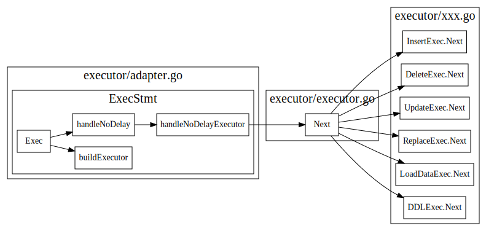

# TiDB Server Main Loop

<!-- toc -->

跟着官方的[tidb源码阅读博客](https://pingcap.com/blog-cn/tidb-source-code-reading-3/)，看了TiDB main函数，大致了解了一个SQL的处理过程

## conn session

下图显示了TiDB中Accept一个mysql连接的处理流程，对于每个新的conn, TiDB会启动一个goroutine来处理这个conn, 并按照Mysql协议，处理不同的mysql cmd。
每个conn在server端会有个对应的session.

对于Query语句，会session.Execute生成一个执行器，返回一个resultSet, 最后调用``writeResultset``, 从ResultSet.Next中获取结果，然后将结果返回给客户端。


一个sql语句执行过程中经过以下几个过程:

1. `ParseSQL` 将SQL语句解析为stmt ast tree
2. `Compile` 将stmt ast tree 转换为physical plan
3. `BuildExecutor` 创建executor
4. `resultSet.Next` 驱动executor执行


## ParseSQL

### StmtNodes

StmtNode 接口定义
```go
// Node is the basic element of the AST.
// Interfaces embed Node should have 'Node' name suffix.
type Node interface {
	// Restore returns the sql text from ast tree
	Restore(ctx *format.RestoreCtx) error
	// Accept accepts Visitor to visit itself.
	// The returned node should replace original node.
	// ok returns false to stop visiting.
	//
	// Implementation of this method should first call visitor.Enter,
	// assign the returned node to its method receiver, if skipChildren returns true,
	// children should be skipped. Otherwise, call its children in particular order that
	// later elements depends on former elements. Finally, return visitor.Leave.
	Accept(v Visitor) (node Node, ok bool)
	// Text returns the original text of the element.
	Text() string
	// SetText sets original text to the Node.
	SetText(text string)
}

// StmtNode represents statement node.
// Name of implementations should have 'Stmt' suffix.
type StmtNode interface {
	Node
	statement()
}
```

stmtNode实现种类和继承关系


## Compile

Compile中首先使用`planbuilder`，将stmt ast 树转换为logical plan, 
然后`logicalOptimize`做基于规则的逻辑优化，`physicalOptimize`会根据
cost选择最佳的physical plan. 最后`postOptimize`还会做一波优化。


### logical plan optimize

逻辑优化(Rule-based-Optimization, 简称RBO)，主要依据关系代数的等价交换规则做一些逻辑变换。
```go
var optRuleList = []logicalOptRule{
	&gcSubstituter{},
	&columnPruner{},
	&buildKeySolver{},
	&decorrelateSolver{},
	&aggregationEliminator{},
	&projectionEliminator{},
	&maxMinEliminator{},
	&ppdSolver{},
	&outerJoinEliminator{},
	&partitionProcessor{},
	&aggregationPushDownSolver{},
	&pushDownTopNOptimizer{},
	&joinReOrderSolver{},
	&columnPruner{}, // column pruning again at last, note it will mess up the results of buildKeySolver
}
```

### Physical Optimization

物理优化，主要通过对查询的数据读取、表连接方式、表连接顺序、排序等技术进行优化。
基于代价的优化（CBO), 依赖于统计信息的准确性与及时性，执行计划会及时的根据数据变换做对应的调整


主要实现在函数`findBestTask`中，每个logical plan都实现了这个findBestTask接口, 具体实现在`planner/core/find_best_task.go`中
其中`baseLogicalPlan.findBestTask` 为封装的基类函数
在attach2Task中会更新task的cost

#### findBestTask


```go
	// findBestTask converts the logical plan to the physical plan. It's a new interface.
	// It is called recursively from the parent to the children to create the result physical plan.
	// Some logical plans will convert the children to the physical plans in different ways, and return the one
	// With the lowest cost and how many plans are found in this function.
	// planCounter is a counter for planner to force a plan.
	// If planCounter > 0, the clock_th plan generated in this function will be returned.
	// If planCounter = 0, the plan generated in this function will not be considered.
	// If planCounter = -1, then we will not force plan.
	findBestTask(prop *property.PhysicalProperty, planCounter *PlanCounterTp) (task, int64, error)

	// attach2Task makes the current physical plan as the father of task's physicalPlan and updates the cost of
	// current task. If the child's task is cop task, some operator may close this task and return a new rootTask.
	attach2Task(...task) task
```
findBestTask最后的输出为task, 可以使用explain查看最后生成的task

```sql
>create table t (id varchar(31), name varchar(50), age int, key id_idx(id));
>explain select name, age from t where age > 18;
+-----------------------+---------+-----------+---------------+--------------------------------+
| id                    | estRows | task      | access object | operator info                  |
+-----------------------+---------+-----------+---------------+--------------------------------+
| Projection_4          | 0.00    | root      |               | tests.t.name, tests.t.age      |
| └─TableReader_7       | 0.00    | root      |               | data:Selection_6               |
|   └─Selection_6       | 0.00    | cop[tikv] |               | eq(tests.t.id, "pingcap")      |
|     └─TableFullScan_5 | 1.00    | cop[tikv] | table:t       | keep order:false, stats:pseudo |
+-----------------------+---------+-----------+---------------+--------------------------------+
```

### task

cop task 是指被下推到 KV 端分布式执行的计算任务，root task 是指在 TiDB 端单点执行的计算任务。

```go
type task interface {
	count() float64
	addCost(cost float64)
	cost() float64
	copy() task
	plan() PhysicalPlan
	invalid() bool
}
```

#### rootTask
```go
// rootTask is the final sink node of a plan graph. It should be a single goroutine on tidb.
type rootTask struct {
	p   PhysicalPlan
	cst float64
}
```

#### copTask 
```go
// copTask is a task that runs in a distributed kv store.
// TODO: In future, we should split copTask to indexTask and tableTask.
type copTask struct {
	indexPlan PhysicalPlan
	tablePlan PhysicalPlan
	cst       float64
	// indexPlanFinished means we have finished index plan.
	indexPlanFinished bool
	// keepOrder indicates if the plan scans data by order.
	keepOrder bool
	// doubleReadNeedProj means an extra prune is needed because
	// in double read case, it may output one more column for handle(row id).
	doubleReadNeedProj bool

	extraHandleCol   *expression.Column
	commonHandleCols []*expression.Column
	// tblColHists stores the original stats of DataSource, it is used to get
	// average row width when computing network cost.
	tblColHists *statistics.HistColl
	// tblCols stores the original columns of DataSource before being pruned, it
	// is used to compute average row width when computing scan cost.
	tblCols           []*expression.Column
	idxMergePartPlans []PhysicalPlan
	// rootTaskConds stores select conditions containing virtual columns.
	// These conditions can't push to TiKV, so we have to add a selection for rootTask
	rootTaskConds []expression.Expression

	// For table partition.
	partitionInfo PartitionInfo
}
```

### ExecStmt

Compile后最后返回的数据结构为`ExecStmt`, 接下来会使用`buildExecutor`把ExecSmt
转变为executor.

```go
// ExecStmt implements the sqlexec.Statement interface, it builds a planner.Plan to an sqlexec.Statement.
type ExecStmt struct {
	// GoCtx stores parent go context.Context for a stmt.
	GoCtx context.Context
	// InfoSchema stores a reference to the schema information.
	InfoSchema infoschema.InfoSchema
	// Plan stores a reference to the final physical plan.
	Plan plannercore.Plan
	// Text represents the origin query text.
	Text string

	StmtNode ast.StmtNode

	Ctx sessionctx.Context

	// LowerPriority represents whether to lower the execution priority of a query.
	LowerPriority     bool
	isPreparedStmt    bool
	isSelectForUpdate bool
	retryCount        uint
	retryStartTime    time.Time

	// OutputNames will be set if using cached plan
	OutputNames []*types.FieldName
	PsStmt      *plannercore.CachedPrepareStmt
}
```


## Executor

根据physical plan生成相应的executor, Executor interface如下, 使用了Volcano模型，接口用起来和迭代器差不多，采用Open-Next-Close套路来使用。

* `Open`: 做一些初始化工作
* `Next`: 执行具体操作 
* `Close`: 做一些清理操作

```go
// Executor is the physical implementation of a algebra operator.
//
// In TiDB, all algebra operators are implemented as iterators, i.e., they
// support a simple Open-Next-Close protocol. See this paper for more details:
//
// "Volcano-An Extensible and Parallel Query Evaluation System"
//
// Different from Volcano's execution model, a "Next" function call in TiDB will
// return a batch of rows, other than a single row in Volcano.
// NOTE: Executors must call "chk.Reset()" before appending their results to it.
type Executor interface {
	base() *baseExecutor
	Open(context.Context) error
	Next(ctx context.Context, req *chunk.Chunk) error
	Close() error
	Schema() *expression.Schema
}
```


## RecordSet

executor的next方法，将由recordset的next来驱动不断地执行。

下图摘自[2](https://pingcap.com/blog-cn/tidb-source-code-reading-3/)
executor本身


### handleNoDelay

Insert 这种不需要返回数据的语句，只需要把语句执行完成即可。这类语句也是通过 Next 驱动执行，驱动点在构造 recordSet 结构之前



### RecordSet driver


```go
// RecordSet is an abstract result set interface to help get data from Plan.
type RecordSet interface {
	// Fields gets result fields.
	Fields() []*ast.ResultField

	// Next reads records into chunk.
	Next(ctx context.Context, req *chunk.Chunk) error

	// NewChunk create a chunk.
	NewChunk() *chunk.Chunk

	// Close closes the underlying iterator, call Next after Close will
	// restart the iteration.
	Close() error
}
```

RecordSet Next方法接口的实现.
```go
// Next use uses recordSet's executor to get next available chunk for later usage.
// If chunk does not contain any rows, then we update last query found rows in session variable as current found rows.
// The reason we need update is that chunk with 0 rows indicating we already finished current query, we need prepare for
// next query.
// If stmt is not nil and chunk with some rows inside, we simply update last query found rows by the number of row in chunk.
func (a *recordSet) Next(ctx context.Context, req *chunk.Chunk) error {
	err := Next(ctx, a.executor, req)
	if err != nil {
		a.lastErr = err
		return err
	}
	numRows := req.NumRows()
	if numRows == 0 {
		if a.stmt != nil {
			a.stmt.Ctx.GetSessionVars().LastFoundRows = a.stmt.Ctx.GetSessionVars().StmtCtx.FoundRows()
		}
		return nil
	}
	if a.stmt != nil {
		a.stmt.Ctx.GetSessionVars().StmtCtx.AddFoundRows(uint64(numRows))
	}
	return nil
}
```

在writeResult时候不断调用RecordSet的Next方法，去驱动调用executor的Next;

```go
// writeChunks writes data from a Chunk, which filled data by a ResultSet, into a connection.
// binary specifies the way to dump data. It throws any error while dumping data.
// serverStatus, a flag bit represents server information
func (cc *clientConn) writeChunks(ctx context.Context, rs ResultSet, binary bool, serverStatus uint16) error {
	data := cc.alloc.AllocWithLen(4, 1024)
	req := rs.NewChunk()
  //...
	for {
		// Here server.tidbResultSet implements Next method.
		err := rs.Next(ctx, req)
    /...
		rowCount := req.NumRows()
    //...
		for i := 0; i < rowCount; i++ {
			data = data[0:4]
      /...
			if err = cc.writePacket(data); err != nil {
				return err
			}
      //...
    }
  }
	return cc.writeEOF(serverStatus)
}
```

## Ref

1. [理解TIDB执行计划](https://www.bookstack.cn/read/pingcap-docs-cn/sql-understanding-the-query-execution-plan.md)
2. [TiDB 源码阅读系列文章（三）SQL 的一生](https://pingcap.com/blog-cn/tidb-source-code-reading-3/)
