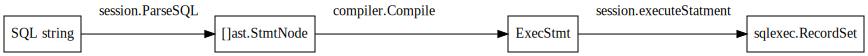
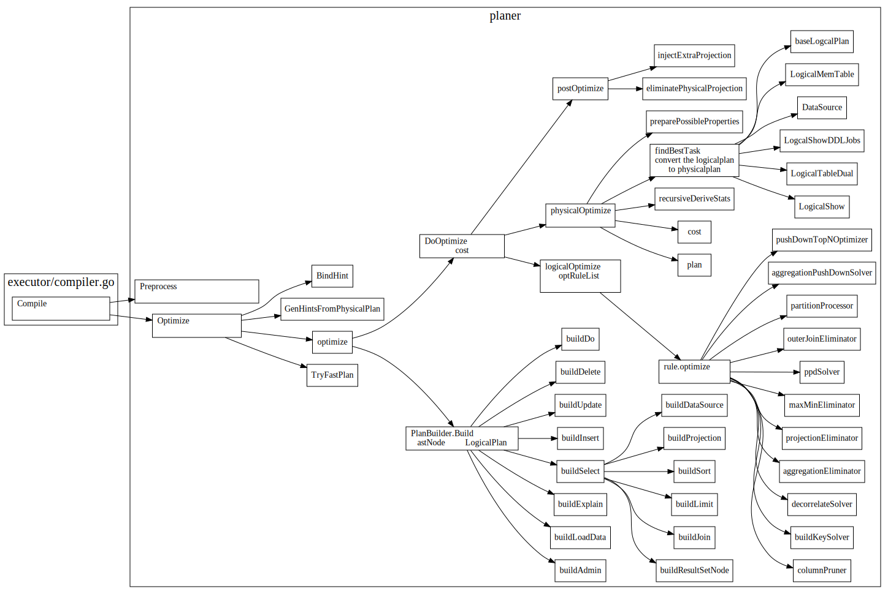
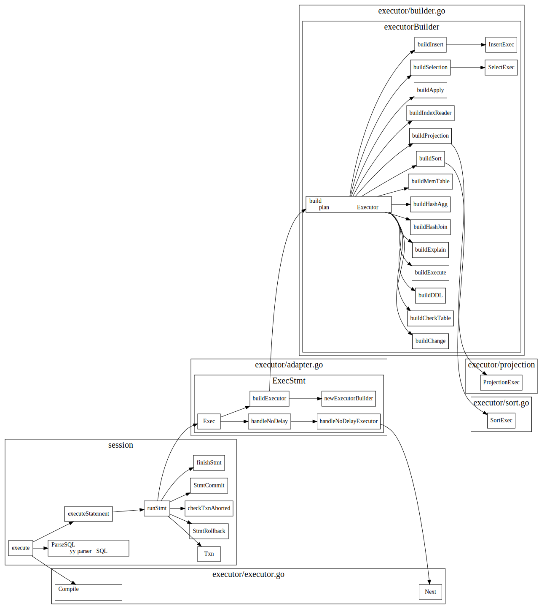

# TiDB Server Main Loop

跟着官方的tidb源码阅读博客，看了TiDB main函数，大致了解了一个SQL的处理过程

## conn accept

下图显示了TiDB中Accept一个mysql连接的处理流程，对于每个新的conn, TiDB会启动一个goroutine来处理这个conn, 并按照Mysql协议，处理不同的mysql cmd。

对于Query语句，会session.Execute生成一个执行器，返回一个resultSet, 最后调用``writeResultset``, 从ResultSet.Next中获取结果，然后将结果返回给客户端。


### 处理conn loop

```go
// Run reads client query and writes query result to client in for loop, if there is a panic during query handling,
// it will be recovered and log the panic error.
// This function returns and the connection is closed if there is an IO error or there is a panic.
func (cc *clientConn) Run(ctx context.Context) {
//other code..
for {
    // other code ...
		data, err := cc.readPacket()

    // other code ...
		if err = cc.dispatch(ctx, data); err != nil {
      // other code ...
    }
    // other code ...
}
}
```

### cmd dispatch

```go
// dispatch handles client request based on command which is the first byte of the data.
// It also gets a token from server which is used to limit the concurrently handling clients.
// The most frequently used command is ComQuery.
func (cc *clientConn) dispatch(ctx context.Context, data []byte) error {
//other code ...
	cmd := data[0]
	data = data[1:]
//other code ...
	dataStr := string(hack.String(data))

	switch cmd {
	case mysql.ComQuery: // Most frequently used command.
		if len(data) > 0 && data[len(data)-1] == 0 {
			data = data[:len(data)-1]
			dataStr = string(hack.String(data))
		}
		return cc.handleQuery(ctx, dataStr)
    //other case ...
  }
}
```

## SQL Execute

TiDB中SQL执行过程如下



### SQL Plan Optimize: 制定查询计划以及优化



### SQL build executor

根据plan生成相应的executor




### executor Next

#### handleNoDelay

不需要返回结果的立即执行


#### RecordSet driver
