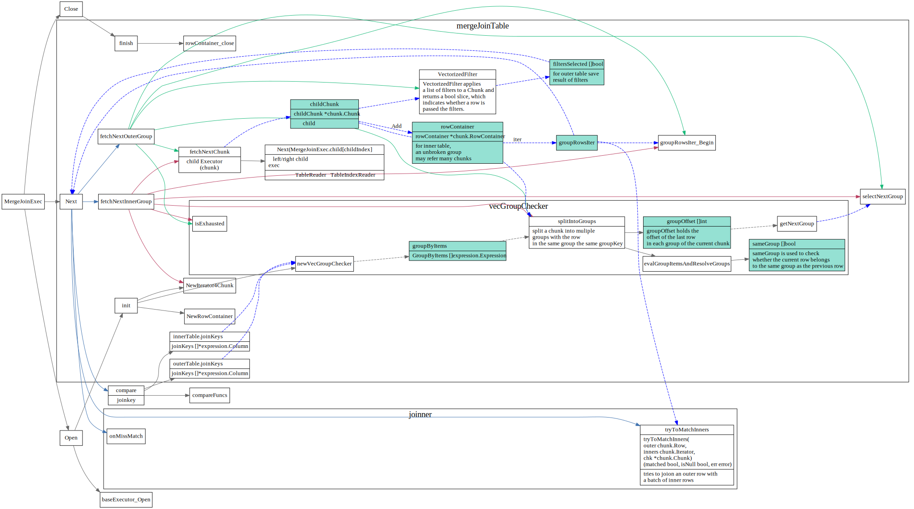
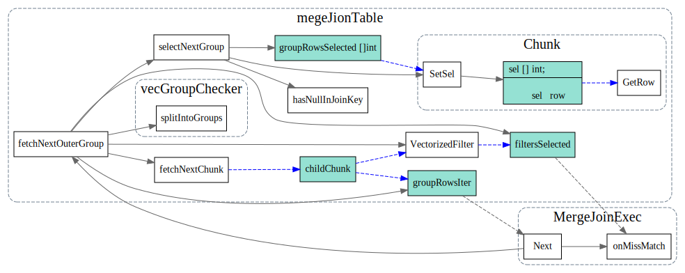

# MergeJoin

<!-- toc -->

## Sort MergeJoin 算法

```
function sortMerge(relation left, relation right, attribute a)
    var relation output
    var list left_sorted := sort(left, a) // Relation left sorted on attribute a
    var list right_sorted := sort(right, a)
    var attribute left_key, right_key
    var set left_subset, right_subset // These sets discarded except where join predicate is satisfied
    advance(left_subset, left_sorted, left_key, a)
    advance(right_subset, right_sorted, right_key, a)
    while not empty(left_subset) and not empty(right_subset)
        if left_key = right_key // Join predicate satisfied
            add cartesian product of left_subset and right_subset to output
            advance(left_subset, left_sorted, left_key, a)
            advance(right_subset, right_sorted,right_key, a)
        else if left_key < right_key
            advance(left_subset, left_sorted, left_key, a)
        else // left_key > right_key
            advance(right_subset, right_sorted, right_key, a)
    return output

// Remove tuples from sorted to subset until the sorted[1].a value changes
function advance(subset out, sorted inout, key out, a in)
    key := sorted[1].a
    subset := emptySet
    while not empty(sorted) and sorted[1].a = key
        insert sorted[1] into subset
        remove sorted[1] 
```


## MergeJoinExec Struct 
```go
// MergeJoinExec implements the merge join algorithm.
// This operator assumes that two iterators of both sides
// will provide required order on join condition:
// 1. For equal-join, one of the join key from each side
// matches the order given.
// 2. For other cases its preferred not to use SMJ and operator
// will throw error.
type MergeJoinExec struct {
	baseExecutor

	stmtCtx      *stmtctx.StatementContext
	compareFuncs []expression.CompareFunc
	joiner       joiner
	isOuterJoin  bool
	desc         bool

	innerTable *mergeJoinTable
	outerTable *mergeJoinTable

	hasMatch bool
	hasNull  bool

	memTracker  *memory.Tracker
	diskTracker *disk.Tracker
}
```


首先使用vecGroupCheck分别将innner chunk和outerchunk 分为相同groupkey的组



#### fetchNextInnerGroup

这个地方没怎么看明白，不太明白它是怎么处理一个groupkey超过多个chunk的情况


#### fetchNextOuterGroup



## Ref
参考资料[TiDB 源码阅读系列文章（十五）Sort Merge Join](https://pingcap.com/blog-cn/tidb-source-code-reading-15/)
