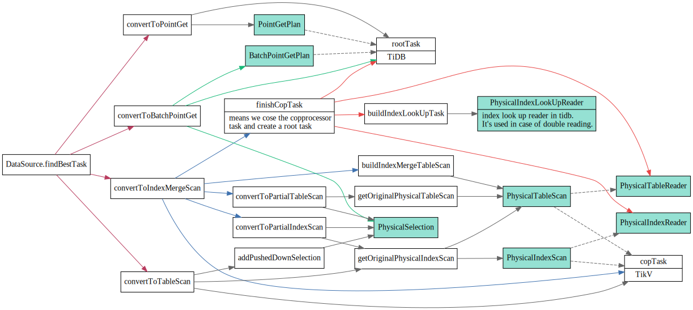
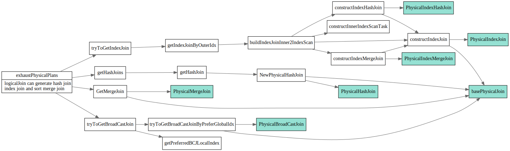

# Physical Optimize

<!-- toc -->

## task

```go
// task is a new version of `PhysicalPlanInfo`. It stores cost information for a task.
// A task may be CopTask, RootTask, MPPTask or a ParallelTask.
type task interface {
	count() float64
	addCost(cost float64)
	cost() float64
	copy() task
	plan() PhysicalPlan
	invalid() bool
}
```

task分两种, roottask在TiDB端执行

* `rootTask` is the final sink node of a plan graph. It should be a single goroutine on tidb.
* `copTask` is a task that runs in a distributed kv store.

1. task是怎么执行的呢？
2. coptask和rootTask的执行在哪而体现的呢？

## findBestTask
```go
type LogicalPlan interface {
	// findBestTask converts the logical plan to the physical plan. It's a new interface.
	// It is called recursively from the parent to the children to create the result physical plan.
	// Some logical plans will convert the children to the physical plans in different ways, and return the one
	// With the lowest cost and how many plans are found in this function.
	// planCounter is a counter for planner to force a plan.
	// If planCounter > 0, the clock_th plan generated in this function will be returned.
	// If planCounter = 0, the plan generated in this function will not be considered.
	// If planCounter = -1, then we will not force plan.
	findBestTask(prop *property.PhysicalProperty, planCounter *PlanCounterTp) (task, int64, error)
  //..
}
```

### DataSource

#### possibleAccessPaths
在逻辑优化partitionProcessor中会计算出Datasource的possibleAccessPath

```go
var optRuleList = []logicalOptRule{
	&partitionProcessor{},
}
```
首先处理分区，然后会根据hints: IndexHints, indexMergeHints, preferStoreType 以及
Table自己的Index(在getPossibleAccessPath中会遍历TableInfo.Indices), 组合列举出所有的accessPath.
最后会去掉违反IsolationRead的path.

```
// partitionProcessor rewrites the ast for table partition.
//
// create table t (id int) partition by range (id)
//   (partition p1 values less than (10),
//    partition p2 values less than (20),
//    partition p3 values less than (30))
//
// select * from t is equal to
// select * from (union all
//      select * from p1 where id < 10
//      select * from p2 where id < 20
//      select * from p3 where id < 30)
//
// partitionProcessor is here because it's easier to prune partition after predicate push down.
```


```go

type DataSource struct {
  //...
	// possibleAccessPaths stores all the possible access path for physical plan, including table scan.
	possibleAccessPaths []*util.AccessPath
  //...
}

type AccessPath struct {
	Index          *model.IndexInfo
	FullIdxCols    []*expression.Column
	FullIdxColLens []int
	IdxCols        []*expression.Column
	IdxColLens     []int
	Ranges         []*ranger.Range
	// CountAfterAccess is the row count after we apply range seek and before we use other filter to filter data.
	// For index merge path, CountAfterAccess is the row count after partial paths and before we apply table filters.
	CountAfterAccess float64
	// CountAfterIndex is the row count after we apply filters on index and before we apply the table filters.
	CountAfterIndex float64
	AccessConds     []expression.Expression
	EqCondCount     int
	EqOrInCondCount int
	IndexFilters    []expression.Expression
	TableFilters    []expression.Expression
	// PartialIndexPaths store all index access paths.
	// If there are extra filters, store them in TableFilters.
	PartialIndexPaths []*AccessPath

	StoreType kv.StoreType

	IsDNFCond bool

	// IsTiFlashGlobalRead indicates whether this path is a remote read path for tiflash
	IsTiFlashGlobalRead bool

	// IsIntHandlePath indicates whether this path is table path.
	IsIntHandlePath    bool
	IsCommonHandlePath bool
	// Forced means this path is generated by `use/force index()`.
	Forced bool
}
```


#### cost

估算Datasource的rowCount, rowSize，然后使用session vars中定义的一些factor来计算cost.

TiDB中定义了一些Session Vars, 这些值由`SetSystemVars`来设置

```
func (s *SessionVars) SetSystemVar(name string, val string) error {
```

```go
type SessionVars struct {
  //..
	// CPUFactor is the CPU cost of processing one expression for one row.
	CPUFactor float64
	// CopCPUFactor is the CPU cost of processing one expression for one row in coprocessor.
	CopCPUFactor float64
	// CopTiFlashConcurrencyFactor is the concurrency number of computation in tiflash coprocessor.
	CopTiFlashConcurrencyFactor float64
	// NetworkFactor is the network cost of transferring 1 byte data.
	NetworkFactor float64
	// ScanFactor is the IO cost of scanning 1 byte data on TiKV and TiFlash.
	ScanFactor float64
	// DescScanFactor is the IO cost of scanning 1 byte data on TiKV and TiFlash in desc order.
	DescScanFactor float64
	// SeekFactor is the IO cost of seeking the start value of a range in TiKV or TiFlash.
	SeekFactor float64
	// MemoryFactor is the memory cost of storing one tuple.
	MemoryFactor float64
	// DiskFactor is the IO cost of reading/writing one byte to temporary disk.
	DiskFactor float64
	// ConcurrencyFactor is the CPU cost of additional one goroutine.
	ConcurrencyFactor float64
  //..
}
```

可以在tidb client中看下当前session对应的factor

```sql
show session variables like '%factor'
+-------------------------------------+-------+
| Variable_name                       | Value |
+-------------------------------------+-------+
| innodb_fill_factor                  |       |
| tidb_opt_concurrency_factor         | 3     |
| tidb_opt_copcpu_factor              | 3     |
| tidb_opt_correlation_exp_factor     | 1     |
| tidb_opt_cpu_factor                 | 3     |
| tidb_opt_desc_factor                | 3     |
| tidb_opt_disk_factor                | 1.5   |
| tidb_opt_memory_factor              | 0.001 |
| tidb_opt_network_factor             | 1     |
| tidb_opt_scan_factor                | 1.5   |
| tidb_opt_seek_factor                | 20    |
| tidb_opt_tiflash_concurrency_factor | 24    |
+-------------------------------------+-------+
```

这个地方用到了信息统计的Histogram和CMSketch，用来估算RowCount(filter后的rowCount)


DataSource对应的copTask为PhysicalTableScan, PhysicalIndexScan
带Selection PushDown的那种，还有TopN pushdown吧。

* PhysicalTableReader
* PhysicalIndexReader
* PhysicalIndexLookUpReader



### LogicalJoin

Join分为三类, HashJoin, IndexJoin, SortMergeJoin

* PhysicalIndexJoin

* PhysicalIndexHashJoin
* PhysicalHashJoin

* PhysicalIndexMergeJoin
* PhysicalMergeJoin



## Ref

1. 
