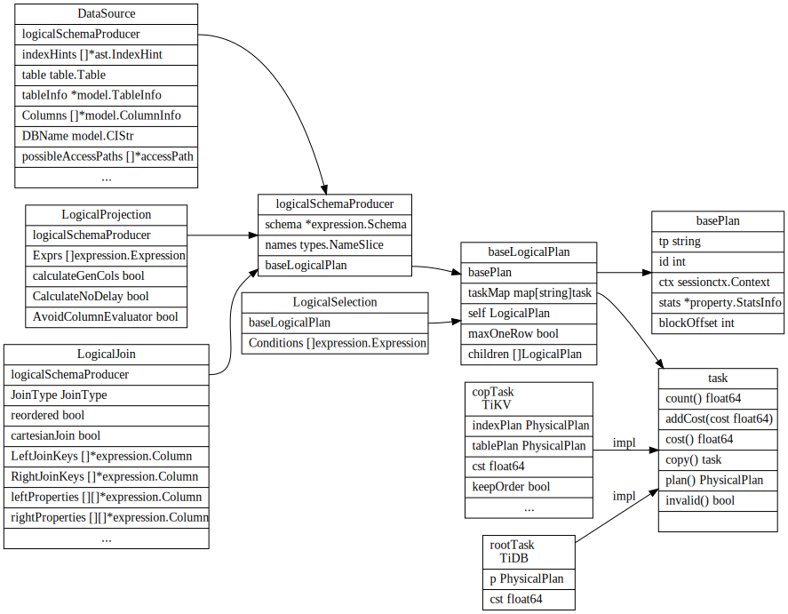
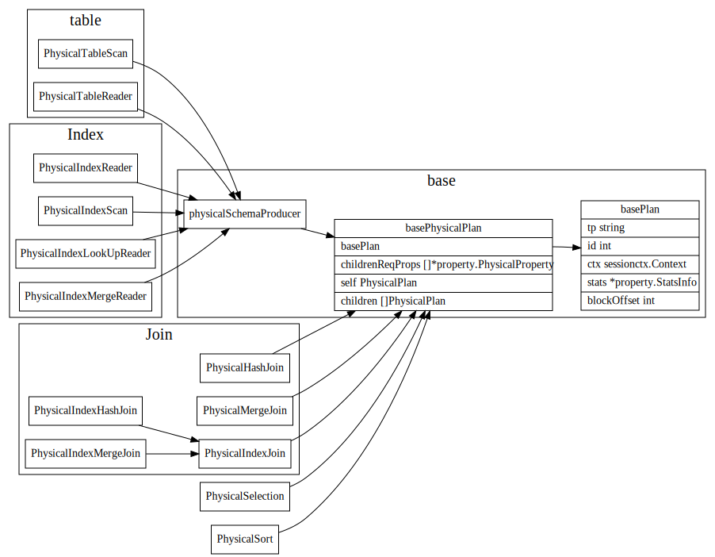

# Plan

## logical plan
```go
var (
	_ LogicalPlan = &LogicalJoin{}
	_ LogicalPlan = &LogicalAggregation{}
	_ LogicalPlan = &LogicalProjection{}
	_ LogicalPlan = &LogicalSelection{}
	_ LogicalPlan = &LogicalApply{}
	_ LogicalPlan = &LogicalMaxOneRow{}
	_ LogicalPlan = &LogicalTableDual{}
	_ LogicalPlan = &DataSource{}
	_ LogicalPlan = &TableGather{}
	_ LogicalPlan = &TableScan{}
	_ LogicalPlan = &LogicalUnionAll{}
	_ LogicalPlan = &LogicalSort{}
	_ LogicalPlan = &LogicalLock{}
	_ LogicalPlan = &LogicalLimit{}
	_ LogicalPlan = &LogicalWindow{}
)
```


## physical plan
```go
//planner/core/physical_plans.go
var (
	_ PhysicalPlan = &PhysicalSelection{}
	_ PhysicalPlan = &PhysicalProjection{}
	_ PhysicalPlan = &PhysicalTopN{}
	_ PhysicalPlan = &PhysicalMaxOneRow{}
	_ PhysicalPlan = &PhysicalTableDual{}
	_ PhysicalPlan = &PhysicalUnionAll{}
	_ PhysicalPlan = &PhysicalSort{}
	_ PhysicalPlan = &NominalSort{}
	_ PhysicalPlan = &PhysicalLock{}
	_ PhysicalPlan = &PhysicalLimit{}
	_ PhysicalPlan = &PhysicalIndexScan{}
	_ PhysicalPlan = &PhysicalTableScan{}
	_ PhysicalPlan = &PhysicalTableReader{}
	_ PhysicalPlan = &PhysicalIndexReader{}
	_ PhysicalPlan = &PhysicalIndexLookUpReader{}
	_ PhysicalPlan = &PhysicalIndexMergeReader{}
	_ PhysicalPlan = &PhysicalHashAgg{}
	_ PhysicalPlan = &PhysicalStreamAgg{}
	_ PhysicalPlan = &PhysicalApply{}
	_ PhysicalPlan = &PhysicalIndexJoin{}
	_ PhysicalPlan = &PhysicalHashJoin{}
	_ PhysicalPlan = &PhysicalMergeJoin{}
	_ PhysicalPlan = &PhysicalUnionScan{}
	_ PhysicalPlan = &PhysicalWindow{}
	_ PhysicalPlan = &BatchPointGetPlan{}
)
```


###

DataSource to physical plan


```
func (p *basePhysicalPlan) attach2Task(tasks ...task) task {
	t := finishCopTask(p.ctx, tasks[0].copy())
	return attachPlan2Task(p.self, t)
}
```

## join


1. hashJoin: 简单来说，A 表和 B 表的 Hash Join 需要我们选择一个 Inner 表来构造哈希表，然后对 Outer 表的每一行数据都去这个哈希表中查找是否有匹配的数据。
2. IndexJoin: 对于 BNJ 算法，我们注意到，对于 Outer 表中每个 batch，我们并没有必要对 Inner 表都进行一次全表扫操作，很多时候可以通过索引减少数据读取的代价
3. SortMergeJoin:  简单说来就是将 Join 的两个表，首先根据连接属性进行排序，然后进行一次扫描归并, 进而就可以得出最后的结果。这个算法最大的消耗在于对内外表数据进行排序，而当连接列为索引列时，我们可以利用索引的有序性避免排序带来的消耗, 所以通常在查询优化器中，连接列为索引列的情况下可以考虑选择使用 SMJ。

```
func (p *LogicalJoin) getHashJoins(prop *property.PhysicalProperty) []PhysicalPlan {
	if !prop.IsEmpty() { // hash join doesn't promise any orders
		return nil
	}
	joins := make([]PhysicalPlan, 0, 2)
	switch p.JoinType {
	case SemiJoin, AntiSemiJoin, LeftOuterSemiJoin, AntiLeftOuterSemiJoin:
		joins = append(joins, p.getHashJoin(prop, 1, false))
	case LeftOuterJoin:
		joins = append(joins, p.getHashJoin(prop, 1, false))
		joins = append(joins, p.getHashJoin(prop, 1, true))
	case RightOuterJoin:
		joins = append(joins, p.getHashJoin(prop, 0, false))
		joins = append(joins, p.getHashJoin(prop, 0, true))
	case InnerJoin:
		joins = append(joins, p.getHashJoin(prop, 1, false))
		joins = append(joins, p.getHashJoin(prop, 0, false))
	}
	return joins
}
```
