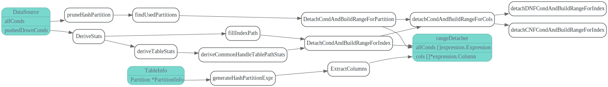
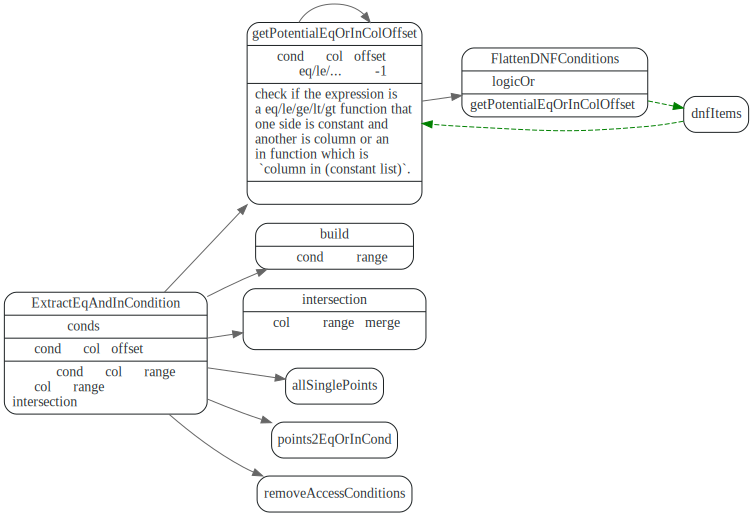

# range: 索引范围计算

<!-- toc -->

## 主要作用

从查询条件中，抽出指定columns(主要是主键，索引, partition）相关filter，转换为Range,
用来做RangeScan查询, 这样TiKV只用扫描对应Key Range的数据。

比如下面的SQL查询(摘自参考1），会把primary key a 上filter抽离出来: ``range: (1,5), (8,10)``

```sql
CREATE TABLE t (a int primary key, b int, c int);
select * from t where ((a > 1 and a < 5 and b > 2) or (a > 8 and a < 10 and c > 3)) and d = 5;
```

```sql
explain select * from t where ((a > 1 and a < 5 and b > 2) or (a > 8 and a < 10 and c > 3) and (a > 100)) ;


TableReader_7        | 2.00    | root      |               | data:Selection_6                                                                                                                    |
| └─Selection_6        | 2.00    | cop[tikv] |               | or(and(and(gt(tests.t.a, 1), lt(tests.t.a, 5)), gt(tests.t.b, 2)), and(and(gt(tests.t.a, 8), lt(tests.t.a, 10)), gt(tests.t.c, 3))) |
|   └─TableRangeScan_5 | 6.00    | cop[tikv] | table:t       | range:(1,5), (8,10), keep order:false, stats:pseudo
```


## 单列索引

### DetachCondsForColumn

在成本估算和填充AccessPath一些信息时会调用该函数。主要是针对主键和单例索引。


```go
// DetachCondsForColumn detaches access conditions for specified column from other filter conditions.
func DetachCondsForColumn(sctx sessionctx.Context, conds []expression.Expression, col *expression.Column) (accessConditions, otherConditions []expression.Expression) {
	checker := &conditionChecker{
		colUniqueID: col.UniqueID,
		length:      types.UnspecifiedLength,
	}
	return detachColumnCNFConditions(sctx, conds, checker)
}
```


### conditionChecker

没怎么看明白conditionChecker到底是干嘛的。


## 多列索引

### rangeDetacher



#### DetachCondAndBuildRangeForIndex


#### detachDNFCondAndBuildRangeForIndex


#### detachCNFCondAndBuildRangeForIndex

>AND 表达式中，只有当之前的列均为点查的情况下，才会考虑下一个列。

>e.g. 对于索引 (a, b, c)，有条件 a > 1 and b = 1，那么会被选中的只有 a > 1。对于条件 a in (1, 2, 3) and b > 1，两个条件均会被选到用来计算 range。


#### ExtractEqAndInCondition

```go
// ExtractEqAndInCondition will split the given condition into three parts by the information of index columns and their lengths.
// accesses: The condition will be used to build range.
// filters: filters is the part that some access conditions need to be evaluate again since it's only the prefix part of char column.
// newConditions: We'll simplify the given conditions if there're multiple in conditions or eq conditions on the same column.
//   e.g. if there're a in (1, 2, 3) and a in (2, 3, 4). This two will be combined to a in (2, 3) and pushed to newConditions.
// bool: indicate whether there's nil range when merging eq and in conditions.
func ExtractEqAndInCondition(sctx sessionctx.Context, conditions []expression.Expression,
```



## range build: 计算逻辑区间

计算一个expression对应的range
```go
func (r *builder) build(expr expression.Expression) []point {
	switch x := expr.(type) {
	case *expression.Column:
		return r.buildFromColumn(x)
	case *expression.ScalarFunction:
		return r.buildFromScalarFunc(x)
	case *expression.Constant:
		return r.buildFromConstant(x)
	}

	return fullRange
}
```


### point

> 每个 point 代表区间的一个端点，其中的 excl 表示端点为开区间的端点还是闭区间的端点。start 表示这个端点是左端点还是右端点。

```go
// Point is the end point of range interval.
type point struct {
	value types.Datum
	excl  bool // exclude
	start bool
}
```

## FlattenDNFConditions/FlattenCNFConditions

extract DNF/CNF expression's leaf item

```go
// FlattenDNFConditions extracts DNF expression's leaf item.
// e.g. or(or(a=1, a=2), or(a=3, a=4)), we'll get [a=1, a=2, a=3, a=4].
func FlattenDNFConditions(DNFCondition *ScalarFunction) []Expression {
	return extractBinaryOpItems(DNFCondition, ast.LogicOr)
}

// FlattenCNFConditions extracts CNF expression's leaf item.
// e.g. and(and(a>1, a>2), and(a>3, a>4)), we'll get [a>1, a>2, a>3, a>4].
func FlattenCNFConditions(CNFCondition *ScalarFunction) []Expression {
	return extractBinaryOpItems(CNFCondition, ast.LogicAnd)
}
```

## 参考

1. [TiDB 源码阅读系列文章（十三）索引范围计算简介](https://pingcap.com/blog-cn/tidb-source-code-reading-13/)
