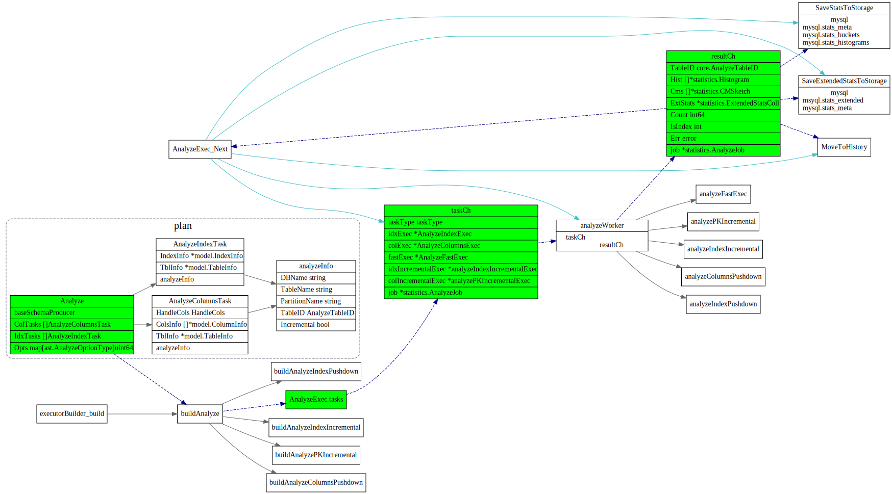
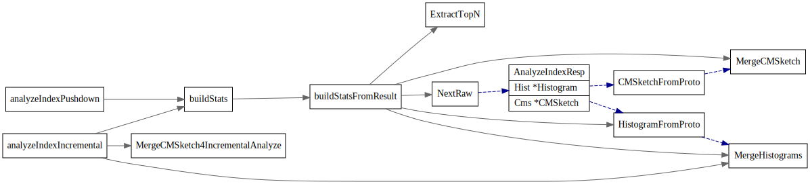
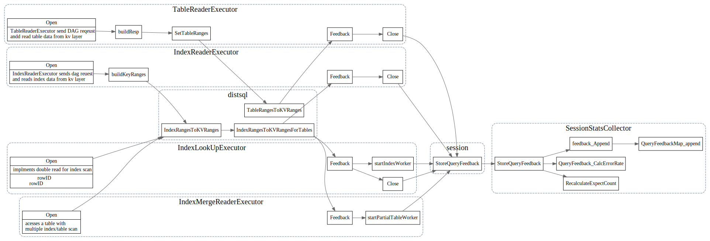
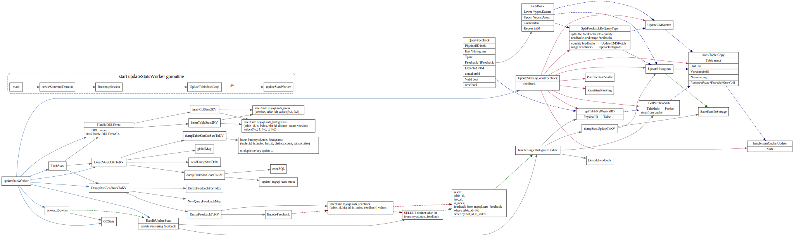

# 统计信息

<!-- toc -->

## 概念

在 TiDB 中，我们维护的统计信息包括表的总行数，列的等深直方图，Count-Min Sketch，Null 值的个数，平均长度，不同值的数目等等
用于快速估算代价。

### 等深直方图

相比于等宽直方图，等深直方图在最坏情况下也可以很好的保证误差
等深直方图，就是落入每个桶里的值数量尽量相等。

### CMSketch

Count-Min Sketch 是一种可以处理等值查询，Join 大小估计等的数据结构，并且可以提供很强的准确性保证。自 2003 年在文献 An improved data stream summary: The count-min sketch and its applications 中提出以来，由于其创建和使用的简单性获得了广泛的使用。

### FMSketch

## TiDB中实现

### Histogram

一个Histogram对应一个column或者index的统计信息。

```go
// Histogram represents statistics for a column or index.
type Histogram struct {
	ID        int64 // Column ID.
	NDV       int64 // Number of distinct values.
	NullCount int64 // Number of null values.
	// LastUpdateVersion is the version that this histogram updated last time.
	LastUpdateVersion uint64

	Tp *types.FieldType

	// Histogram elements.
	//
	// A bucket bound is the smallest and greatest values stored in the bucket. The lower and upper bound
	// are stored in one column.
	//
	// A bucket count is the number of items stored in all previous buckets and the current bucket.
	// Bucket counts are always in increasing order.
	//
	// A bucket repeat is the number of repeats of the bucket value, it can be used to find popular values.
	Bounds  *chunk.Chunk
	Buckets []Bucket

	// Used for estimating fraction of the interval [lower, upper] that lies within the [lower, value].
	// For some types like `Int`, we do not build it because we can get them directly from `Bounds`.
	scalars []scalar
	// TotColSize is the total column size for the histogram.
	// For unfixed-len types, it includes LEN and BYTE.
	TotColSize int64

	// Correlation is the statistical correlation between physical row ordering and logical ordering of
	// the column values. This ranges from -1 to +1, and it is only valid for Column histogram, not for
	// Index histogram.
	Correlation float64
}

// Bucket store the bucket count and repeat.
type Bucket struct {
	Count  int64
	Repeat int64
}

type scalar struct {
	lower        float64
	upper        float64
	commonPfxLen int // commonPfxLen is the common prefix length of the lower bound and upper bound when the value type is KindString or KindBytes.
}
```

### 统计信息存储

在TiDB中统计信息会存在几个表中

* `mysql.stats_meta`: 统计信息元信息
* `mysql.stats_histograms`: 统计信息直方图
* `mysql.stats_buckets` : 统计信息桶
* `mysql.stats_extended`
* `mysql.stats_feedback` : 收集的stats feedback， 会被定期apply到上面的表中


```sql
	// CreateStatsMetaTable stores the meta of table statistics.
	CreateStatsMetaTable = `CREATE TABLE IF NOT EXISTS mysql.stats_meta (
		version 		BIGINT(64) UNSIGNED NOT NULL,
		table_id 		BIGINT(64) NOT NULL,
		modify_count	BIGINT(64) NOT NULL DEFAULT 0,
		count 			BIGINT(64) UNSIGNED NOT NULL DEFAULT 0,
		INDEX idx_ver(version),
		UNIQUE INDEX tbl(table_id)
	);`

	// CreateStatsColsTable stores the statistics of table columns.
	CreateStatsColsTable = `CREATE TABLE IF NOT EXISTS mysql.stats_histograms (
		table_id 			BIGINT(64) NOT NULL,
		is_index 			TINYINT(2) NOT NULL,
		hist_id 			BIGINT(64) NOT NULL,
		distinct_count 		BIGINT(64) NOT NULL,
		null_count 			BIGINT(64) NOT NULL DEFAULT 0,
		tot_col_size 		BIGINT(64) NOT NULL DEFAULT 0,
		modify_count 		BIGINT(64) NOT NULL DEFAULT 0,
		version 			BIGINT(64) UNSIGNED NOT NULL DEFAULT 0,
		cm_sketch 			BLOB,
		stats_ver 			BIGINT(64) NOT NULL DEFAULT 0,
		flag 				BIGINT(64) NOT NULL DEFAULT 0,
		correlation 		DOUBLE NOT NULL DEFAULT 0,
		last_analyze_pos 	BLOB DEFAULT NULL,
		UNIQUE INDEX tbl(table_id, is_index, hist_id)
	);`

	// CreateStatsBucketsTable stores the histogram info for every table columns.
	CreateStatsBucketsTable = `CREATE TABLE IF NOT EXISTS mysql.stats_buckets (
		table_id 	BIGINT(64) NOT NULL,
		is_index 	TINYINT(2) NOT NULL,
		hist_id 	BIGINT(64) NOT NULL,
		bucket_id 	BIGINT(64) NOT NULL,
		count 		BIGINT(64) NOT NULL,
		repeats 	BIGINT(64) NOT NULL,
		upper_bound BLOB NOT NULL,
		lower_bound BLOB ,
		UNIQUE INDEX tbl(table_id, is_index, hist_id, bucket_id)
	);`

	// CreateStatsFeedbackTable stores the feedback info which is used to update stats.
	CreateStatsFeedbackTable = `CREATE TABLE IF NOT EXISTS mysql.stats_feedback (
		table_id 	BIGINT(64) NOT NULL,
		is_index 	TINYINT(2) NOT NULL,
		hist_id 	BIGINT(64) NOT NULL,
		feedback 	BLOB NOT NULL,
		INDEX hist(table_id, is_index, hist_id)

	// CreateStatsExtended stores the registered extended statistics.
	CreateStatsExtended = `CREATE TABLE IF NOT EXISTS mysql.stats_extended (
		stats_name varchar(32) NOT NULL,
		db varchar(32) NOT NULL,
		type tinyint(4) NOT NULL,
		table_id bigint(64) NOT NULL,
		column_ids varchar(32) NOT NULL,
		scalar_stats double DEFAULT NULL,
		blob_stats blob DEFAULT NULL,
		version bigint(64) unsigned NOT NULL,
		status tinyint(4) NOT NULL,
		PRIMARY KEY(stats_name, db),
		KEY idx_1 (table_id, status, version),
		KEY idx_2 (status, version)
	);`

	// CreateStatsTopNTable stores topn data of a cmsketch with top n.
	CreateStatsTopNTable = `CREATE TABLE IF NOT EXISTS mysql.stats_top_n (
		table_id 	BIGINT(64) NOT NULL,
		is_index 	TINYINT(2) NOT NULL,
		hist_id 	BIGINT(64) NOT NULL,
		value 		LONGBLOB,
		count 		BIGINT(64) UNSIGNED NOT NULL,
		INDEX tbl(table_id, is_index, hist_id)
	);`
```
#### 创建相关Table
这些SQL将由ddl worker owner在启动的时候执行, 创建相应的Table


#### 更新和使用相关Table

每个TiDB启动后，会调用UpdateTableStatsLoop，分别使用一个goroutine执行如下任务:

1. `autoAnalzeWorker` 定时触发autoAnaly worker, 根据一定规则触发执行`analyze table xxx`, 执行AnlyzeExec,会后将结果写入`mysql.stats_*`中。
2. `loadStatsWorker` 把`mysql.stat_*`信息定期加载到本地缓存中。
3. `updateStatsWorker` 将本地收集的feedback apply到自己的本地缓存上，并写入`mysql.stats_feedback`中，如果该节点是owner, 会将`mysql.stats_feedback`表中信息apply到 `mysql.stat_*`表中。


### 生成统计信息

#### AnalyzeExec

在执行 analyze 语句的时候，TiDB 会将 analyze 请求下推到每一个 Region 上，然后将每一个 Region 的结果合并起来。

Analyze 语句



#### analyzeColumnsPushdown


#### analyzeIndexPushdown



#### QueryFeedback

##### 收集QueryFeedback

Datasource对应的一些Executor: `TableReaderExecutor`, `IndexReaderExecutor`, 
`IndexLookupExecutor`, `IndexMergeReaderExecutor`
执行时候会生成一些feedback信息 

```go
// Feedback represents the total scan count in range [lower, upper).
type Feedback struct {
	Lower  *types.Datum
	Upper  *types.Datum
	Count  int64
	Repeat int64
}
// QueryFeedback is used to represent the query feedback info. It contains the query's scan ranges and number of rows
// in each range.
type QueryFeedback struct {
	PhysicalID int64
	Hist       *Histogram
	Tp         int
	Feedback   []Feedback
	Expected   int64 // Expected is the Expected scan count of corresponding query.
	actual     int64 // actual is the actual scan count of corresponding query.
	Valid      bool  // Valid represents the whether this query feedback is still Valid.
	desc       bool  // desc represents the corresponding query is desc scan.
}
```



###### TablesRangesToKVRanges
```go
// TablesRangesToKVRanges converts table ranges to "KeyRange".
func TablesRangesToKVRanges(tids []int64, ranges []*ranger.Range, fb *statistics.QueryFeedback) []kv.KeyRange {
	if fb == nil || fb.Hist == nil {
		return tableRangesToKVRangesWithoutSplit(tids, ranges)
	}
	krs := make([]kv.KeyRange, 0, len(ranges))
	feedbackRanges := make([]*ranger.Range, 0, len(ranges))
	for _, ran := range ranges {
		low := codec.EncodeInt(nil, ran.LowVal[0].GetInt64())
		high := codec.EncodeInt(nil, ran.HighVal[0].GetInt64())
		if ran.LowExclude {
			low = kv.Key(low).PrefixNext()
		}
		// If this range is split by histogram, then the high val will equal to one bucket's upper bound,
		// since we need to guarantee each range falls inside the exactly one bucket, `PrefixNext` will make the
		// high value greater than upper bound, so we store the range here.
		r := &ranger.Range{LowVal: []types.Datum{types.NewBytesDatum(low)},
			HighVal: []types.Datum{types.NewBytesDatum(high)}}
		feedbackRanges = append(feedbackRanges, r)

		if !ran.HighExclude {
			high = kv.Key(high).PrefixNext()
		}
		for _, tid := range tids {
			startKey := tablecodec.EncodeRowKey(tid, low)
			endKey := tablecodec.EncodeRowKey(tid, high)
			krs = append(krs, kv.KeyRange{StartKey: startKey, EndKey: endKey})
		}
	}
	fb.StoreRanges(feedbackRanges)
	return krs
}
```

这些信息会先插入到一个QueryFeedbackMap的一个队列中，
后面的`updateStatsWorker` 定期apply 这些feedback到自己的cache中。以及将这些
feedback apply到`mysql.stats_*`中


##### apply feedback locally



#### apply feedback 

每个TiDB会将本地搜集到的feedback插到`mysql.stats_feedback`中，然后
由owner将表`mysql.stats_feedback`插入
`mysql.stats_histograms`, `msyql.stats_buckets`等表。


##### UpdateHistogram

没怎么看明白这块算法。


### 使用统计信息


#### 加载统计信息
从mysql.stats_*表中加载信息。

每个TiDB server有个goroutine 周期性的更新stat信息
Handle can update stats info periodically.


在TiDB启动时候，会启动一个goroutine, loadStatsWorker


Update, 更新statsCache


加载载table的Histogram和CMSketch tableStatsFromStorage


#### Selectivity

#### StatsNode
```go
// StatsNode is used for calculating selectivity.
type StatsNode struct {
	Tp int
	ID int64
	// mask is a bit pattern whose ith bit will indicate whether the ith expression is covered by this index/column.
	mask int64
	// Ranges contains all the Ranges we got.
	Ranges []*ranger.Range
	// Selectivity indicates the Selectivity of this column/index.
	Selectivity float64
	// numCols is the number of columns contained in the index or column(which is always 1).
	numCols int
	// partCover indicates whether the bit in the mask is for a full cover or partial cover. It is only true
	// when the condition is a DNF expression on index, and the expression is not totally extracted as access condition.
	partCover bool
}
```

```go
// Selectivity is a function calculate the selectivity of the expressions.
// The definition of selectivity is (row count after filter / row count before filter).
// And exprs must be CNF now, in other words, `exprs[0] and exprs[1] and ... and exprs[len - 1]` should be held when you call this.
// Currently the time complexity is o(n^2).
```

Selectivity: 
1. 计算表达式的ranges: ExtractColumnsFromExpressions

questions:
1. correlated column 是什么意思？
2. maskCovered作用是什么
3. statsNode的作用是什么


## 参考

1. [TiDB 源码阅读系列文章（十二）统计信息(上)](https://pingcap.com/blog-cn/tidb-source-code-reading-12/)
2. [TiDB 源码阅读系列文章（十四）统计信息（下)](https://pingcap.com/blog-cn/tidb-source-code-reading-14/)
3. [TiDB统计信息原理简介与实践](https://asktug.com/t/topic/37691)
