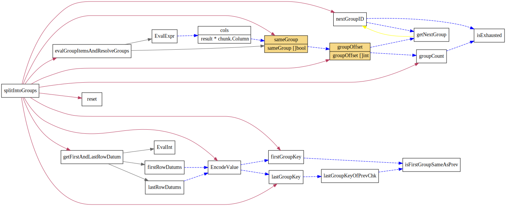

# Stream Agg
<!-- toc -->

## StreamAggExec

```go
// StreamAggExec deals with all the aggregate functions.
// It assumes all the input data is sorted by group by key.
// When Next() is called, it will return a result for the same group.
```

<!--  -->

TODO: 这个地方加一些描述


## vecGroupChecker

TODO: 这个地方加一些描述

