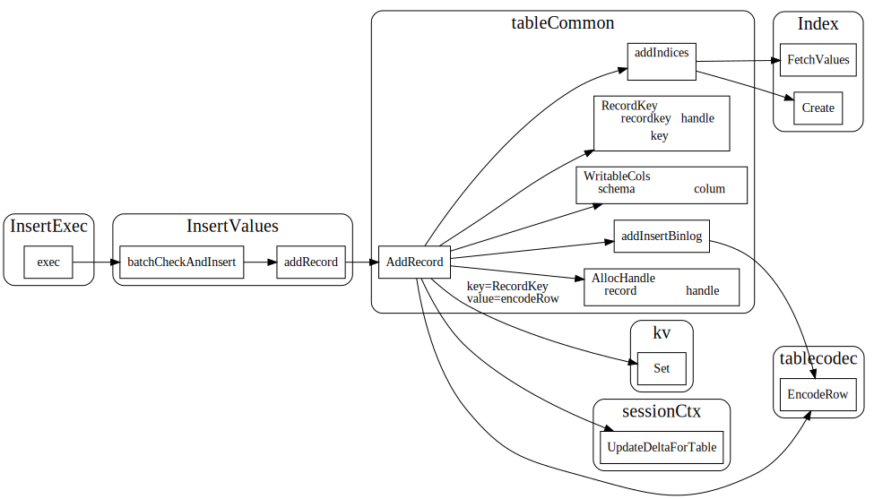
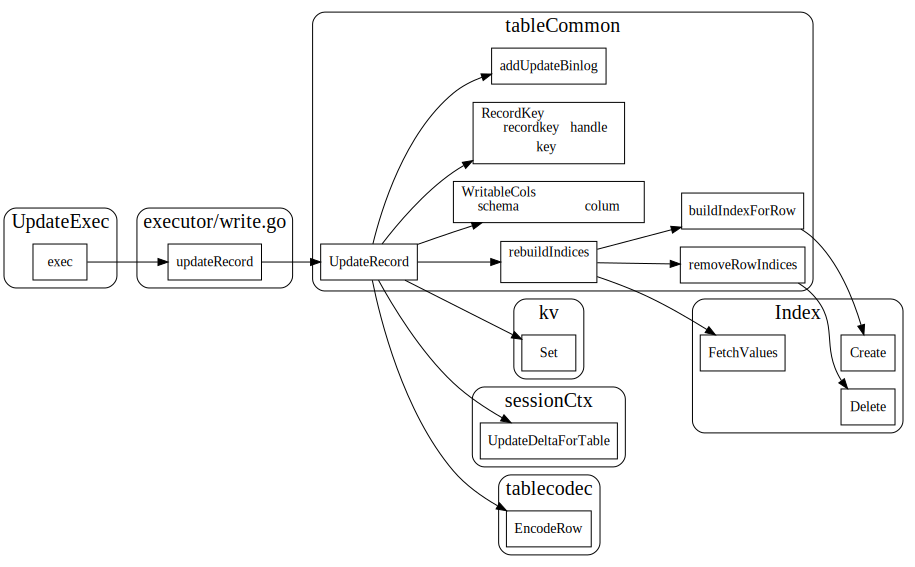
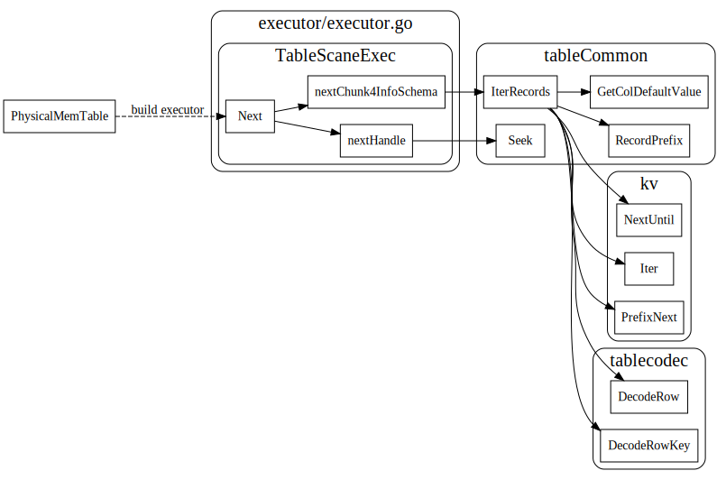

# Table

## table interface


## TableID的分配

tableID，PhyicalID

## 从table 到kv

```go
var (
	tablePrefix     = []byte{'t'}
	recordPrefixSep = []byte("_r")
	indexPrefixSep  = []byte("_i")
)
```
```go
// GenTableRecordPrefix composes record prefix with tableID: "t[tableID]_r".
func GenTableRecordPrefix(tableID int64) kv.Key {
	buf := make([]byte, 0, len(tablePrefix)+8+len(recordPrefixSep))
	return appendTableRecordPrefix(buf, tableID)
}
```
```go
// GenTableIndexPrefix composes index prefix with tableID: "t[tableID]_i".
func GenTableIndexPrefix(tableID int64) kv.Key {
	buf := make([]byte, 0, len(tablePrefix)+8+len(indexPrefixSep))
	return appendTableIndexPrefix(buf, tableID)
}
```

```go

// GenTablePrefix composes table record and index prefix: "t[tableID]".
func GenTablePrefix(tableID int64) kv.Key {
	buf := make([]byte, 0, len(tablePrefix)+8)
	buf = append(buf, tablePrefix...)
	buf = codec.EncodeInt(buf, tableID)
	return buf
}
```

## table的增删改查

### AddRecord


### UpdateRecord


### RemoveRecord


### IterRecords




