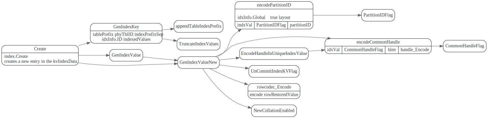

# table/index存储编码

<!-- toc -->

## RowKey

Rowkey形式如下
```
{tablePrefix}{tableID}{recordPrefixSep}{handle.Encode()}
```
prefix 常量值如下:
```go
var (
	tablePrefix     = []byte{'t'}
	recordPrefixSep = []byte("_r")
	indexPrefixSep  = []byte("_i")
	metaPrefix      = []byte{'m'}
)
```


### Handle

Handle is the ID of a row, 主要类型有：CommonHandle, IntHandle,  PartitionHandle

CommonHandle 指非整形的handle 比如string等, IntHandle是int64的handle
PartitionHandle 增加了一个PartitionID 字段

```go
// Handle is the ID of a row.
type Handle interface {
	// IsInt returns if the handle type is int64.
	IsInt() bool
	// IntValue returns the int64 value if IsInt is true, it panics if IsInt returns false.
	IntValue() int64
	// Next returns the minimum handle that is greater than this handle.
	Next() Handle
	// Equal returns if the handle equals to another handle, it panics if the types are different.
	Equal(h Handle) bool
	// Compare returns the comparison result of the two handles, it panics if the types are different.
	Compare(h Handle) int
	// Encoded returns the encoded bytes.
	Encoded() []byte
	// Len returns the length of the encoded bytes.
	Len() int
	// NumCols returns the number of columns of the handle,
	NumCols() int
	// EncodedCol returns the encoded column value at the given column index.
	EncodedCol(idx int) []byte
	// Data returns the data of all columns of a handle.
	Data() ([]types.Datum, error)
	// String implements the fmt.Stringer interface.
	String() string
}
```

#### CommanHandle
```go
// CommonHandle implements the Handle interface for non-int64 type handle.
type CommonHandle struct {
	encoded       []byte
	colEndOffsets []uint16
}
```

#### PartitionHandle

PartitionHandle 用于GlobalIndex

```go
type PartitionHandle struct {
	Handle
	PartitionID int64
}
```

#### IntHandle
```go
type IntHandle int64
```

## Index

### IndexKey

indexKey形式如下:

```
{tablePrefix}{phyTblID}{indexPrefixSep}{idxInfo.ID}{indexedValues}
```
一般的local index phyTblID用的是分区table对应的Physical table ID


### Global Index

如果是GlobalIndex，phyTblID 则用的是tablInfo.ID, 真实的ParitionID会被编码到IndexKey的value中.
```go
// GenIndexKey generates storage key for index values. Returned distinct indicates whether the
// indexed values should be distinct in storage (i.e. whether handle is encoded in the key).
func (c *index) GenIndexKey(sc *stmtctx.StatementContext, indexedValues []types.Datum, h kv.Handle, buf []byte) (key []byte, distinct bool, err error) {
	idxTblID := c.phyTblID
	if c.idxInfo.Global {
		idxTblID = c.tblInfo.ID
	}
	return tablecodec.GenIndexKey(sc, c.tblInfo, c.idxInfo, idxTblID, indexedValues, h, buf)
}
```

在``PartitionHandlesToKVRanges``中则会使用partitionID来计算handle的RowKey


### Index Value Layout





## DecodeIndexKV


## IndexType

TiDB 中IndexType是为了兼容MySQL语法而设置的，在实际起到什么作用。

```
	IndexTypeBtree
	IndexTypeHash
	IndexTypeRtree
```

## 参考:

1. [三篇文章了解 TiDB 技术内幕 - 说计算](https://pingcap.com/blog-cn/tidb-internal-2/)
2. [Proposal: Support global index for partition table](https://github.com/pingcap/tidb/blob/master/docs/design/2020-08-04-global-index.md)
3. [2.0解析系列 | 一文详解 OceanBase 2.0 的“全局索引”功能](https://zhuanlan.zhihu.com/p/48745358)
