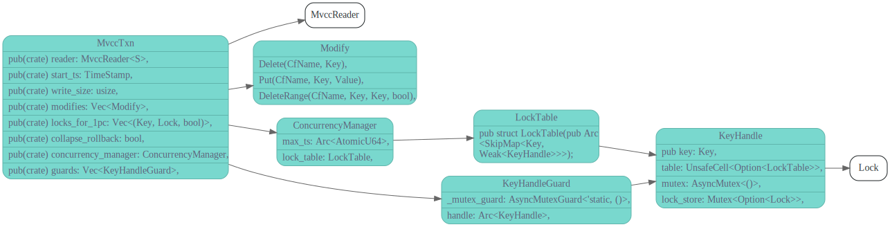
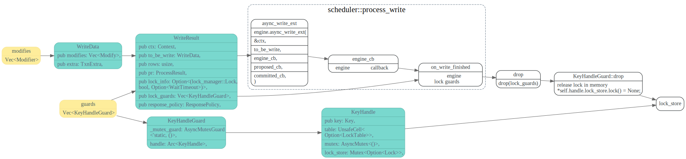

# MvccTxn

<!-- toc -->

## MvccTxn DataStruct

## MvccTxn fn

最后的修改会暂存在modifies成员变量中。

## modifies and guards 后续处理

不太明白，为什么调用`KeyHandleGuard::drop`就算是释放锁了

## key check
read_key_check
read_range_check

key guard会在哪些地方被用到呢？
那个地方会check lock ?
lock guard 只对read有效？
为什么不直接从table中删掉key呢?
因为这样搞的话，需要对整个table上lock吗？

往lock table里面插数据是aysnc 单线程的？

