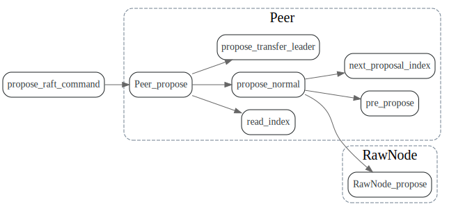
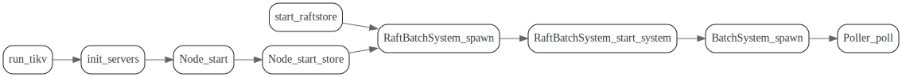

# PeerFsm

<!-- toc -->

## Data struct

## RaftPoller

TiKV调用RawNode的地方

### tick

谁在发送PeerMsg Tick呢？

### ready

谁触发了ready 呢？

### advance_append

谁发送了`PeerMsg::ApplyRes` ?

### step

从kv grpc接口发送的消息，最后发送到了RawNode_step

### proposal

## poller

谁在向poller的fsm_receiver中发消息呢？

猜测router负责使用tx发送消息,system 从rx中接收消息，然后处理消息。

## RaftBatchSystem

## mailBox
