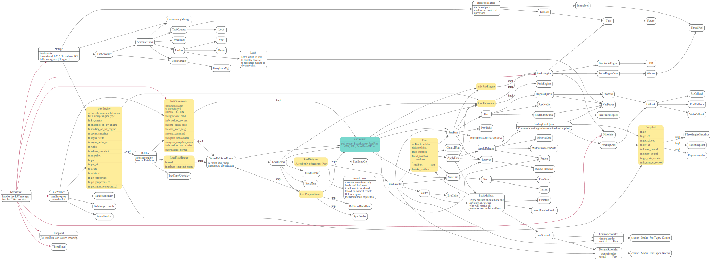
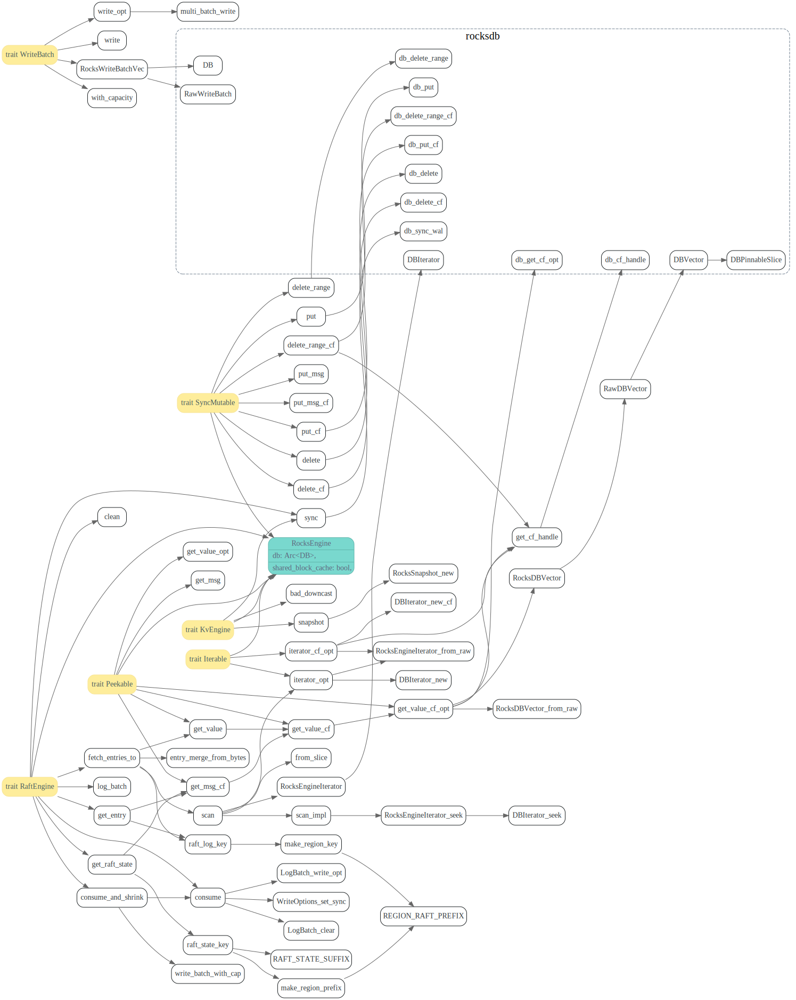

# PeerFsm

<!-- toc -->

## raft-rs

TiKV调用RawNode的地方


### tick


谁在发送PeerMsg Tick呢？


### ready


谁触发了ready 呢？

write batch是在什么时候apply的？为什么？

### 处理`Apply<EK::Snapshot>`


### handle raft log


handle_raft_ready里面

```
        if !ready.entries().is_empty() {
            self.append(&mut ctx, ready.take_entries(), ready_ctx)?;
        }
```

### 处理 `ApplyRes<Ek::Shapshot>`


### advance_append


谁发送了`PeerMsg::ApplyRes` ?

### step

从kv grpc接口发送的消息，最后发送到了RawNode_step


### propose


### readIndex

kv get


LocalReader_read


propose read index


apply reads


### LeaseRead

#### PeerMsg::RaftCommand


## kv Service




[TiKV 源码解析系列文章（十一）Storage - 事务控制层](https://pingcap.com/blog-cn/tikv-source-code-reading-11/)

### ServerRaftStoreRouter


## RocksEngine




### RocksSnapshot

### RocksWriteBatch


### RaftLogBatch

## Node

## RaftLog

