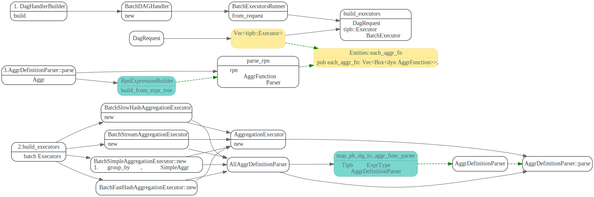
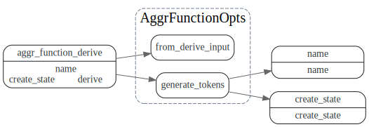
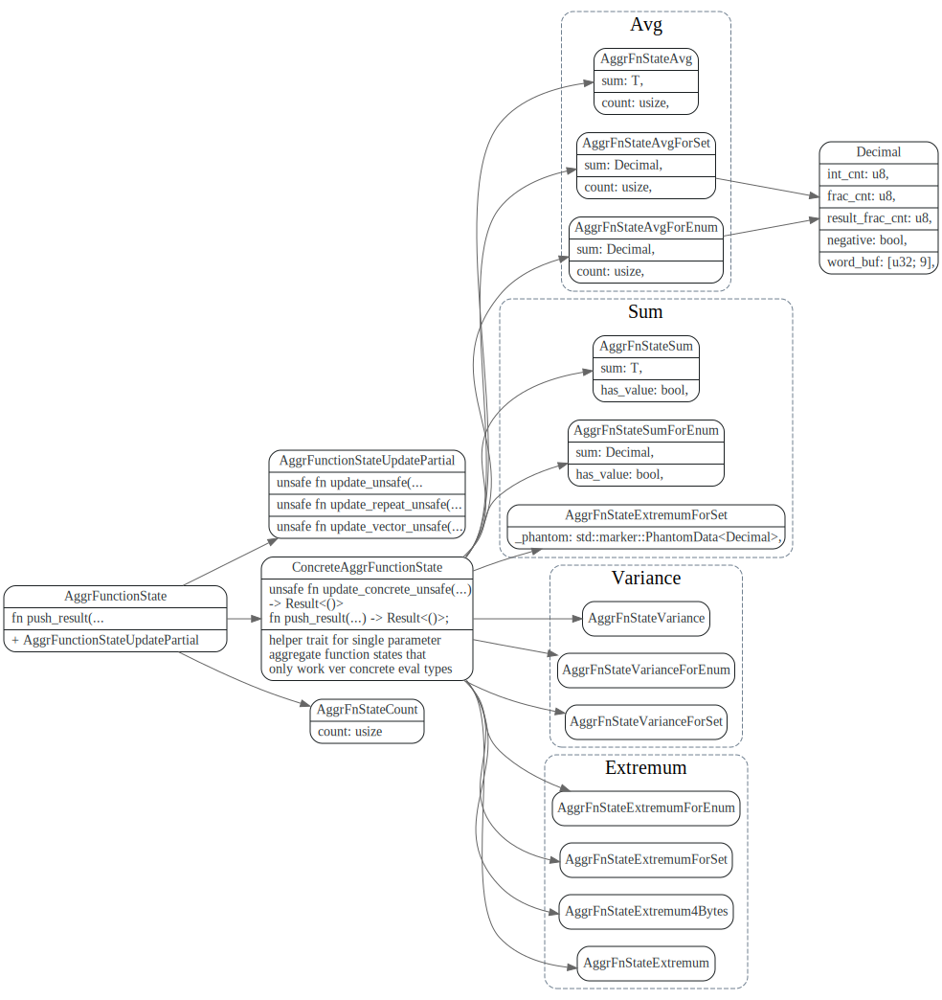

# AggrFunction

在build_executors时，会将DagRequest中的tipb::Executors 解析为AggrFunction
存放在Entities.each_aggr_fn Vec中.

```rust
pub trait AggrFunction: std::fmt::Debug + Send + 'static {
    /// The display name of the function.
    fn name(&self) -> &'static str;

    /// Creates a new state instance. Different states aggregate independently.
    fn create_state(&self) -> Box<dyn AggrFunctionState>;
}
```



### AggrFunctionState

AggrFunctionState 由AggrFunction::create_state创建.
定义了一个derive, aggr_function, 用来自动生成create_state

```rust
#[derive(Debug, AggrFunction)]
#[aggr_function(state = AggrFnStateAvg::<T>::new())]
pub struct AggrFnAvg<T>
where
    T: Summable,
    VectorValue: VectorValueExt<T>,
{
    _phantom: std::marker::PhantomData<T>,
}
```




