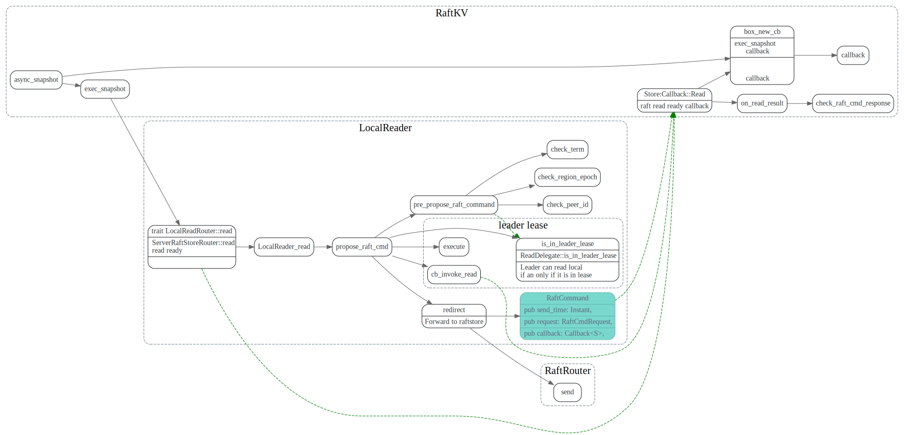
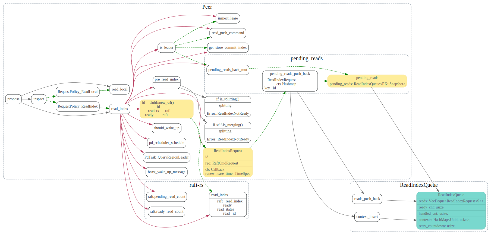
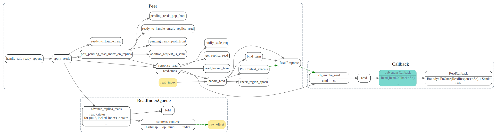

# async snapshot


## Engine::async_snapshot

检查是否在leader lease, 或者发送给raftstore, 等待readIndex ready callback



### in leader lease

如果是在leader lease，可以直接从store中读数据，返回给客户端
是怎么判断in leader lease的？
和后面的read local是什么关系呢？


### RaftRouter::send

不在leader lease需要发给Raft来处理


## PeerFsmDelegate_handle_RaftCommand

消息会由RaftPoller取出，由`PeerFsmDelegate::handle_normals`来处理
做一些检查，然后调用`Peer::propose`

## Peer::propose

### inspect

检查是否可以read_local还需要走read_index
根据是否在leader lease来确定RequestPolicy是ReadIndex还是ReadLocal


### read local

read local就直接使用kv的snapshot，然后调用在exec_snapshot中设置的回调函数，
该回调接着往上回调，直到使用callback/future pair来触发future，通知grpc的
异步任务返回结果给client.


### read index

有个ReadIndexQueue, 保存了callback, 和传给raft_rs层的Uuid




这个地方没怎么看明白

```rust
        if self.is_leader() {
            match self.inspect_lease() {
                // Here combine the new read request with the previous one even if the lease expired is
                // ok because in this case, the previous read index must be sent out with a valid
                // lease instead of a suspect lease. So there must no pending transfer-leader proposals
                // before or after the previous read index, and the lease can be renewed when get
                // heartbeat responses.
                LeaseState::Valid | LeaseState::Expired => {
                    // Must use the commit index of `PeerStorage` instead of the commit index
                    // in raft-rs which may be greater than the former one.
                    // For more details, see the annotations above `on_leader_commit_idx_changed`.
                    let commit_index = self.get_store().commit_index();
                    if let Some(read) = self.pending_reads.back_mut() {
                        let max_lease = poll_ctx.cfg.raft_store_max_leader_lease();
                        if read.renew_lease_time + max_lease > renew_lease_time {
                            read.push_command(req, cb, commit_index);
                            return false;
                        }
                    }
                }
                // If the current lease is suspect, new read requests can't be appended into
                // `pending_reads` because if the leader is transferred, the latest read could
                // be dirty.
                _ => {}
            }
        }
  ```

## read ready callback

### Peer::apply_reads

每次处理完raft消息后，都会调用collect_ready，获取raft中ready states，
然后更新pendin_reads队列，对于leader可以检查下applied term, 
对于follower，要等到自己的applied index > read_index 才行。




```rust
        if !self.is_leader() {
            // NOTE: there could still be some pending reads proposed by the peer when it was
            // leader. They will be cleared in `clear_uncommitted_on_role_change` later in
            // the function.
            self.pending_reads.advance_replica_reads(states);
            self.post_pending_read_index_on_replica(ctx);
        } else {
            self.pending_reads.advance_leader_reads(states);
            propose_time = self.pending_reads.last_ready().map(|r| r.renew_lease_time);
            if self.ready_to_handle_read() {
                while let Some(mut read) = self.pending_reads.pop_front() {
                    self.response_read(&mut read, ctx, false);
                }
            }
```

follower等自己applied到read_index后才会invoke_read调用回调。

```rust
    fn ready_to_handle_unsafe_replica_read(&self, read_index: u64) -> bool {
        // Wait until the follower applies all values before the read. There is still a
        // problem if the leader applies fewer values than the follower, the follower read
        // could get a newer value, and after that, the leader may read a stale value,
        // which violates linearizability.
        self.get_store().applied_index() >= read_index
            // If it is in pending merge state(i.e. applied PrepareMerge), the data may be stale.
            // TODO: Add a test to cover this case
            && self.pending_merge_state.is_none()
            // a peer which is applying snapshot will clean up its data and ingest a snapshot file,
            // during between the two operations a replica read could read empty data.
            && !self.is_applying_snapshot()
    }
```

### Peer::response_read
