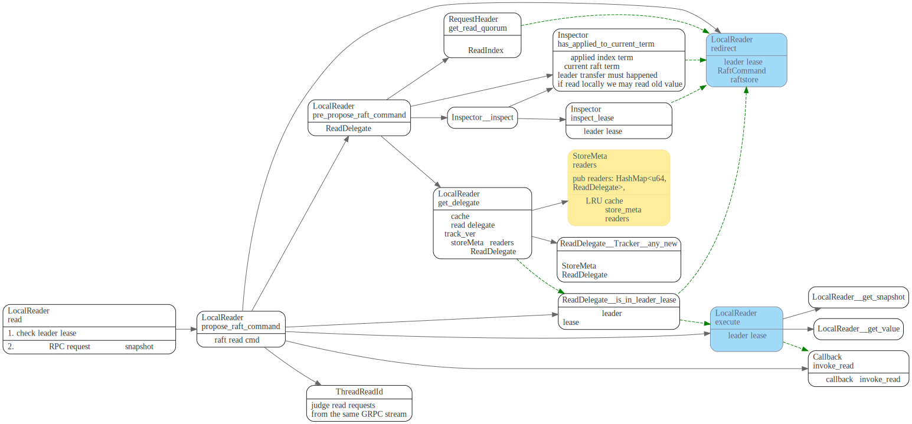
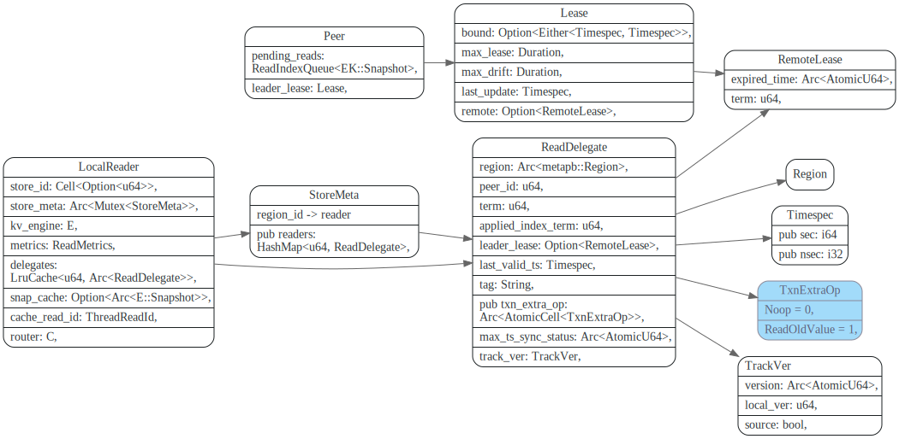
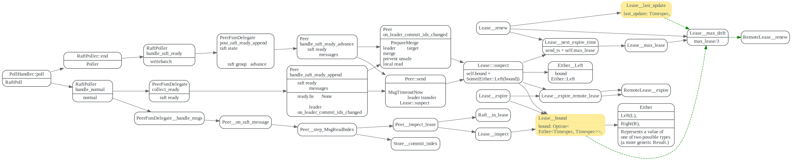

# Async Snapshot

<!-- toc -->

## async snapshot

async snapshot最终会调到LocalReader::read方法, 如果可以local read(根据当前leader
lease是否过期，request是否强制要求走readIndex等来判断）
就直接使用当前kv engine的snapshot. 否则就需要走一次read index,

使用router将readIndex请求发给regionId对应的PeerFsm.


## LocalReader

LocalReader数据结构关系图如下, 它引用了SotreMeta，用来获取regionID对应的ReadDelegate,
然后根据ReadDelegate,来判断能否直接local read.


LocalReader 首先会检查是否还在leader lease内，不在leader lease内,
会将raft 请求redirct给PeerFsm来处理。

在leader lease内的read request
会直接用自己的kv engine snapshot，并且对于同一个Grpc stream request
（使用ThreadReadId 来标识）会用同一个snapshot.

LocalReader 检查leader lease主要靠regionId对应的ReadDelegate中的RemoteLease, 
而ReadDelegate 是集中放在`StoreMeta::reads`中的，为了避免每次需要用lock来访问
`SotreMeta::reads`, LocalReader加了一层LruCache.

// TODO: 为啥？
注意这里面的`Inspector::inspect_lease` 
只检查了`ReadDelegate::leader_lease`是否为None.
在后面read时候，才会去真正检查是否是validate.

但是搜了代码，貌似没被钓到过。




`LocalReader::get_delegate` 先看LRU cache中是否有regionID对应的ReadDelegate, 
如果没有，或者ReadDelegate的`track_ver`发生了变化， 则需要加锁然后从StoreMeta.readers
获取最新ReadDelegate


### ThreadReadId

tikv 用ThreadReadId来判断reads是否from 同一个GRPC Stream，比如下面的KvService中的`batch_commands` stream接口中的read request会用同一个ThreadReadId

为什么coprocessor 那而没有用ThreadReadID?


在LocalReader `get_snapshot`时，如果`cache_read_id` == `read_id`
则直接返回`snap_cache`, 否则就调用`kv_engine::snapshot` ，并更新`snap_cache`
和`cache_read_id`


### ReadDelegate

StoreMeta的readers保存了regionID -> ReadDelegate的映射。而LocalReader的则有一份`delegates` 保存了
一些ReadDelegate的cache.




TrackVer则用判断ReadDelegate是否发生了变化, 里面的version是个Atomic Arc, 保存当前最新版本，在TrackVer被clone时，
`local_ver` 会保存当前version最新版本。ReadDelegate update时候，会将Atomic version inc 1.

```rust
impl Clone for TrackVer {
    fn clone(&self) -> Self {
        TrackVer {
            version: Arc::clone(&self.version),
            local_ver: self.version.load(Ordering::Relaxed),
            source: false,
        }
    }
```

ReadDelegate update, 会更新TrackVer,这样LocalReader 就会知道自己LRU Cache中的
ReadDelegate过期了，会重新加载ReadDelegate.

## 参考文献

1. [TiKV 功能介绍 - Lease Read](https://pingcap.com/zh/blog/lease-read)


# draft

```
lease = max_lease - (commit_ts - send_ts)

raft_store_max_leader_lease: ReadableDuration::secs(9),
```
lease和split/merge之间也有相互影响

lease 的bound是啥？ `max_drift`起到的作用是？
`max_lease`是9s, election timeout是10

为什么要引入supsect这个状态呢？直接设置为Invalid 不可以吗？

LeaseState有`Suspect`, `Valid`, `Expired`三种状态



这里面的ts 需要使用`monotonic_raw_now`, 具体原因是？

## ReadIndex

这个corner case不是很明白，为什么新的leader的commit index不是最新的？

> 但这里，需要注意，实现 ReadIndex 的时候有一个 corner case，在 etcd 和 TiKV 最初实现的时候，我们都没有注意到。也就是 leader 刚通过选举成为 leader 的时候，这时候的 commit index 并不能够保证是当前整个系统最新的 commit index，所以 Raft 要求当 leader 选举成功之后，首先提交一个 no-op 的 entry，保证 leader 的 commit index 成为最新的。

> 所以，如果在 no-op 的 entry 还没提交成功之前，leader 是不能够处理 ReadIndex 的。但之前 etcd 和 TiKV 的实现都没有注意到这个情况，也就是有 bug。解决的方法也很简单，因为 leader 在选举成功之后，term 一定会增加，在处理 ReadIndex 的时候，如果当前最新的 commit log 的 term 还没到新的 term，就会一直等待跟新的 term 一致，也就是 no-op entry 提交之后，才可以对外处理 ReadIndex。


## Follower read

## 参考文献

> TiKV 的 lease read 实现在原理上面跟 Raft 论文上面的一样，但实现细节上面有些差别，我们并没有通过 heartbeat 来更新 lease，

> 而是通过写操作。对于任何的写入操作，都会走一次 Raft log，所以我们在 propose 这次 write 请求的时候，记录下当前的时间戳 start，然后等到对应的请求 apply 之后，我们就可以续约 leader 的 lease。当然实际实现还有很多细节需要考虑的，譬如：

1. [TiKV 功能介绍 - Lease Read](https://pingcap.com/zh/blog/lease-read)

