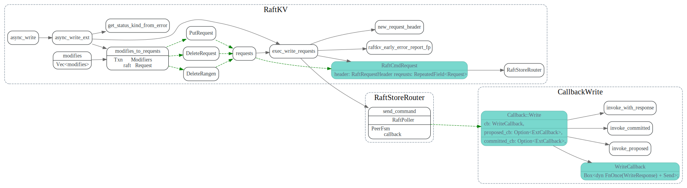
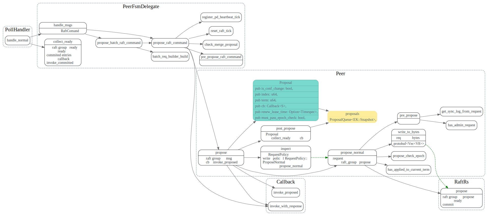

# async write

<!-- toc -->

## RaftKV::async_write

发送消息给raftStore,并等待回调。

txn的modifies 转换为RaftCmdRequest， 发往RaftStore
然后RaftStore在处理该消息调用回调.

## RaftRouter::send_command

//TODO

## PeerFsmDelegate::handle_msgs

## PeerFsmDelegate::collect_ready

## ApplyFsm::handle_tasks

