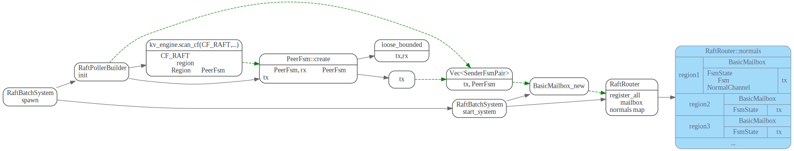
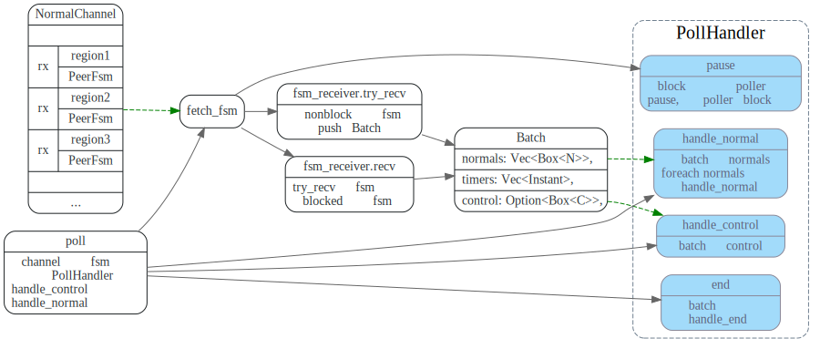
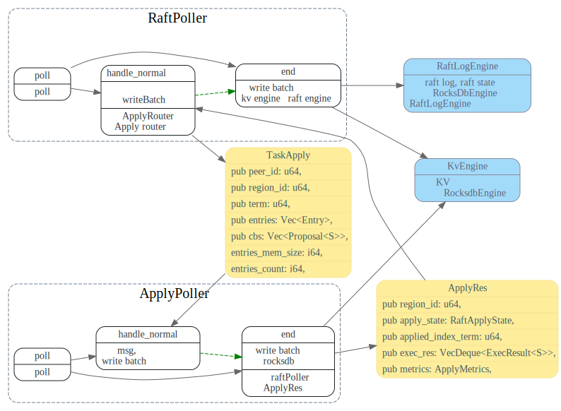

# BatchSystem

<!-- toc -->

## BatchSystem init


## Router normals 初始化

RaftPollerBuilder::init 扫描kv engine的`CF_RAFT` faimly, 加载所有的Region.
对于每个Region,调用PeerFsm::create 创建一个PeerFsm以及用来和它通信的
`loose_bounded`，tx部分则会放入BasicMailbox，然后放到RaftRouter的normals map中。

代码调用流程如下图：




## 消息发送处理流程

TODO: 怎么根据key找到对应的regionID ?这个流程需要明确下.

给某个`region_id`的PeerFsm发送PeerMsg流程如下：

1. 通过RaftRouter找到`region_id`对应的mailbox，并通过mailbox发送到PeerFsm 的msg channel
2. 如果Mailbox中的FsmState是Idle, 则需要用`RaftRouter::normalScheduler` 将PeerFsm发送到NormalChannel

消息处理流程如下：
1. poller线程池poll时，从调用`fetch_fsm` 从Normal Channel读取一批PeerFsm
2. poller调用RaftPoller.begin 开始处理这批PeerFsm的消息。
3. poller从这批PeerFsm 每个rx中unblock方式读取PeerFsm要处理的PeerMsg，由`RaftPoller::handle_normals`处理消息。
将修改写入write batch.
4. poller在一批消息处理完毕后，调用RaftPoller.end, 将write batch等写入磁盘中


## `Router::try_send` 发送消息给Fsm

poller线程工作主要流程是从channel中去fetch 一批fsm，然后再从每个fsm的rx中取消息，处理消息。
为了保证发消息给fsm后，fsm能被poller fetch到，需要将fsm
发送到poller的channel中(使用FsmScheduler来发送)。

为了避免重复的将fsm发送到channel中，TiKV中封装了一个BasicMailbox，
在发给fsm消息的tx上，加了一个FsmState, 用来标记Fsm.

Notified表示已经发送到poller的channel，Idle则表示还没有，在BasicMailbox在发消息时，
如果FsmState为Idle, 则还需要使用FsmScheduler将fsm发送到poller的channel。

```rust
pub struct BasicMailbox<Owner: Fsm> {
    sender: mpsc::LooseBoundedSender<Owner::Message>,
    state: Arc<FsmState<Owner>>,
}
```


## Poller




PollHandler的实现有RaftPoller和ApplyPoller, RaftPoller负责处理RaftCmd和RaftMessage, raft log的保存，
以及驱动raft的状态机。 raft 日志被committed后，交给ApplyPoller来处理。

ApplyPoller将key,value的修改写入KvEngine, 会发送ApplyRes给RaftPoller，告知Apply 结果.



### RaftPoller


### ApplyPoller


