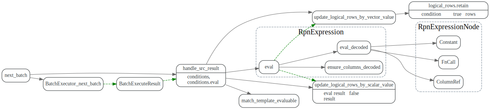

# BatchExecutor

<!-- toc -->

## Scan executor

Scan executor负责从Storage中扫描读数据，最底层的是RangesScanner，它使用Storage
的point_get 或者scan, 从storage iter数据。

`ScanExecutor`封装了一些公用代码，`TableScanExectuorImpl`和`IndexScanExecutorImpl`
分别用来做扫表和扫index.

### ScanExecutor::next_batch

迭代读取`scan_rows`行数据，每次调用`RangesScanner::next`从
`Storage`中读取kv数据, 然后调用impl的`process_kv_pair`处理kv数据.
并放入`LazyBatchColumnVec`中，最后返回给上层调用者。

### RangesScanner::next

从storage中读取数据

## Selection

调用Src BatchExecutor的next_batch, 获取数据，然后对于自己的每个condition
调用 RpnExpression::eval, 计算condition的结果，然后只保留condition为true的
logical rows.

### next_batch

## Agg executor

