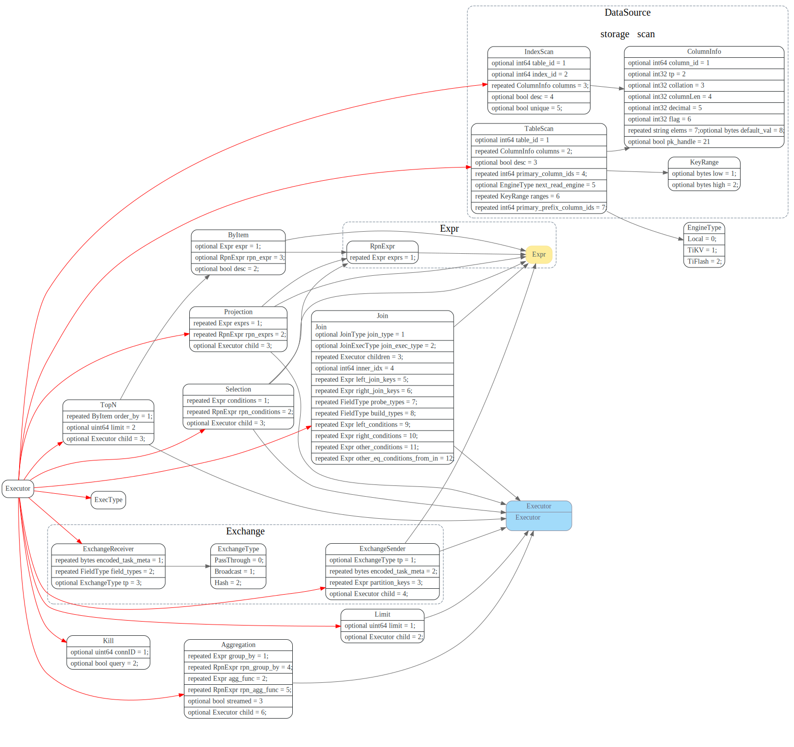
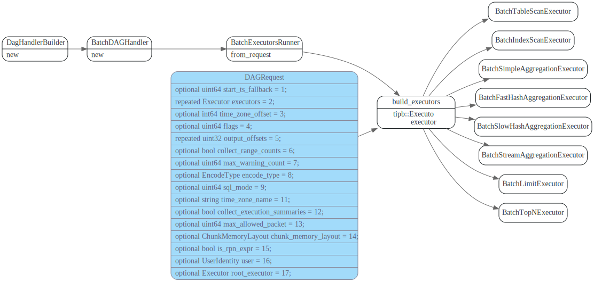
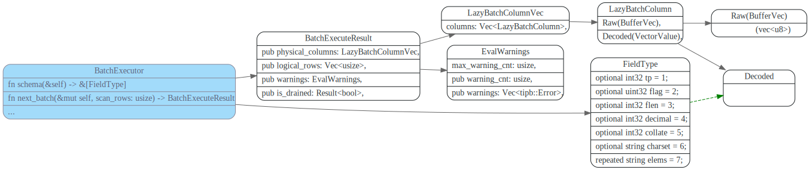
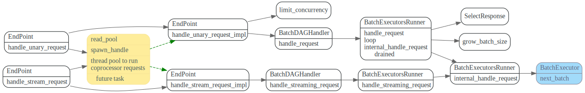

# BatchExecutor

<!-- toc -->

## Executor proto

tipb proto中定义的Executor 关系如下

其中TableScan和IndexScan是最底层的Executor, 从Storage can key range的数据，供上层(Selection等）其他Executor使用。



## build_executors

build_executors 根据tipb中定义的Executor 创建对应的BatchExecutor
```rust
#[allow(clippy::explicit_counter_loop)]
pub fn build_executors<S: Storage + 'static>(
    executor_descriptors: Vec<tipb::Executor>,
    storage: S,
    ranges: Vec<KeyRange>,
    config: Arc<EvalConfig>,
    is_scanned_range_aware: bool,
) -> Result<Box<dyn BatchExecutor<StorageStats = S::Statistics>>> {

    match first_ed.get_tp() {

        ExecType::TypeTableScan => {
        //...
```

参数中的`executor_descriptors`数组，第i个是第i+1个的child Executor, 
且第一个为TableScan或者IndexScan。





## BatchExecutor Trait

BatchExecutor定义了Executor的基本接口, 其中的`next_batch`用来
从child Executor中获取数据。

数据格式为`LazyBatchColumnVec`




```rust
impl<C: ExecSummaryCollector + Send, T: BatchExecutor> BatchExecutor
    for WithSummaryCollector<C, T>
{
    type StorageStats = T::StorageStats;

    fn schema(&self) -> &[FieldType] {
        self.inner.schema()
    }

    fn next_batch(&mut self, scan_rows: usize) -> BatchExecuteResult {
        let timer = self.summary_collector.on_start_iterate();
        let result = self.inner.next_batch(scan_rows);
        self.summary_collector
            .on_finish_iterate(timer, result.logical_rows.len());
        result
    }

    fn collect_exec_stats(&mut self, dest: &mut ExecuteStats) {
        self.summary_collector
            .collect(&mut dest.summary_per_executor);
        self.inner.collect_exec_stats(dest);
    }

    fn collect_storage_stats(&mut self, dest: &mut Self::StorageStats) {
        self.inner.collect_storage_stats(dest);
    }

    fn take_scanned_range(&mut self) -> IntervalRange {
        self.inner.take_scanned_range()
    }

    fn can_be_cached(&self) -> bool {
        self.inner.can_be_cached()
    }
}
```

## BatchExecutorsRunner

### call next_batch



