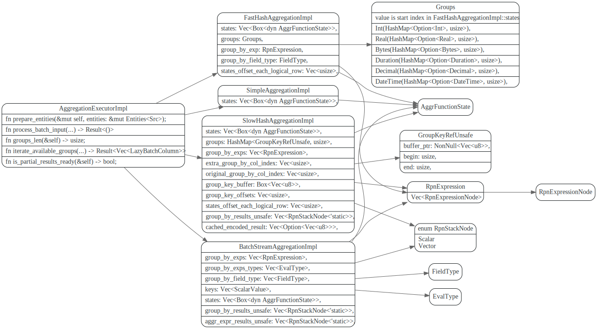
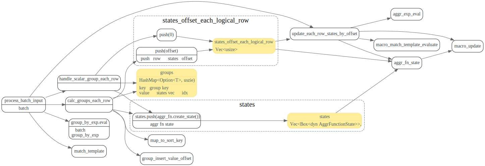
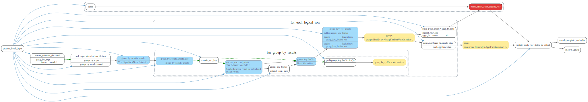
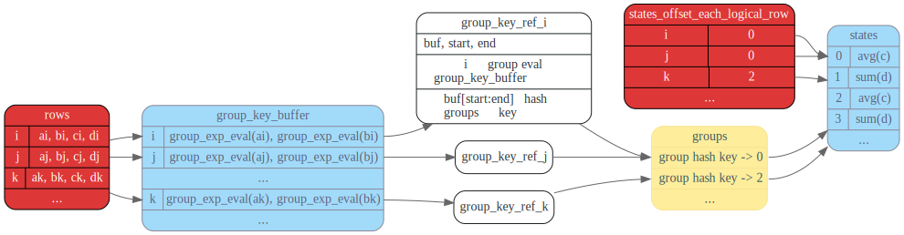

# Agg executor


## next_batch


## AggregationExecutorImpl

对应四种实现，每个里面都有个states 是`Vec<Box<dyn AggrFunctionState>>`
用来保存aggr state (比如avg 的state需要保存sum和count).



`SimpleAggregationImpl` 是没有group by 的，比如下面这种SQL。
```sql
select count(*) from table
```

## SimpleAggregationImpl

这个没有groupby


## FastHashAggregationImpl

这个只有一个group by expr



## SlowHashAggregationImpl
有多个group by expr




假设数据有四列`a`,`b`,`c`,`d`, 执行

```sql
select 
  exp_1(a), exp_2(b), avg(c), sum(d) 
from t 
group by 
  exp_1(a), exp_2(b)
```
slow hash agg中相关数据结构关系如下:



## BatchStreamAggregationImpl

假定已排好序


stream agg中相关数据结构关系如下:


