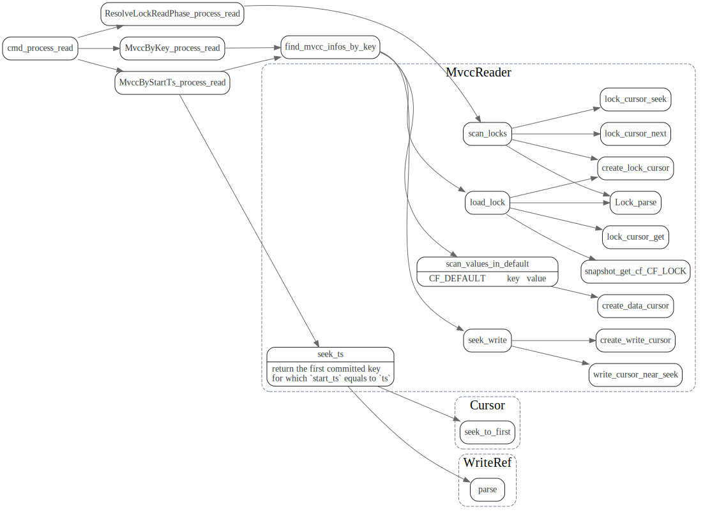
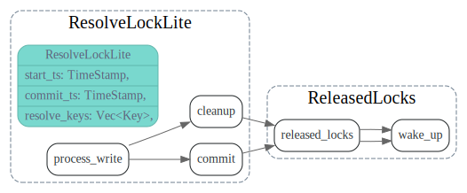
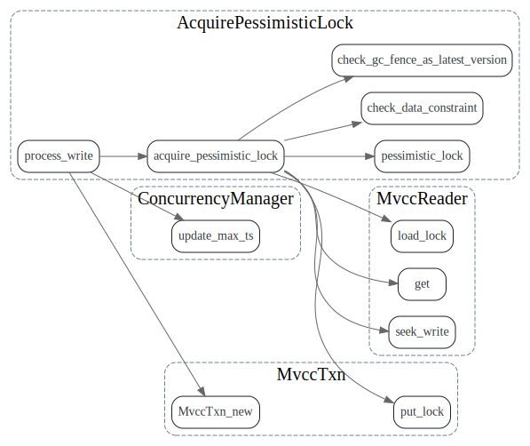

# Command

<!-- toc -->

## Command::process_read



## Command::process_write

在scheduler.process_write中调用了engine的async_write_ext处理了


### Prewrite
谁决定，哪个是primary key ?

secondaries key 的lock什么时候写入的？
PrewriteRequest 

```rust
impl From<PrewriteRequest> for TypedCommand<PrewriteResult> {
```
由grpc请求自己决定哪个是primary key

Prewrite 主要内容:

[TiKV 事务模型概览，Google Spanner 开源实现](https://pingcap.com/blog-cn/tidb-transaction-model/)

>Prewrite 对应传统 2PC 的第一阶段：
>
>首先在所有行的写操作中选出一个作为 primary row，其他的为 secondary rows
>
>PrewritePrimary: 对 primaryRow 写入锁（修改 meta key 加入一个标记），锁中记录本次事务的开始时间戳。上锁前会检查：
>
>该行是否已经有别的客户端已经上锁 (Locking)
>是否在本次事务开始时间之后，检查versions ，是否有更新 [startTs, +Inf) 的写操作已经提交 (Conflict)
>在这两种种情况下会返回事务冲突。否则，就成功上锁。将行的内容写入 row 中，版本设置为 startTs
>
>将 primaryRow 的锁上好了以后，进行 secondaries 的 prewrite 流程：
>
>类似 primaryRow 的上锁流程，只不过锁的内容为事务开始时间 startTs 及 primaryRow 的信息
>检查的事项同 primaryRow 的一致
>当锁成功写入后，写入 row，时间戳设置为 startTs


### Commit


### Rollback


### ResolveLockReadPhase


### ResolveLock
tidb: LockResolve.resolveLock

清理lock ?


ResolveLockRequest

### ResolveLockLite

> - Support `ResolveLockLite` to allow only resolving specified lock keys. [4882](https://github.com/tikv/tikv/pull/4882)


ResolveLock Lite和ResolveLock的区别？引入这个的目的是什么


### CheckSecondaryLocks

TODO: 不太理解CheckSecondaryLocks的作用.

```rust
    /// Check secondary locks of an async commit transaction.
    ///
    /// If all prewritten locks exist, the lock information is returned.
    /// Otherwise, it returns the commit timestamp of the transaction.
    ///
    /// If the lock does not exist or is a pessimistic lock, to prevent the
    /// status being changed, a rollback may be written.
```

rollback ts的作用

> txn: Store rollback ts in the lock when the key is locked by another transaction (#8439)

为什么check_secondary_locks 会 process_write ?做修改？


### TxnHeartBeat

增大primary key 的TTL

只需要增大primary key的吗？其他的secondaries key 需要也enlarge吗？

```rust
    /// Heart beat of a transaction. It enlarges the primary lock's TTL.
    ///
    /// This is invoked on a transaction's primary lock. The lock may be generated by either
    /// [`AcquirePessimisticLock`](Command::AcquirePessimisticLock) or
    /// [`Prewrite`](Command::Prewrite).
```


### PessimisticRollback

和普通的Rollback有什么区别？


### AcquirePessimisticLock



