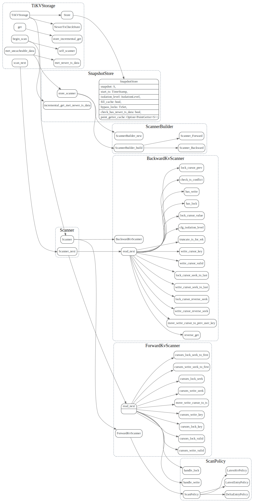

# Coprocessor

## draft


BatchExecutor

```
{agg;selection} ->  BatchTableScanner;BatchIndexScanner -> Scanner -> RangeScanner -> Storage.scan_next;
```

分为三类 scanner, selection, agg

其中scanner是作为基础数据源的，selection/agg就是在这个基础数据源上做filter和agg
scanner 又依赖于RangesScanner


### RangesScanner

TiKVStorage

这块需要先把Storage/mvcc的scanner先研究透了.



### ScanExecutor

impl负责process_kv_pair, RangeScanner扫描获取kv

ranges_iterator感觉像获取多个range的数据？

把多个range chain起来？


