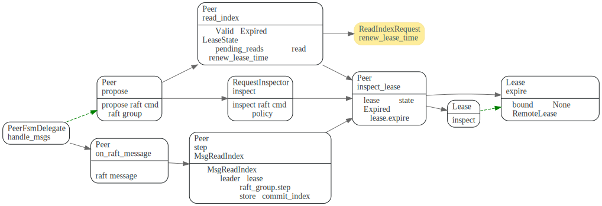
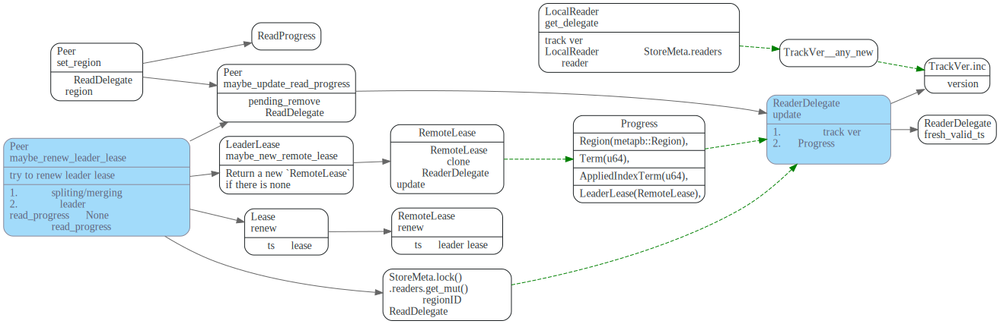
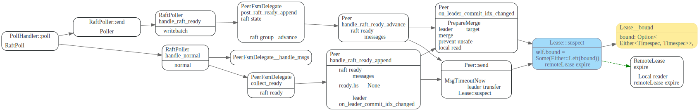
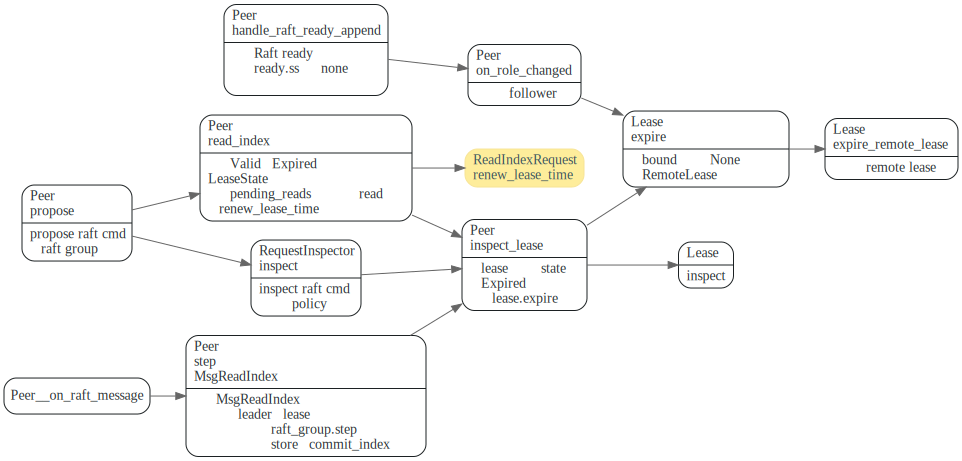

# Leader Lease


[TiKV 功能介绍 - Lease Read](https://pingcap.com/zh/blog/lease-read) 中描述了
raft 中leader lease 机制如下:

> 在 Raft 论文里面，提到了一种通过 clock + heartbeat 的 lease read 优化方法。
> 也就是 leader 发送 heartbeat 的时候，会首先记录一个时间点 start，
> 当系统大部分节点都回复了 heartbeat response，那么我们就可以认为 leader 的 
> lease 有效期可以到 start + election timeout / clock drift bound这个时间点。

> 由于 Raft 的选举机制，因为 follower 会在至少 election timeout 的时间之后，
> 才会重新发生选举，所以下一个 leader 选出来的时间一定可以保证大于 
> start + election timeout / clock drift bound。

在TiKV实现中，并不是通过底层的raft-rs heatbeat 机制而是通过上层的读写操作
来renew lease的. 

TiKV实现了transfer leadership, 在转移leadership时，target节点
不必等到election timout就能开始选举，上面的假设就不成立了，
因此TiKV引入了`LeaseState::Suspect`状态


## data struct

在TiKV中，每个region，有两个存放lease的地方，一个为`Peer::leader_lease`类型为`Lease`,一个是ReadDelegate
的`RemoteLease`. 在更改`Peer::lease_lease`时，同时也会更新`RemoteLease`. RemoteLease 主要由LocalReader来用. 


## Lease bound

记录leader lease变量为`Lease::bound`, Lease::bound值可能为以下两种:

```rust
///   1. Suspect Timestamp
///      A suspicious leader lease timestamp, which marks the leader may still hold or lose
///      its lease until the clock time goes over this timestamp.
///   2. Valid Timestamp
///      A valid leader lease timestamp, which marks the leader holds the lease for now.
///      The lease is valid until the clock time goes over this timestamp.
```

如果bound为None，说明lease还没被设置，
或者expired了，或者节点角色由leader变为了follower, lease失效了。

如果boud类型为`Either::Left`则当前LeaseState为Supsect(说明leadership可能在转移中).
如果bound类型为`Either::Right`, 并且ts < bound, 则说明还在lease内。


## Inspect
```rust
/// Inspect the lease state for the ts or now.
pub fn inspect(&self, ts: Option<Timespec>) -> LeaseState {
    match self.bound {
        Some(Either::Left(_)) => LeaseState::Suspect,
        Some(Either::Right(bound)) => {
            if ts.unwrap_or_else(monotonic_raw_now) < bound {
                LeaseState::Valid
            } else {
                LeaseState::Expired
            }
        }
        None => LeaseState::Expired,
    }
}
```

inspect被调用流程如下：

主要有个trait RequestInspector，它有个默认的实现`inspect`方法，然后会调用`inspect_lease`和`has_applied_to_current_term`
两个方法。

`LocalReader`的`Inspector`和`Peer`都implement了该trait, 各自实现了`has_applied_to_current_term`和`inspect_lease`方法。


LocalReader会使用ReadDelegate中的RemoteLease inspect一次看是否在lease内。如果不在，则会将请求通过raft route 发给对应的PeerFsm, Peer::propose时，会使用
Peer的Lease inspect检查一次。


此外`Peer::inspect_lease`还有两个调用路径如下, 主要是对`read_index`的优化



在leader 节点处理其他peer发来的消息时，
如果消息为MsgReadIndex, 并且当前leader在lease内的话，就直接返回
当前store的commit index，不用再去调用`raft_group`的step方法了。

另外在leader节点, 在调用`raft_group`的`read_index`会如果当前LeaseState不为Supsect, 
则还会用`pending_reads`中最后一个ReadIndexRequest的`renew_lease_time`来看是否在
lease内。

```rust
    // 3. There is already a read request proposed in the current lease;
    //Peer的read_index方法
    fn read_index<T: Transport>(
    //...

        if self.is_leader() {
            match self.inspect_lease() {
                // Here combine the new read request with the previous one even if the lease expired is
                // ok because in this case, the previous read index must be sent out with a valid
                // lease instead of a suspect lease. So there must no pending transfer-leader proposals
                // before or after the previous read index, and the lease can be renewed when get
                // heartbeat responses.
                LeaseState::Valid | LeaseState::Expired => {
                    // Must use the commit index of `PeerStorage` instead of the commit index
                    // in raft-rs which may be greater than the former one.
                    // For more details, see the annotations above `on_leader_commit_idx_changed`.
                    let commit_index = self.get_store().commit_index();
                    if let Some(read) = self.pending_reads.back_mut() {
                        let max_lease = poll_ctx.cfg.raft_store_max_leader_lease();
                        if read.renew_lease_time + max_lease > renew_lease_time {
                            read.push_command(req, cb, commit_index);
                            return false;
                        }
                    }
                }
                // If the current lease is suspect, new read requests can't be appended into
                // `pending_reads` because if the leader is transferred, the latest read could
                // be dirty.
                _ => {}
            }
        }

```


## renew

为了保持和etcd逻辑一致，TiKV中并没有通过hearbeat来renew leader lease(参见PingCap博客[TiKV 功能介绍 - Lease Read](https://pingcap.com/zh/blog/lease-read))，
而是在上层通过读写操作来renew leader lease.

1. 在节点刚成为leader时，`on_role_changed`会更新新当选leader的lease.
2. `Peer::apply_reads`时，使用`read_index`发起时候的ts更新leadr lease
3. 在处理committed log entries时，会使用write 的ts leader lease.

在2，3中，如果Peer处理Raft ready时，如果leader节点成功的处理了`read_index`和`propose`write请求，
则说明发起该请求时，该节点肯定是leader, 因此可以用发起请求时候的ts来renew leader lease.


函数`Peer::maybe_renew_leader_lease` 会更新Peer的leader lease, 同时会update ReadDelegate的RemoteLease




## suspect

由于leader transfer时，target节点不必等待election timeout就可以发起election, 因此此时要将leader
的Lease设为Supsect状态。




## expire

在peer节点由leader变为follower时，会将lease expire, 另一方面如果lease长时间没被renew(比如长时间没有读写操作），inspect时，lease会被expire

lease expire时会将bound设置为None，并将ReadDelegate的RemoteLease也设置为None.




## 参考文献

1. [TiKV 功能介绍 - Lease Read](https://pingcap.com/zh/blog/lease-read)
