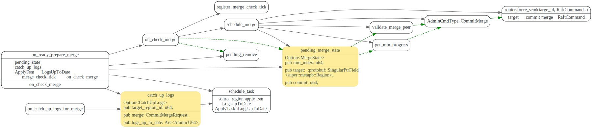
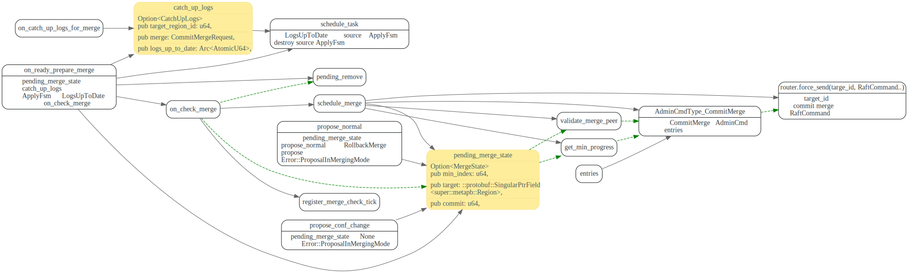
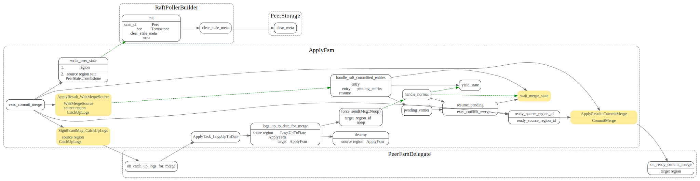

# Merge Region

<!-- toc -->

## 触发Merge

### PD Server MergeChecker

> PD 在决定某个 Source Region 需要 Merge 到相邻的 Target Region 之后，之后会通过 Conf Change 把它们的 Peer 对齐到相同的 TiKV 上，再给该 Region 发送请求触发 Merge。

主要代码在`server/schedule/checker/merge_cheker.go`


### source region: change peer

将source region 的peer对齐到target region上.

### source region:  TiKV pd worker: schedule_heartbeat_receiver

source region收到merge op后，发送`PrepareMerge` Raft Command


## PrepareMerge

### PreapreMerge proposal 之前检查

在PrepareMerge被source region leader proposal之前，会做一些检查:

1. 检查target_region是否和source_region 在same store上
2. 检查target_region和source region是否是sibling region.
3. 检查从所有source Region 的 Follower 上最小的 commit index 对应的日志到当前最后一条日志之间是否没有CompactLog/Split/Merge/Conf Change。(摘自[1])


在ApplyFsm执行PrepareMerge时，region的epoch和conf_version都会+1, 这样PrepareMerge 之后Proposal的log entry 在Apply时都会被skip掉。
所以soure region在propose PreapreMerge 之后，就不可读写了。

### source region: ApplyDelegate::exec_prepare_merge

raft command 通过raft proposal以log entry方式发给source raft region中的
各个peer, 在达到commit 状态后，会发送给ApplyFsm来处理


Apply fsm上会执行 `exec_prepare_merge`
通过`write_peer_state`，将merge state保存下来，即使
后面即使发生了重启，Tikv也会接着执行pending_merge.

然后发送`ExecResult::PrepareMerge`消息给source region 各个peer


### source region: on_check_merge

注意此处的`CommitMerge`消息是发往本地 target region peer的.

>非Leader 的 Peer 收到后会静默丢弃，而 Leader 这里不用担心多次 Propose 的问题，Apply CommitMerge 会让 Epoch 中的 version 增加，所以在之后带有相同 Epoch 的 Proposal 都会被跳过。

### rollback_merge



### source region: PeerFsmDelegate::on_ready_prepare_merge

source region raft 在收到`ExecResult::PreapreMerge`消息之后，
会调用`on_ready_prepare_merge` 处理该消息。

主要设置了`pending_merge_state`，设置之后，该region raft
对于proposal请求，会返回`Error::ProposalInMergeMode`.

然调用on_check_merge, 经过一系列检查后，
向本地的target region Propose 一条`AdminType::CommitMerge` 消息。

注意此处的`catch_up_logs`,



## CommitMerge

### target region: ApplyFsm::exec_commit_merge

target region的ApplyFsm在`AdminType::CommitMerge`达到commit状态时，会调用
ApplyFsm::exec_commit_merge来处理该消息

`exec_commit_merge` 主处理流程如下：

```rust
// The target peer should send missing log entries to the source peer.
//
// So, the merge process order would be:
// 1.   `exec_commit_merge` in target apply fsm and send `CatchUpLogs` to source peer fsm
// 2.   `on_catch_up_logs_for_merge` in source peer fsm
// 3.   if the source peer has already executed the corresponding `on_ready_prepare_merge`, set pending_remove and jump to step 6
// 4.   ... (raft append and apply logs)
// 5.   `on_ready_prepare_merge` in source peer fsm and set pending_remove (means source region has finished applying all logs)
// 6.   `logs_up_to_date_for_merge` in source apply fsm (destroy its apply fsm and send Noop to trigger the target apply fsm)
// 7.   resume `exec_commit_merge` in target apply fsm
// 8.   `on_ready_commit_merge` in target peer fsm and send `MergeResult` to source peer fsm
// 9.   `on_merge_result` in source peer fsm (destroy itself)
```

在targer region上执行`exec_commit_merge`,等待Source Region处理完CatchUpLogs 之后，

target region 更新了自己region的 start_key或者end_key, 然跟新自己在rocksdb中的region
信息，并把source region的状态设置为Tombstone, 这样TiKV重启时，会清理掉source region
stale meta 数据。

exec_commit_merge 时会将epoch + 1

最后发`ApplyResult::CommitMerge` 消息给target region raft.

```rust
region.mut_region_epoch().set_version(version);
if keys::enc_end_key(&region) == keys::enc_start_key(source_region) {
    region.set_end_key(source_region.get_end_key().to_vec());
} else {
    region.set_start_key(source_region.get_start_key().to_vec());
}
```

> 由于 Source Region 的日志可能不够，为了让数据一致，我们先发送 CommitMerge中的 entries 给 Source Region，等待它把日志补全并且全部 Apply 完



### source region: on_catch_up_logs_for_merge

等待source region 把日志补齐，并且apply.

如果source region 执行到了on_ready_prepare_merge，那么
说明PrepareMerge这个Log entry已经被applied 了，
也就是说需要merge的日志,都已经被applied了。


### target region: PeerFsmDelegate::on_ready_commit_merge

targe region 各个peer 调用on_ready_commit_merge 来处理收到的`ApplyResult::CommitMerge` 消息

主要是更新meta信息, 向pd发送region心跳，更新自己在pd中的reigon 信息，

最后发送`SignificantMsg::MergeResult`消息给source region raft, 让source region
做一些数据清理工作。


### source region:  PeerFsmDelegate::on_merge_result

source region 处理target region 发来的MergeResult消息, 清理掉元信息, destroy PeerFsm
对于pending的proposals返回`RegionNotFound`错误


## 参考文献:

1.[Region Merge 源码解析](https://cloud.tencent.com/developer/article/1762520)

# Draft

2pc ?
prepare, commit, rollback

谁发起了merge region ?

有类似的split region checker吗？
pd 根据什么来决定要merge region ?
怎么判断哪两个region要merge ?

怎么避免region 不断在split和merge 之间震荡？

merge region的主要问题是什么？

store meta是什么？ 存储在哪儿？

merge 方式 A + B -> C ? 还是 A= A + B

target region, source region.

PeerState::Tombstone 状态作用是？

Region 数据结构。

region 进入tombstone状态的后续处理是啥？

在merge region时候，soure region的新的log是怎么处理的？

```rust
pub struct Region {
    // message fields
    pub id: u64,
    pub start_key: ::std::vec::Vec<u8>,
    pub end_key: ::std::vec::Vec<u8>,
    pub region_epoch: ::protobuf::SingularPtrField<RegionEpoch>,
    pub peers: ::protobuf::RepeatedField<Peer>,
    pub encryption_meta: ::protobuf::SingularPtrField<super::encryptionpb::EncryptionMeta>,
    // special fields
    pub unknown_fields: ::protobuf::UnknownFields,
    pub cached_size: ::protobuf::CachedSize,
}
```


applyFsm 主要负责write_peer_state，保存peer的state.
## 关键函数

## check merge
logs_up_to_date_for_merge 是targe的logs的和


