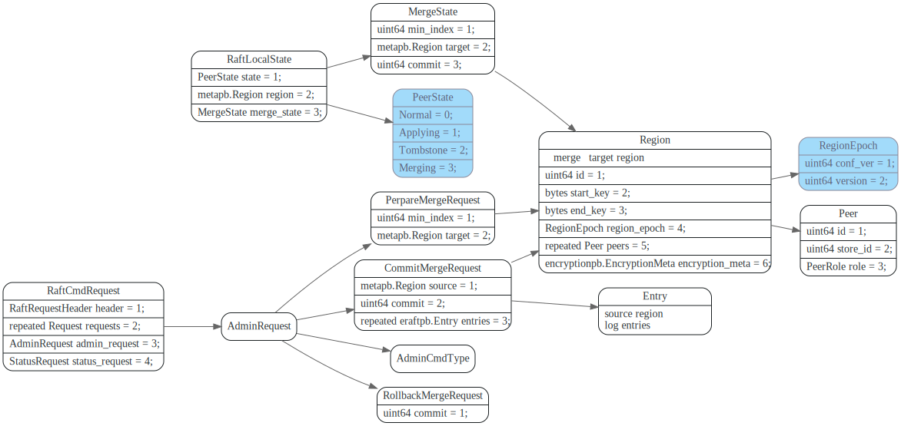
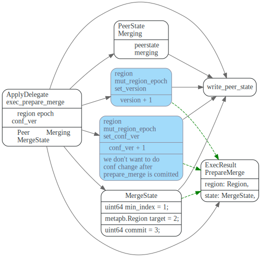
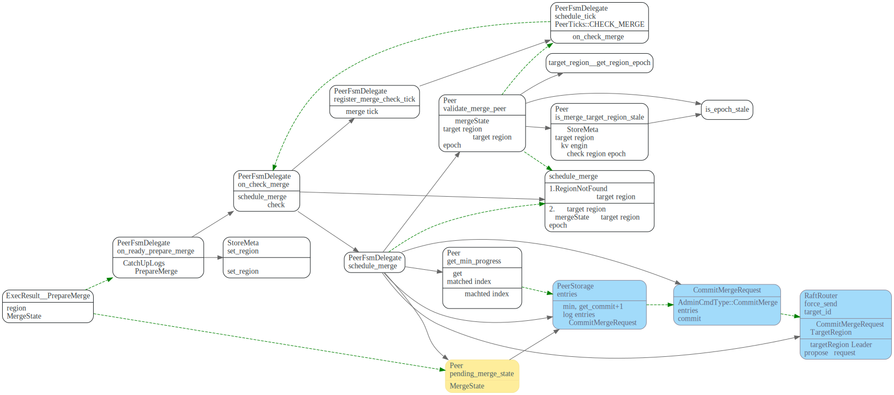
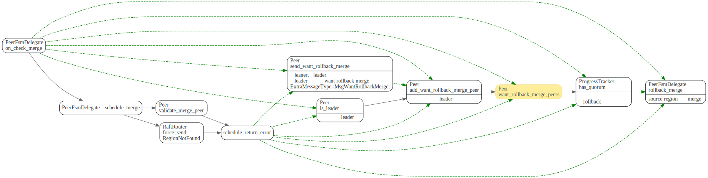
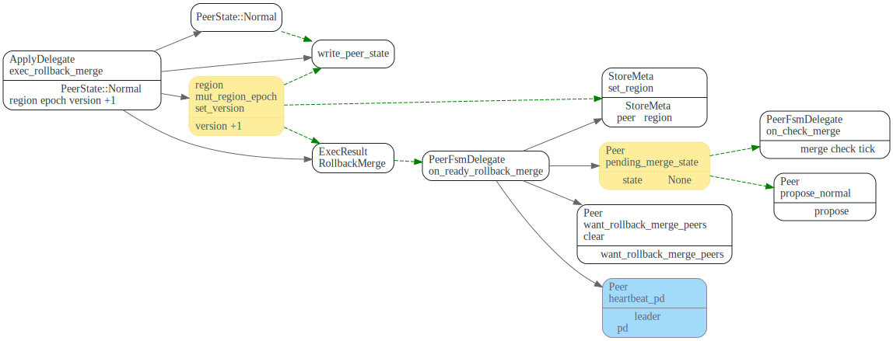
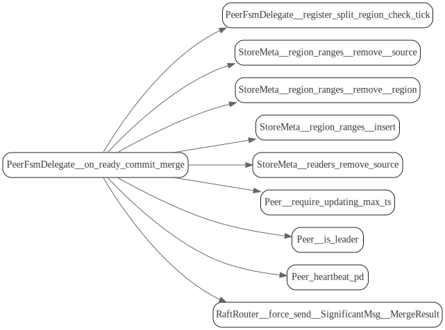
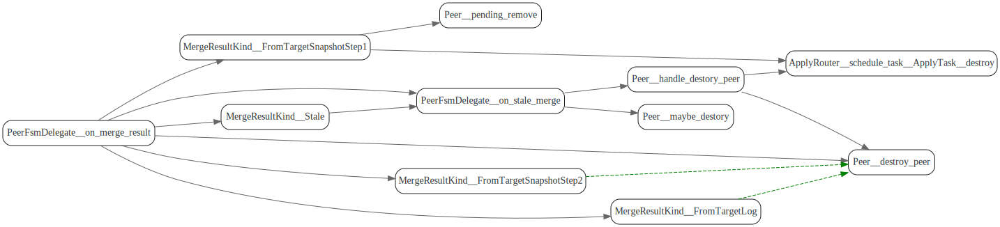

# Merge Region

<!-- toc -->

Merge Region时，PD先将source region和targer Region 的TiKV节点对齐。

## Merge流程

理解的关键点

1. Source region 在向target region 提交CommitMerge前,怎么发现和处理target region发生了变动
2. source region的`on_catch_up_logs_for_merge`和`on_ready_prepare_merge`这两个被调用时序问题。
3. target和source region之间通过CatchUpLogs中的atomic `catch_up_logs`,来同步补齐的状态。

## 相关RaftCmdRequest

在merge region中，主要涉及到的raft cmd为PrePareMergeRequest和CommitMergeRequest

PrepareMergeRequest 将由source region来proposal并执行，在source region执行PrepareMerge时，
PeerState为Merging, 并在RaftLocalState中保存了一个`MergeState`。然后发CommitMergeRequest给本地的`target region`, 

target region把CommitMergeRequest proposal到target region的raft group后，
由target region来执行CommitMerge.



## PrepareMerge

### Source Region: propose PrepareMerge

Source Region leader在leader收到PrepareMerge请求后，会propose 一条PrepareMerge消息。

propose 之前会做一些检查, 最后会设置PrePareMerge中的`min_index`参数


在ApplyFsm执行PrepareMerge时，region的epoch和`conf_version`都会+1,
这样PrepareMerge 之后Proposal的log entry 在Apply时都会被skip掉。
所以soure region在propose PreapreMerge 之后，就不可读写了。


### Source Region `ApplyDelegate::exec_prepare_merge`

将PeerState设置为Merging, 将region epoch的`conf_ver`和version 都+1




### Source Region `PeerFsmDelegate::on_ready_prepare_merge`



source region raft 在收到ExecResult::PreapreMerge消息之后， 会调用`on_ready_prepare_merge` 处理该消息。
首先设置了`pending_merge_state`，在此之后，该region raft 对于proposal(RollbackMerge的除外)请求，会返回Error::ProposalInMergeMode.

```rust
    fn propose_normal<T>(
        &mut self,
        poll_ctx: &mut PollContext<EK, ER, T>,
        mut req: RaftCmdRequest,
    ) -> Result<Either<u64, u64>> {
        if self.pending_merge_state.is_some()
            && req.get_admin_request().get_cmd_type() != AdminCmdType::RollbackMerge
        {
            return Err(Error::ProposalInMergingMode(self.region_id));
        }
```

然调用`on_check_merge`, 经过一系列检查后， 向本地的target region Propose 一条CommitMergeRequest消息,
CommitMergeRequest 带上了source region一些peer要补齐的log entries.

其中比较重要的方法是`Peer::validate_merge_peer`, 会检查Source的MergeState 中的target region信息
和当前本地target region信息。如果merge state中的比本地的epoch小，则返回错误。

如果比本地的大，则需要等target region epoch 追上后再`schedule_merge`,
在下一次check merge tick中接着检查。


向本地target region发送AdminCmdType::CommitMerge类型的RaftCmd.

```rust
// Please note that, here assumes that the unit of network isolation is store rather than
// peer. So a quorum stores of source region should also be the quorum stores of target
// region. Otherwise we need to enable proposal forwarding.
self.ctx
    .router
    .force_send(
        target_id,
        PeerMsg::RaftCommand(RaftCommand::new(request, Callback::None)),
    )
    .map_err(|_| Error::RegionNotFound(target_id))
```

处理Schedule Error: RegionNotFound, 以及target region epoch比merge state中的大。




## RollbackMerge

RollbackMerge执行后，会将`pending_merge_state`设置为none, 这样
就停止了`on_check_merge`, 并且`propose_normal`也可以正常工作了

RollbackMerge会将region epoch的version +1, 然后通过pd hearbeat
上报给pd server.



## CommitMerge

### Target Region `ApplyDelegate::exec_commit_merge`

CommitMerge消息由source region 发给本地的target region后，如果本地
的target region是leader， 则会像正常消息一样propose 到raft group,
如果target region不是leader, 则会slient drop掉该消息。

在target节点执行CommitMerge时，会先发送一个CatchUpLogs消息，给本地的source region
让它把日志补齐，CatchUpLogs里面带了一个`logs_up_to_date`是个AtomicU64.

如果source region补齐了log, 则会设置`logs_up_to_date`为自己的`region_id`。

`ApplyDelegate::wait_merge_state` 也引用了`logs_up_to_date`，每次`resume_pending`
都会load `logs_up_to_date`，如果有值，则会继续重新执行`exec_commit_merge`.

最后返回结果`ExecResult::CommitMerge`


等SourceRegion 已经CatchUpLogs后, 会修改atomic `logs_up_to_date`
从而影响`ApplyDelegate::wait_merge_state`, 在`resume_pending`
时重新执行`exec_commit_merge`。


这次会将target region的key range扩大, 增加target region的version, 最后调用
`write_peer_state`将target region信息保存起来。

### Source Region: `PeerFsmDelegate::on_catch_up_logs_for_merge`

使用CommitMergeRequest中的entries，补齐apply自己本地raft log.
，然后发送LogsUpToDate消息个ApplyFsm。

ApplyFsm中设置atomic 变量`CatchUpLogs::logs_up_to_date`值为
`source_region_id`, 然后发Noop消息给target region， 让target region接着处理自己的`wait_merge_state`


在执行`on_catch_up_logs_for_merge`时，如果`pending_merge_state`不为None,
说明source region可能已经过PreapreMerge消息了，直接发送`LogsUpToDate`消息给applyFsm.

```rust
fn on_catch_up_logs_for_merge(&mut self, mut catch_up_logs: CatchUpLogs) {

if let Some(ref pending_merge_state) = self.fsm.peer.pending_merge_state {
    if pending_merge_state.get_commit() == catch_up_logs.merge.get_commit() {
        assert_eq!(
            pending_merge_state.get_target().get_id(),
            catch_up_logs.target_region_id
        );
        // Indicate that `on_ready_prepare_merge` has already executed.
        // Mark pending_remove because its apply fsm will be destroyed.
        self.fsm.peer.pending_remove = true;
        // Just for saving memory.
        catch_up_logs.merge.clear_entries();
        // Send CatchUpLogs back to destroy source apply fsm,
        // then it will send `Noop` to trigger target apply fsm.
        self.ctx
            .apply_router
            .schedule_task(region_id, ApplyTask::LogsUpToDate(catch_up_logs));
        return;
    }
}
```

同样在执行`on_ready_prepare_merge`中如果 `Peer.catch_up_logs`不为None，说明`on_catch_up_logs_for_merge`
这个先执行的，此时执行时的是被补齐的log中的PrepareMerge消息。

这时候Log已经补齐了，可以ApplyFsm发送LogsUpToDate消息了。

```rust
fn on_ready_prepare_merge(&mut self, region: metapb::Region, state: MergeState) {
//...
    if let Some(ref catch_up_logs) = self.fsm.peer.catch_up_logs {
        if state.get_commit() == catch_up_logs.merge.get_commit() {
            assert_eq!(state.get_target().get_id(), catch_up_logs.target_region_id);
            // Indicate that `on_catch_up_logs_for_merge` has already executed.
            // Mark pending_remove because its apply fsm will be destroyed.
            self.fsm.peer.pending_remove = true;
            // Send CatchUpLogs back to destroy source apply fsm,
            // then it will send `Noop` to trigger target apply fsm.
            self.ctx.apply_router.schedule_task(
                self.fsm.region_id(),
                ApplyTask::LogsUpToDate(self.fsm.peer.catch_up_logs.take().unwrap()),
            );
            return;
        }
    }
```

### Target region: `PeerFsmDelegate::on_ready_commit_merge`

target region的PeerFsm 中更新StoreMeta中regions, readers， `region_ranges`信息，
删除`source_region`的，更新target region的

然后发送SignificantMsg::MergeResult消息给`source_region`.




### Source Region: `PeerFsmDelegate::on_merge_result`

destory source regon PeerFsm和ApplyFsm.

如果ApplyFsm还没被注销的话，发送ApplyTask::destory 先destory ApplyFsm.


