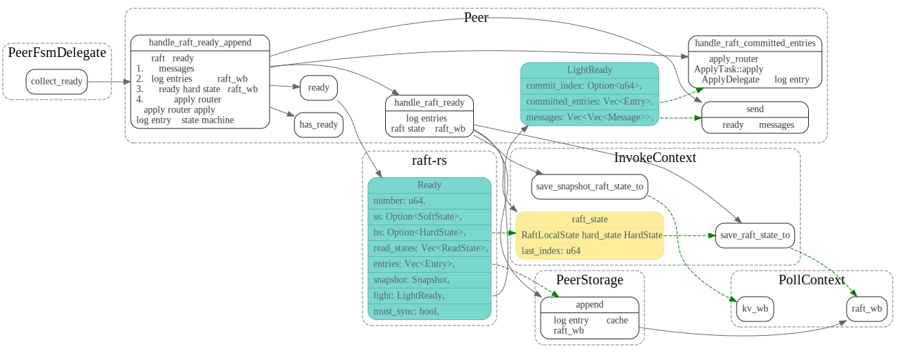
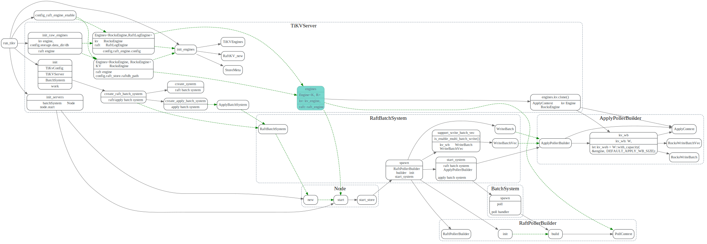
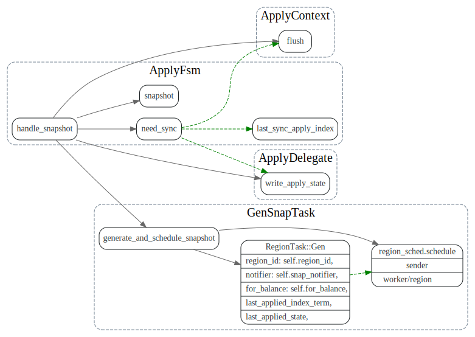

# Peer Storage

<!-- toc -->

## 数据结构关系


```rust
pub trait Storage {
    fn initial_state(&self) -> Result<RaftState>;
    fn entries(&self, low: u64, high: u64, max_size: u64) -> Result<Vec<Entry>>;
    fn term(&self, idx: u64) -> Result<u64>;
    fn first_index(&self) -> Result<u64>;
    fn last_index(&self) -> Result<u64>;
    fn snapshot(&self) -> Result<Snapshot>;
}
```

## RaftState 更新和保存

### collect_ready

每次`handle_msg`后，都会调用`collect_ready`，处理raft中`ready`的hard state, log entries, committed log entries, snapshot等

`log entries`和`raft_state` 会先写入`PollContext::raft_wb`，在最后`RaftPoller::end`时，会将`PollContext:raft_wb`写入rocksdb。

写入完毕后，再更新PeerStorage的`raft_state`, `last_term`, `last_index`一些成员变量。




### PeerStorage::handle_raft_ready

将Ready的hs, entries, snapshot信息等写入 PollContext的write batch中, 写完后这些信息还没有保存到磁盘上。
要等到`RaftPoller.handle_raft_ready`中将write_batch写入rocksdb中.

1. 调用`append` 将`Ready.entries`写入`PollContext.raft_wb`

2. 调用`save_apply_sate_to`将`PeerStorage.apply_state` 写入`PollContext.kv_wb`

3. 调用`save_raft_state_to` 将raft_state(包含了`Ready.hs`) 写入`PollContext.raft_wb`

4. 将`Ready.hs`和`snap_index`写入`PollContext.k_wb`, 保存原因如下(需要研究下为啥）

```rust
 // in case of restart happen when we just write region state to Applying,
 // but not write raft_local_state to raft rocksdb in time.
 // we write raft state to default rocksdb, with last index set to snap index,
 // in case of recv raft log after snapshot.
```

最后返回一个`InvokeContext`,在后面保存完wb中数据后，再调用`post_ready`传回来。


### RaftPoller::handle_raft_ready

将`PollContext.raft_wb`, `PollContext.kv_wb` 写入rocksdb之后, 调用PeerStorage的
`post_ready`, 更新PeerStorage 的成员变量。此处传入`post_ready`
的`InvokeContext`，就是`PeerStorage::handle_raft_ready`所返回的.


在post_ready中，如果ready有snapshot, 则会调用`schedule_applying_snapshot`
由worker/region.rs中的`snap-generator`线程池来apply snapshot.

## Apply State


AppDelegate 执行committed entries, 并更新apply state的`applied_index`
调用`write_apply_state` 将`applied index`写入kv_wb。kv_wb在commit 时
被写入rocksdb。


数据写完后，会发消息给raft router，发送的ApplyRes数据结构如下,
其包含了`apply_state`和`applied_index_term`, apply_state中记录了 `last_applied_index`

```rust
#[derive(Debug)]
pub struct ApplyRes<S>
where
    S: Snapshot,
{
    pub region_id: u64,
    pub apply_state: RaftApplyState,
    pub applied_index_term: u64,
    pub exec_res: VecDeque<ExecResult<S>>,
    pub metrics: ApplyMetrics,
}
```

PeerStorage 更新apply_state， applied_index_term, 先写入raft_wb, 在`RaftPoller::end`
中将raft_wb写入rocksdb.


## PollContext/ApplyContext

PollContex和ApplyContext的创建过程如下:



###  RaftLogEngine
TiKV中可以打开`config.raft_log.enable`，使用`RaftLogEngine`来存储raft log entry，它对于raft log entry的保存做了专门的优化，
相应repo见： [raft-engine](https://github.com/tikv/raft-engine), 如果该配置没打开的话，就使用RocksEngine来存raft log entry.


### RocksWriteBatchVec

如果`rocksdb.is_enable_multi_batch_write` 这个是true，ApplyDelegate的会使用`RocksWriteBatchVec`, 否则就用`RocksWriteBatch`

RocksWriteBatchVec的定义如下：

```rust
/// `RocksWriteBatchVec` is for method `multi_batch_write` of RocksDB, which splits a large WriteBatch
/// into many smaller ones and then any thread could help to deal with these small WriteBatch when it
/// is calling `AwaitState` and wait to become leader of WriteGroup. `multi_batch_write` will perform
/// much better than traditional `pipelined_write` when TiKV writes very large data into RocksDB. We
/// will remove this feature when `unordered_write` of RocksDB becomes more stable and becomes compatible
/// with Titan.
pub struct RocksWriteBatchVec {
    db: Arc<DB>,
    wbs: Vec<RawWriteBatch>,
    save_points: Vec<usize>,
    index: usize,
    cur_batch_size: usize,
    batch_size_limit: usize,
}
````


## Snapshot

PeerStorage会异步的去gen/apply snapshot.

```rust
pub enum SnapState {
    Relax,
    Generating(Receiver<Snapshot>),
    Applying(Arc<AtomicUsize>),
    ApplyAborted,
}
```

Snapshot相关trait,定义在`store/snap.rs`中

```rust
/// `Snapshot` is a trait for snapshot.
/// It's used in these scenarios:
///   1. build local snapshot
///   2. read local snapshot and then replicate it to remote raftstores
///   3. receive snapshot from remote raftstore and write it to local storage
///   4. apply snapshot
///   5. snapshot gc
pub trait Snapshot<EK: KvEngine>: GenericSnapshot {
    fn build(
        &mut self,
        engine: &EK,
        kv_snap: &EK::Snapshot,
        region: &Region,
        snap_data: &mut RaftSnapshotData,
        stat: &mut SnapshotStatistics,
    ) -> RaftStoreResult<()>;
    fn apply(&mut self, options: ApplyOptions<EK>) -> Result<()>;
}

/// `GenericSnapshot` is a snapshot not tied to any KV engines.
pub trait GenericSnapshot: Read + Write + Send {
    fn path(&self) -> &str;
    fn exists(&self) -> bool;
    fn delete(&self);
    fn meta(&self) -> io::Result<Metadata>;
    fn total_size(&self) -> io::Result<u64>;
    fn save(&mut self) -> io::Result<()>;
}
```

### Gen Snapshot

#### PeerStorage::snapshot

leader peer调用`snapshot`来生成region的snapshot发给`follower`
`snapshot`的生成是异步的,
会由专门的worker/region来处理处理完毕后，通过channel的tx来通知`snapshot`已OK, 
等leader下次调用snapshot时，去从channel try_recive 生成的snapshot
如果snapshot没生成好，`SnapshotTemporarilyUnavailable`错误，leader过段时间再来轮询。


#### ApplyFsm::handle_snapshot



#### worker/region.rs: handle_gen

在worker/region 的`snap-generator`线程池中执行生成snapshot的任务


#### peer_storage.rs: do_snapshot

kv_snap 是在哪儿传过来的。。

生成snapshot, 包含了metadata和数据部分


#### store/snap.rs: build

生成snapshot数据部分，将数据写入cf文件中.

```rust
pub const SNAPSHOT_CFS_ENUM_PAIR: &[(CfNames, CfName)] = &[
    (CfNames::default, CF_DEFAULT),
    (CfNames::lock, CF_LOCK),
    (CfNames::write, CF_WRITE),
];

pub const CF_DEFAULT: CfName = "default";
pub const CF_LOCK: CfName = "lock";
pub const CF_WRITE: CfName = "write";
```
对于上面的每个column family，扫描region的所有key,value，写入文件中。


### Apply Snapshot

#### worker/region: handle_apply

在`snap-generator`线程池中，执行`apply_snap`, 导入数据到rocksdb中


#### store/snap.rs: apply


## draft


ApplyDelegate 的apply_state和PeerStorage 中的apply state之间关系?

这两者之间怎么同步的呢？

```rust
    /// TiKV writes apply_state to KV RocksDB, in one write batch together with kv data.
    ///
    /// If we write it to Raft RocksDB, apply_state and kv data (Put, Delete) are in
    /// separate WAL file. When power failure, for current raft log, apply_index may synced
    /// to file, but KV data may not synced to file, so we will lose data.
    apply_state: RaftApplyState,
```

```rust
#[derive(Debug, Copy, Clone, Serialize, Deserialize)]
pub struct RaftTruncatedState {
    pub index: u64,
    pub term: u64,
}

#[derive(Debug, Copy, Clone, Serialize, Deserialize)]
pub struct RaftApplyState {
    pub applied_index: u64,
    pub commit_index: u64,
    pub commit_term: u64,
    pub truncated_state: RaftTruncatedState,
}
```


### RaftLogBatch


## Entries

### Entry cache

### trait RaftEngine

## state
