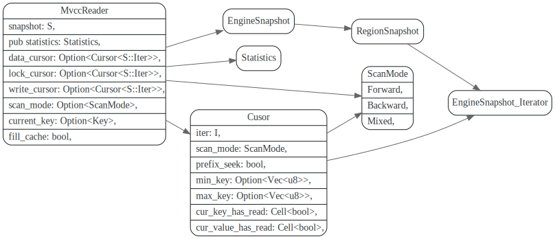
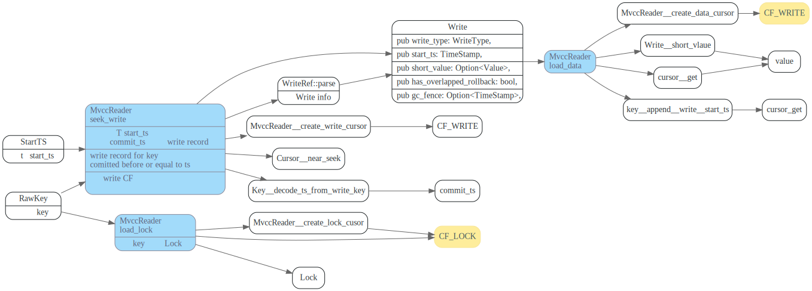

# Percolator in TiKV

<!-- toc -->

## data  struct

在TiKV中，data/lock/write这些信息会写入不同的Column Family 中，由于Rocksdb 不同的column faimly 共享一个WAL,
所以不同CF的写入是原子性的。

1. Data 信息写入`CF_DEFAULT`, key 为`raw_key start_ts`, 值为要写入的数据
2. Write 信息会写入`CF_WRITE`, key为`raw_key commit_ts`, 注意<b>Rollback类型的Write</b> 写入的key 为<b>`raw_key start_ts`</b>，值为Write, 使用WriteRef::tobytes序列化，WriteRef::parse反序列化。
3. Lock 信息会写入`CF_LOCK`, key 为`raw_key`, 值为LockInfo, 使用Lock::tobytes序列化，Lock::parse反序列化。


## MvccTxn

### `put_lock`

加锁操作, 其中只有PrewriteMutation中是新创建lock的。

`check_txn_status_lock_exists` 更新lock的`min_commit_ts`


`mark_rollback_on_mismatching_lock` 将事务的start_ts加入到
lock的 `rollback_ts` vec，该字段说明如下

```rust
// In some rare cases, a protected rollback may happen when there's already another
// transaction's lock on the key. In this case, if the other transaction uses calculated
// timestamp as commit_ts, the protected rollback record may be overwritten. Checking Write CF
// while committing is relatively expensive. So the solution is putting the ts of the rollback
// to the lock.
pub rollback_ts: Vec<TimeStamp>,
```


### `unlock_key`


### `put_write`


在commit或者rollback时，会创建write record，
commit时，保存的write record用的是`key commit_ts`
其中`commit_ts`,是事务提交的ts.

rollback时候，会创建一个WriteType::Rollback的WriteRecord。
对应的key是`key start_ts`, 其中`start_ts`是事务的自身的`start_ts`


### `delete_write`


### modifies

由MvccTxn负责data/lock/write的写入, 会先将将改动保存在`MvccTxn::modifies` vec中。


### modifiers 后续处理

modifiers会转换为WriteData, 然后放到WriteResult中，由`Schedule::process_write`负责将WriteResult异步
保存起来。


### WriteResult 保存


## MvccReader

在执行txn事务cmd时，由MvccReader的`load_lock`, `load_data`和`seek_write` 负责读取相应数据。



### `seek_write`
主要的方法为`seek_write`, 如果事务T(假设它ts为`start_ts`, 要读key的数据，首先要`seek_write`,
找到距离`start_ts` 最近的commit record。

然后使用它的`Write.start_ts` 去Data column中读取数据，或者对于short value, TiKV做了
一个优化，`short_value`直接保存在了Write中，直接返回`Write.short_value`就行了. 省去了一次读数据。

`MvccReader::seek_write`和`MvccReader::load_data`的实现，体现了Percolator的思想，即使用Write column 来
控制事务所写数据的可见性，以及`start_ts`和`commit_ts`的作用。


