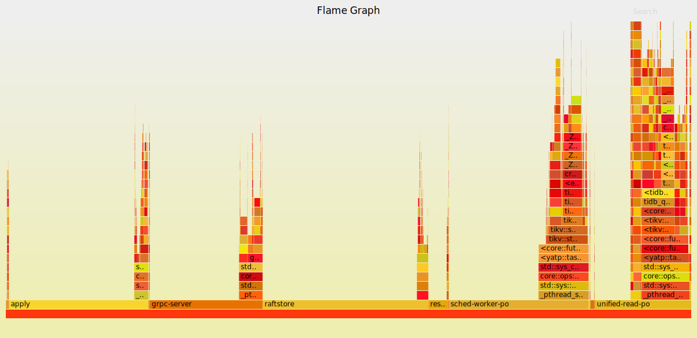
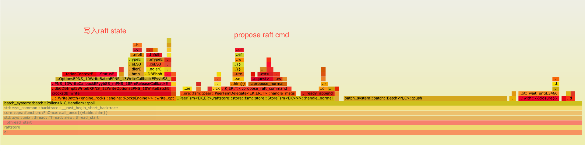
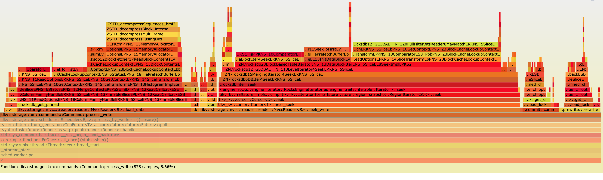
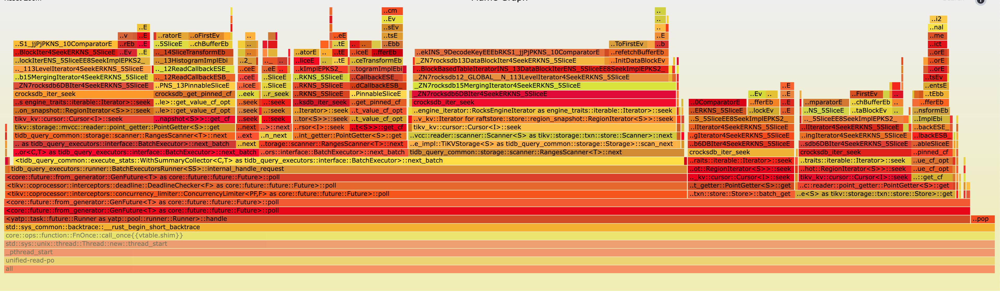

# Performance

本地使用tipu 启动了一个cluster, 跑了bench。

```bash
tiup bench  tpcc -H 127.0.0.1 -P 4000 -D tpcc --warehouses 10000 run
```

然后在TiDB的dashboard上，做了一个profile，下载打开后，tikv对应的profile如下(可以在新的tab页打开下面的svg，看到交互的火焰图)



1. apply: 20.33%, apply fsm poller, 主要负责将k数据写入到rocksdb.
2. raft store: 24.15%, peer fsm poller
3. grpc: 16.45%
4. sched-worker-pro：20.39%
5. unified-read-pro: 14.2%


## Batch System: Apply Poller

主要负责将k数据写入到rocksdb，主要时间用在了数据flush上。

`raftstore::store::fsm::apply::ApplyContext<EK,W>::flush`上


## Batch System: Raft Poller

raft store: 24.15%, peer fsm poller, 可以看到其中有将近1/3的时间用在了write_opt上，主要是
write raft state( 比如hard state(term, votefor), raft log等）



## Storage: 事务

sched-worker-pro 占总体时间的20.39%

主要时间用在`Command:process_write`上, 其中MvccReader::seek_write和MvccReader::load_data占据大部分时间.




## Coprocessor
5. unified-read-pro: 14.2%

主要时间用在了Cusor::Seek上



## Grpc 接口

3. grpc: 16.45%


