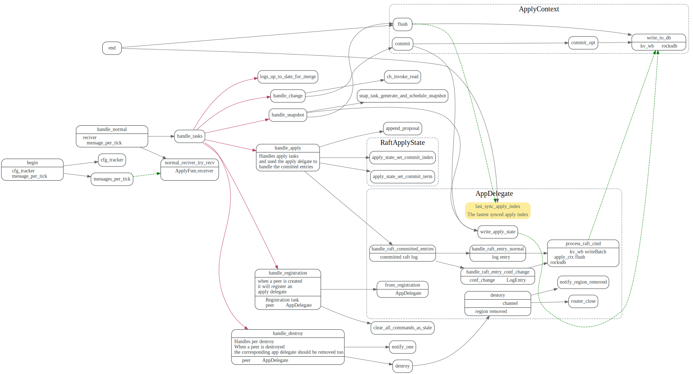

# Poller

<!-- toc -->

## poll

## RaftPoller

### StoreFsmDelegate::handle_msgs

### PeerFsmDelegate::handle_msgs

消息最后都会调用`raft-rs`的RawNode相关方法.

### PeerFsmDelegate::collect_ready

将日志写入raft_wb, snapshot写入kv_wb中(只写入了write_batch，还没落盘)。

使用apply router, 通知ApplyPoller 处理committed raftlog日志。

### RaftPoller::handle_raft_ready

调用`Transport.flush` 发送raft 消息，将raft_wb, kv_wb写入rocksdb中。
使用apply router, 通知ApplyPoller 处理committed raftlog日志。

### PeerFsmDelegate::on_apply_res

主要调用raft-rs的advance_apply，还有处理read_index

## ApplyPoller

### AppDelegate::handle_raft_committed_entries

### ApplyPoller::end

