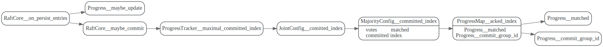

# ProgressTracker

 Leader 上对每一个peer，都维护了一个 Progress


## progress tracker初始化

## maximal committed index

计算committed index

```rust
/// Returns the maximal committed index for the cluster. The bool flag indicates whether
/// the index is computed by group commit algorithm successfully.
///
/// Eg. If the matched indexes are [2,2,2,4,5], it will return 2.
/// If the matched indexes and groups are `[(1, 1), (2, 2), (3, 2)]`, it will return 1.
pub fn maximal_committed_index(&mut self) -> (u64, bool)
```

在日志entries更新保存后，会重新计算一次commit index

leader节点在收到follower的AppendResponse后， 会更新follower pr的mached index.
也会重新计算一次commited index.



## tally votes

统计election 投票


## Progress

这部分分析可以放到Log entry 那儿。
### `Progress::next_idx`

Raft::reset函数中。这个函数会在 Raft 完成选举之后选出的 Leader 上调用，
会将 Leader 的所有其他副本的 `next_idx`设置为跟 Leader 相同的值。之后，
Leader 就可以会按照 Raft 论文里的规定，广播一条包含了自己的 term 的空 Entry 了


## 参考文献：

1. [raft-rs 日志复制过程分析](https://pingcap.com/zh/blog/tikv-source-code-reading-6)
