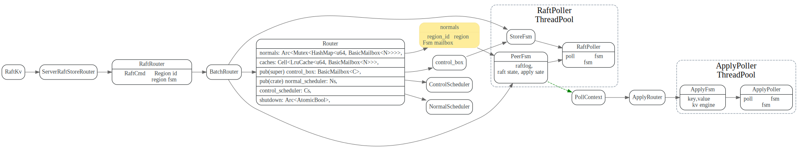
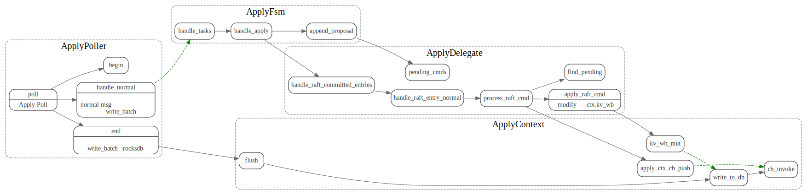

# RaftKV

> * RaftKV对上层提供了`async_snapshot`和`async_write`异步读写接口
> * RaftKV使用RaftStoreRouter将propose（读写请求）发送给region的peer来处理请求。
> * RaftKV中和raft相关部分代码封装在PeerStorage中。
> * RaftKV存储Engine分两种，一个负责存储key,value，一个负责raft log存储.

<!-- toc -->

## Engines

RaftKV 的存储分两种，一个为负责存储state machine的key, value, 对应于模板参数`EK`,
其实现为`RocksEngine`, 

另一个负责存储raft log, 对应于模板参数`ER`，其实现为`RocksEngine`或者`RaftLogEngine`.

[RaftLogEngine](https://github.com/tikv/raft-engine)是一个单独的repo，对raft log存储做了优化。

> A WAL-is-data engine that used to store multi-raft log


在初始化调用`run_tikv`函数时，会根据配置`config.raft_engine.enable`来决定
是否采用`RaftLogEngine`来存储raft log日志


```rust
pub fn run_tikv(config: TiKvConfig) {
    //other code...
    if !config.raft_engine.enable {
        run_impl!(RocksEngine)
    } else {
        run_impl!(RaftLogEngine)
    }
}
```

关键数据结构关系如下：


## RaftRouter

根据`region_id`将RaftCmdRequest消息发送到对应的PeerFSM, 由RaftPoller线程池来
批量的处理消息，处理消息时候，先将写操作写入write batch，在这一批处理完毕后
再将整个write batch写入底层的RaftLogEngine或者RocksEngine, 这样降低了IO频率
, 提高了性能。

Normals Hashmap的初始化和batchSystem的机制，详见后面的BatchSystem相关代码分析。




## PeerStorage

PeerStorage 使用raftlog和kv engine, 实现了Raft-rs中的Storage trait接口。

```rust
pub trait Storage {
    fn initial_state(&self) -> Result<RaftState>;
    fn entries(&self, low: u64, high: u64, max_size: impl Into<Option<u64>>) -> Result<Vec<Entry>>;
    fn term(&self, idx: u64) -> Result<u64>;
    fn first_index(&self) -> Result<u64>;
    fn last_index(&self) -> Result<u64>;
    fn snapshot(&self, request_index: u64) -> Result<Snapshot>;
}
```

Raft的log entries，raft state， apply state写入流程如下：

1. 先调用PeerFsmDelegate`handle_msgs`，将RaftCmdRequest 发给`raft_group`
2. collect ready调用`raft_group.ready`,获取需要保存的log entries
3. `PeerStorage::handle_raft_ready` 将log entries, raft state, apply state等信息写到write batch中
4. `RaftPoller::end` 将write batch写入磁盘中，然后`PeerStorage::post_ready`更改`raft_state`,`apply_state`等状态


## 读写队列

每个raft region的异步读写队列，存放在`Peer`中。
调用`Peer::propose` 处理RaftCmdRequest时，会同时传入一个callback.
Peer会将根据request类型，将request,callback打包在一起放入等待队列中。

对于读请求，会放在ReadIndexQueue，写请求则放入ProposalQueue

```rust
pub struct Peer<EK, ER>
where
    EK: KvEngine,
    ER: RaftEngine,
{

    /// The Raft state machine of this Peer.
    pub raft_group: RawNode<PeerStorage<EK, ER>>,
    pending_reads: ReadIndexQueue<EK::Snapshot>,
    proposals: ProposalQueue<EK::Snapshot>,
    //...
}
```

### ReadIndexQueue

ReadIndex 大致流程如下:
1. 将ReadIndex request和callback放入ReadIndexQueue中，request会生成一个uuid::u64作为Id, 来标识这个request.
2. 带上生成的uuid, 调用`raft_group`的`read_index`方法
3. `apply_reads`处理`raft_group.ready()`返回的`ready.read_states`
4. 根据uuid从队列中找到对应的callback, 调用callback.(TODO: 这块逻辑好像不是这样的）


### ProposalQueue

在向Raft group propose之后，会调用Callback的`invoke_proposed`,

Raft ready 之后log entries commited 之后，会回调Callback的`invoke_committed`
然后将cb 包在Apply中，发送apply task给ApplyFsm.


ApplyFsm在修改写入底层kv engine后，会回调callback的`invoke_all`


