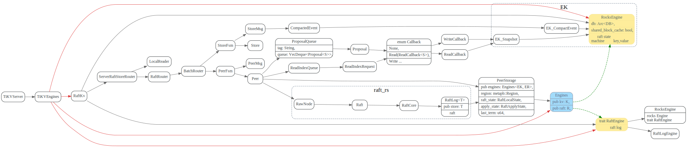
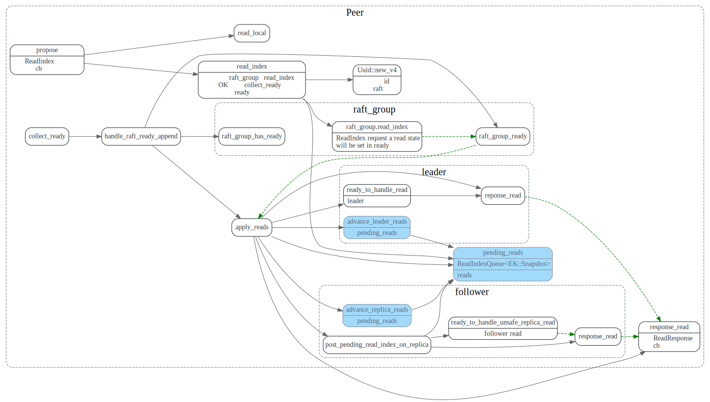
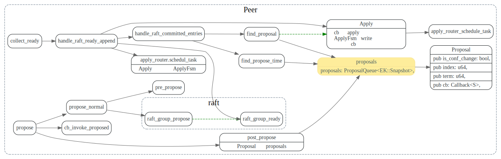

# RaftKV

> * RaftKV存储Engine分两类，一个负责state machine的key,value存储，一个负责raft log存储.
> * RaftKV使用RaftStoreRouter将propose（读写请求）发送给region的peer来处理请求。
> * RaftKV和底层raft相关部分代码封装在struct PeerStorage中。
> * RaftKV对上层提供了异步的读写接口，分别为async_snapshot和async_write，读写等待队列存放在struct Peer中.

<!-- toc -->

## Engines

RaftKV 的存储分两部分，一部分为state machine的key, value, 对应于模板参数`EK`,
对应的实现为`RocksEngine`, 

另一部分为raft的log, 对应于模板参数`ER`，对应的实现为RocksEngine或者`RaftLogEngine`.


在`run_tikv`函数中，会根据配置`raft_engine.enable`来决定
是否采用RaftLogEngine 来存储raft log日志


```rust
pub fn run_tikv(config: TiKvConfig) {
    //other code...
    if !config.raft_engine.enable {
        run_impl!(RocksEngine)
    } else {
        run_impl!(RaftLogEngine)
    }
}
```




## PeerStorage

PeerStorage 使用raftlog和kv engine, 实现了Raft-rs中的Storage trait接口。

```rust
pub trait Storage {
    fn initial_state(&self) -> Result<RaftState>;
    fn entries(&self, low: u64, high: u64, max_size: impl Into<Option<u64>>) -> Result<Vec<Entry>>;
    fn term(&self, idx: u64) -> Result<u64>;
    fn first_index(&self) -> Result<u64>;
    fn last_index(&self) -> Result<u64>;
    fn snapshot(&self, request_index: u64) -> Result<Snapshot>;
}
```

## 读写队列

每个raft region的异步读写队列，存放在`Peer`中。

```rust
pub struct Peer<EK, ER>
where
    EK: KvEngine,
    ER: RaftEngine,
{

    /// The Raft state machine of this Peer.
    pub raft_group: RawNode<PeerStorage<EK, ER>>,
    pending_reads: ReadIndexQueue<EK::Snapshot>,
    proposals: ProposalQueue<EK::Snapshot>,
    //...
}
```

RaftKV的`async_snapshot`和`async_write`方法，会先将callback(或者可以触发future的callback)
放入读写队列中，等底层的raft处理好之后，调用callback函数。

比如对于`async_write`, RaftKV先将callback放入Peer的proposals队列中， 等region
leader在raft log commit之后，就会调用callback，告诉上层模块已经写成功了。

还有个lease Read这个是怎么处理的呢?


### ReadIndexQueue

对于`async_snapshot` 对于region leader 会xxx, 对于region follower会先去调用leader的readIndex，
获取当前最新 readIndex，等自己的statemachine apply到这个read index后，调用上层的callback,
保证上层读到最新的日志。



### ProposalQueue



