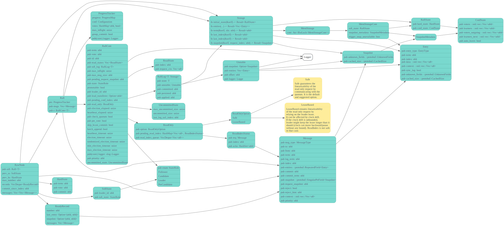
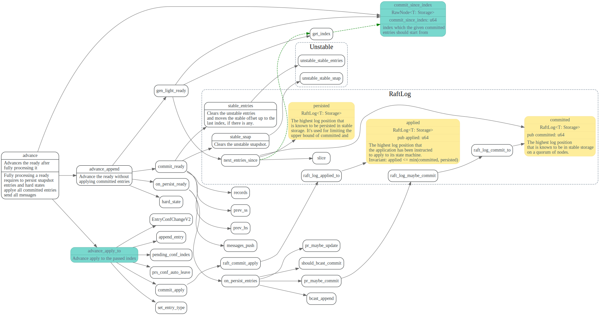
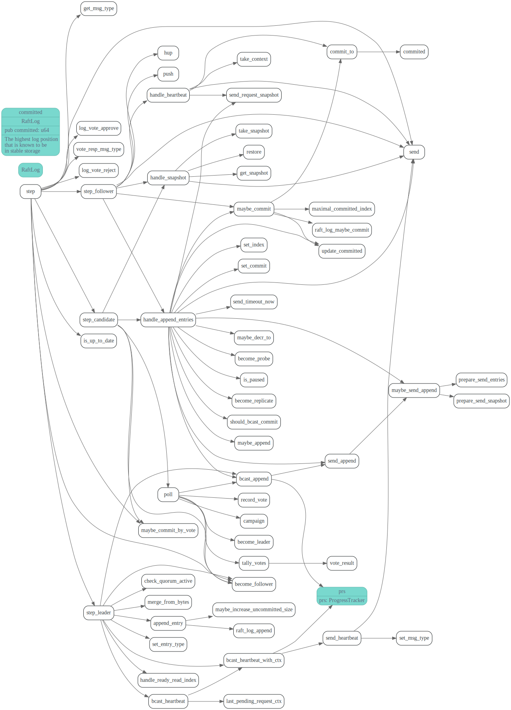

# Raft-rs

<!-- toc -->

## main struct




### RaftLog

```rust
pub struct RaftLog<T: Storage> {
    /// Contains all stable entries since the last snapshot.
    pub store: T,

    /// Contains all unstable entries and snapshot.
    /// they will be saved into storage.
    pub unstable: Unstable,

    /// The highest log position that is known to be in stable storage
    /// on a quorum of nodes.
    ///
    /// Invariant: applied <= committed
    pub committed: u64,

    /// The highest log position that is known to be persisted in stable
    /// storage. It's used for limiting the upper bound of committed and
    /// persisted entries.
    ///
    /// Invariant: persisted < unstable.offset && applied <= persisted
    pub persisted: u64,

    /// The highest log position that the application has been instructed
    /// to apply to its state machine.
    ///
    /// Invariant: applied <= min(committed, persisted)
    pub applied: u64,
}
```

## RawNode

1. RawNode::propose 发起一次新的提交，尝试在 Raft 日志中追加一个新项；

2. RawNode::ready_since 从 Raft 节点中获取最近的更新，包括新近追加的日志、新近确认的日志，以及需要给其他节点发送的消息等；

3. 在将一个 Ready 中的所有更新处理完毕之后，使用 RawNode::advance 在这个 Raft 节点中将这个 Ready 标记为完成状态。

### tick


## election

### PreCandidate

### tick election: 发起投票

发起election


### handle MsgRequestVote/MsgRequestPreVote
主要会检查m.term(消息的term)和自己term, 以及candidate的日志是否足够新


```rust
MessageType::MsgRequestVote | MessageType::MsgRequestPreVote => {
    // We can vote if this is a repeat of a vote we've already cast...
    let can_vote = (self.vote == m.from) ||
        // ...we haven't voted and we don't think there's a leader yet in this term...
        (self.vote == INVALID_ID && self.leader_id == INVALID_ID) ||
        // ...or this is a PreVote for a future term...
        (m.get_msg_type() == MessageType::MsgRequestPreVote && m.term > self.term);
    // ...and we believe the candidate is up to date.
    if can_vote
        && self.raft_log.is_up_to_date(m.index, m.log_term)
        && (m.index > self.raft_log.last_index() || self.priority <= m.priority)
    {
     //发送prove Resp
     }else {
     //发送reject resp
     }
```

### handle MsgRequestPreVoteResponse/MsgRequestVoteResponse


### leader transfer

## heartbeat

### leader: send_heartbeat

leader定时向所有成员发送Heartbeat, 注意，这块的commit 是`min(pr.matched, self.raft_log.committed)`

```rust
// Attach the commit as min(to.matched, self.raft_log.committed).
// When the leader sends out heartbeat message,
// the receiver(follower) might not be matched with the leader
// or it might not have all the committed entries.
// The leader MUST NOT forward the follower's commit to
// an unmatched index.
```


### follower/candidate: handle_heartbeat

如果从leader收到的msg term >= self.term,
会重置heartbeat_timeout时间，然后更新raft_log的committed_index


### leader: handle_heartbeat_response


## log append

### propose

app 希望向 Raft 系统提交一个写入时，需要在 Leader 上调用 RawNode::propose 方法


### follower: handle_append_entries


### leader: handle_append_response

progressMap

leader 处理follower的append entries 的回复。
在哪里判断收到了大部分follower的确认?
怎么更新自己的commit index的?


## snapshot


## conf change

在leader节点， 通过`RawNode.propose_conf_change` 使用上述Log Append机制，
发送ConfChange日志给raft cluster中其他节点。

在`ConfChange` Log Entry committed之后，集成raft-rs的服务，在处理committed Log Entry时, 会调用`RawNode.apply_conf_change` 更改conf配置，最终这些修改会更改
ProgressTracker中的progress和conf， 并进入JointConsensus，同时使用新老配置来计算committed index和统计vote result。

leader节点在`commit_apply`时，如果发现applied 的Log Entry中有ConfChange entry(还有其他一些条件)
会再发一个空的`ConfChange` Log Entry，在该日志被`apply_conf_change`时，会清空JointConfig的outgoing，
结束JointConseus状态。

### Joint Consensus

此处贴上论文中的那张图。

```rust
//JointConfig
pub struct Configuration {
    //incoming 为新的配置
    pub(crate) incoming: MajorityConfig,
    //outgoing 为老的配置
    pub(crate) outgoing: MajorityConfig,
}

// MajorityConfig
pub struct Configuration {
    voters: HashSet<u64>,
}
```
#### 计算committed index
```rust
    //同时统计新老配置中的committed index
    // JointConfig
    pub fn committed_index(&self, use_group_commit: bool, l: &impl AckedIndexer) -> (u64, bool) {
        let (i_idx, i_use_gc) = self.incoming.committed_index(use_group_commit, l);
        let (o_idx, o_use_gc) = self.outgoing.committed_index(use_group_commit, l);
        (cmp::min(i_idx, o_idx), i_use_gc && o_use_gc)
    }

    //MajorityConfig
    pub fn committed_index(&self, use_group_commit: bool, l: &impl AckedIndexer) -> (u64, bool) {
        if self.voters.is_empty() {
            // This plays well with joint quorums which, when one half is the zero
            // MajorityConfig, should behave like the other half.
            return (u64::MAX, true);
        }
        // other codes
    }
```

#### 统计vote result
```rust
    //
    pub fn vote_result(&self, check: impl Fn(u64) -> Option<bool>) -> VoteResult {
        let i = self.incoming.vote_result(&check);
        let o = self.outgoing.vote_result(check);
        match (i, o) {
            // It won if won in both.
            (VoteResult::Won, VoteResult::Won) => VoteResult::Won,
            // It lost if lost in either.
            (VoteResult::Lost, _) | (_, VoteResult::Lost) => VoteResult::Lost,
            // It remains pending if pending in both or just won in one side.
            _ => VoteResult::Pending,
        }
    }

    // majority config
    pub fn vote_result(&self, check: impl Fn(u64) -> Option<bool>) -> VoteResult {
        if self.voters.is_empty() {
            // By convention, the elections on an empty config win. This comes in
            // handy with joint quorums because it'll make a half-populated joint
            // quorum behave like a majority quorum.
            return VoteResult::Won;
        }
    }
```

### ConfChange Log Entry 数据结构


### propose conf change


### apply conf

#### enter joint 

leader节点的ConfChange日志被commit后，节点在apply该日志时，开始使用JointConseus，
同时使用新(incoming)老(outgoing)配置来做统计vote和计算committed index


#### leave joint

leader 在`commit_apply`时, 如果发现pending_conf_index 的日志被
commit了，且`prs.conf().auto_leave`会发送空的EntryConfChangeV2消息。

节点在处理(`apply_conf_change`)该空消息时, 会进入leave joint，清空outgoing的配置，
使用incoming新的配置。


```rust
    pub fn commit_apply(&mut self, applied: u64) {
        let old_applied = self.raft_log.applied;
        #[allow(deprecated)]
        self.raft_log.applied_to(applied);

        // TODO: it may never auto_leave if leader steps down before enter joint is applied.
        if self.prs.conf().auto_leave
            && old_applied <= self.pending_conf_index
            && applied >= self.pending_conf_index
            && self.state == StateRole::Leader
        {
            // If the current (and most recent, at least for this leader's term)
            // configuration should be auto-left, initiate that now. We use a
            // nil Data which unmarshals into an empty ConfChangeV2 and has the
            // benefit that appendEntry can never refuse it based on its size
            // (which registers as zero).
            let mut entry = Entry::default();
            entry.set_entry_type(EntryType::EntryConfChangeV2);

            // append_entry will never refuse an empty
            if !self.append_entry(&mut [entry]) {
                panic!("appending an empty EntryConfChangeV2 should never be dropped")
            }
            self.pending_conf_index = self.raft_log.last_index();
            info!(self.logger, "initiating automatic transition out of joint configuration"; "config" => ?self.prs.conf());
        }
    }
```

#### post conf change

暂时还不太清楚post conf change的作用是什么


## group commit


## lease read

## 服务对接接口
### ready

然后调用ready获取需要发送的messages, snapshot等, 最后获取
一个Ready struct

>Ready 结构包括了一些系列 Raft 状态的更新，在本文中我们需要关注的是：
>
>hs: Raft 相关的元信息更新，如当前的 term，投票结果，committed index 等等。
>
>committed_entries: 最新被 commit 的日志，需要应用到状态机中。
>
>messages: 需要发送给其他 peer 的日志。
>
>entries: 需要保存的日志。


```rust
/// Ready encapsulates the entries and messages that are ready to read,
/// be saved to stable storage, committed or sent to other peers.
#[derive(Default, Debug, PartialEq)]
pub struct Ready {
    number: u64,

    ss: Option<SoftState>,

    hs: Option<HardState>,

    read_states: Vec<ReadState>,

    entries: Vec<Entry>,

    snapshot: Snapshot,

    light: LightReady,

    must_sync: bool,
}
```

### advance

```rust
    /// Advances the ready after fully processing it.
    ///
    /// Fully processing a ready requires to persist snapshot, entries and hard states, apply all
    /// committed entries, send all messages.
    ///
    /// Returns the LightReady that contains commit index, committed entries and messages. `LightReady`
    /// contains updates that only valid after persisting last ready. It should also be fully processed.
    /// Then `advance_apply` or `advance_apply_to` should be used later to update applying progress.
    pub fn advance(&mut self, rd: Ready) -> LightReady {
        let applied = self.commit_since_index;
        let light_rd = self.advance_append(rd);
        self.advance_apply_to(applied);
        light_rd
    }
```




### step



## 参考

1. [raft.github.io](https://raft.github.io)
2. [joint-consensus](https://github.com/peterbourgon/raft/blob/master/JOINT-CONSENSUS.md)
