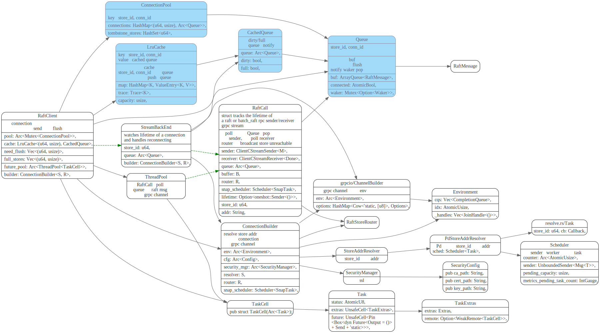

# RaftClient

<!-- toc -->

## caller

### send raft message


### send extra message


## Transport

### trait Transport

```rust
/// Transports messages between different Raft peers.
pub trait Transport: Send + Clone {
    fn send(&mut self, msg: RaftMessage) -> Result<()>;

    fn need_flush(&self) -> bool;

    fn flush(&mut self);
}
```
### ServerTransport

#### 数据结构之间关系



#### RaftClient的创建


## 主要函数调用流程

### send

先从LRUCache 中获取`(store_id, conn_id)`的Queue，如果成功, 
则向 Queue中push raftMessage, 如果push消息时返回Full错误，就调用`notify`，
wake RaftCall 去`pop` Queue消息, 将消息发送出去。

如果`LRUCache`没有，则向connection pool中获取，如果获取还失败的话，则创建一个。

最后在future pool中执行`start`, 


### start

start会异步的调用`PdStoreAddrResolver`去resolve store_id的addr, 
然后创建连接，调用`batch_call` 新建一个`RaftCall`. `RaftCall`被poll时会不断的去Queue中pop 消息, 并通过grpc stream将消息发出去。

由于包含snap的Message太大，会有`send_snapshot_sock`专门处理


### resolve


### send_snapshot_sock

`have_snap`的`RaftMessage`由`snap-handler`线程来发送.

send_snapshot_sock 使用`scheduler`的tx，向`snap-handler`
线程发送`SnapTask::Send`, 然后在`snap-handler`中由`send_snap`
来处理。

`send_snap`会去snap manager获取snapshot 构造一个SnapChunk
然后创建和peer所在store addr的grpc connection channel，使用`snapshot`grpc调用
将SnapChunk数据发送给peer.

SnapChunk实现了Stream trait, 在`poll_next`中调用`read_exact`一块块的将snap数据发出去。


### broadcast_unreachable

往`store_id`消息失败, 向自己所有region广播store unreachable消息


## draft


