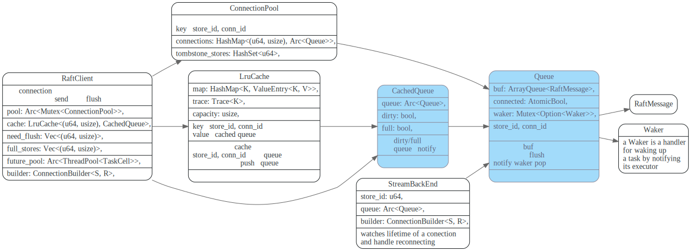
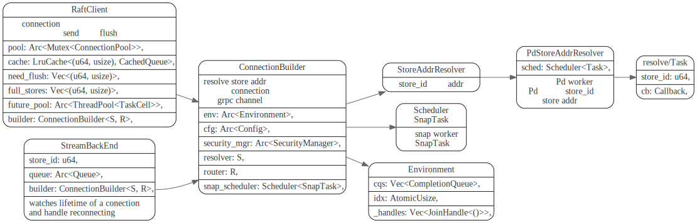
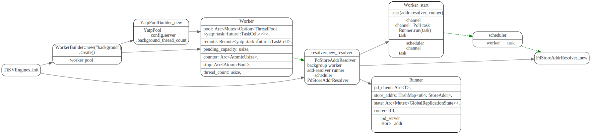
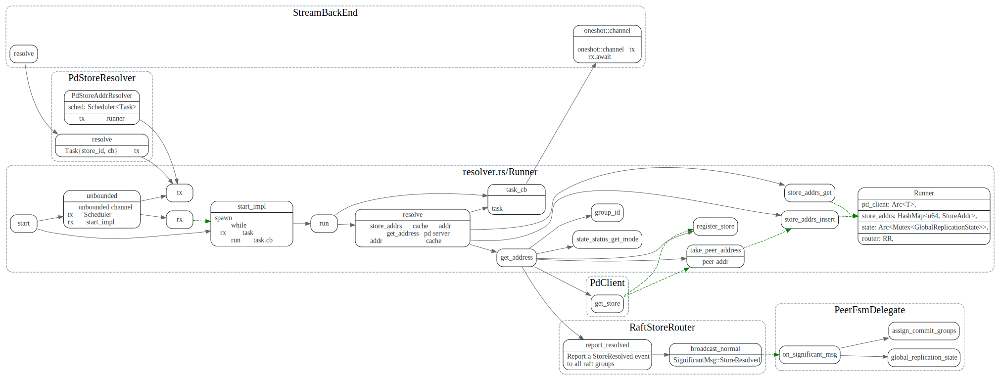
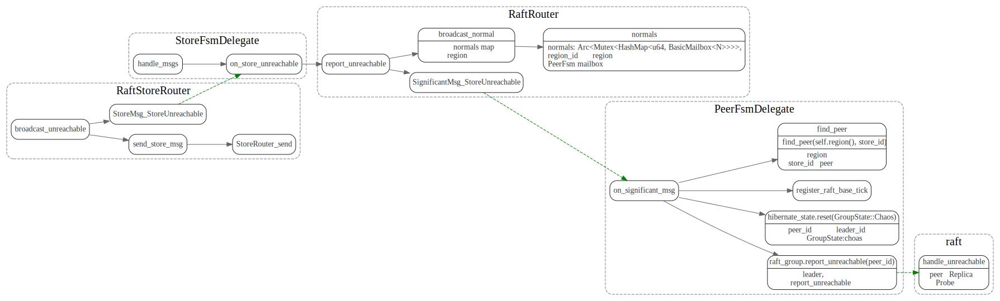
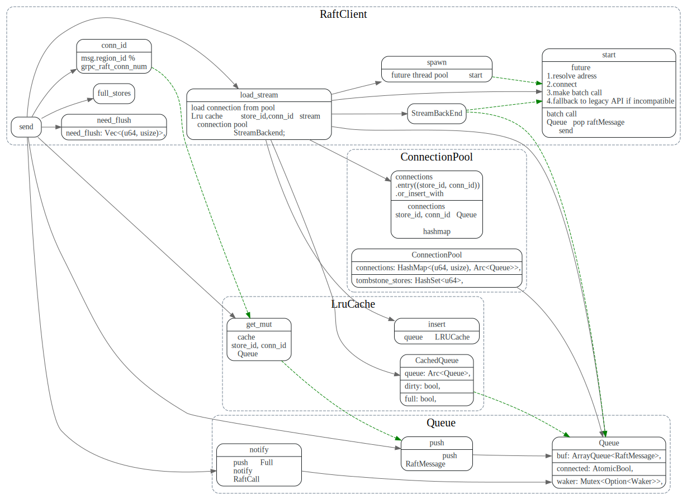

# RaftClient

<!-- toc -->


## trait Transport

```rust
/// Transports messages between different Raft peers.
pub trait Transport: Send + Clone {
    fn send(&mut self, msg: RaftMessage) -> Result<()>;

    fn need_flush(&self) -> bool;

    fn flush(&mut self);
}
```

raft client使用方式如下，先send 将消息放入队列中，最后flush，才真正的发送消息。

```rust
/// A raft client that can manages connections correctly.
///
/// A correct usage of raft client is:
///
/// ```text
/// for m in msgs {
///     if !raft_client.send(m) {
///         // handle error.   
///     }
/// }
/// raft_client.flush();
/// ```
```

## ServerTransport


### connection pool



### connection builder




### RaftClient的创建


## 主要函数调用流程

### send

先从LRUCache 中获取`(store_id, conn_id)`对应的Queue，如果成功, 
则向 Queue中push raftMessage, 如果push消息时返回Full错误，就调用`notify`，
通知RaftCall 去`pop` Queue消息, 将消息发送出去。

如果`LRUCache`中没有，则向Connection Pool中获取，如果获取还失败的话，则创建一个。


最后在future pool中执行`start`, 

### `load_stream`


### start

start会异步的调用`PdStoreAddrResolver`去resolve `store_id`的addr, 
然后创建连接。

调用`batch_call` 新建一个`RaftCall`. 
`RaftCall`被poll时会不断的去Queue中pop 消息, 并通过grpc stream将消息发出去。


由于包含snap的Message太大，会有`send_snapshot_sock`专门处理


### resolve

store addr resolver将会在background yatp 线程池中执行。



resolve时候，通过PdStoreAddrResolver 发送消息给 addr-resolver,
addr-resolver 先本地cache中看有没有store 的addr,如果没有，或者
已经过期了，就调用PdClient的`get_store`方法，获取store的addr地址。

最后`task_cb`回调函数，会触发`oneshot_channel`, 继续执行await resolve后续的代码。



### `send_snapshot_sock`

`have_snap`的`RaftMessage`由`snap-handler`线程来发送.

`send_snapshot_sock` 使用`scheduler`的tx，向`snap-handler`
线程发送`SnapTask::Send`, 然后在`snap-handler`中由`send_snap`
来处理。

`send_snap`会去snap manager获取snapshot 构造一个SnapChunk
然后创建和peer所在store addr的grpc connection channel，使用`snapshot`grpc调用
将SnapChunk数据发送给peer.

SnapChunk实现了Stream trait, 在`poll_next`中调用`read_exact`一块块的将snap数据发出去。


### `broadcast_unreachable`

往`store_id`消息失败, 向自己所有region广播store unreachable消息



## draft



