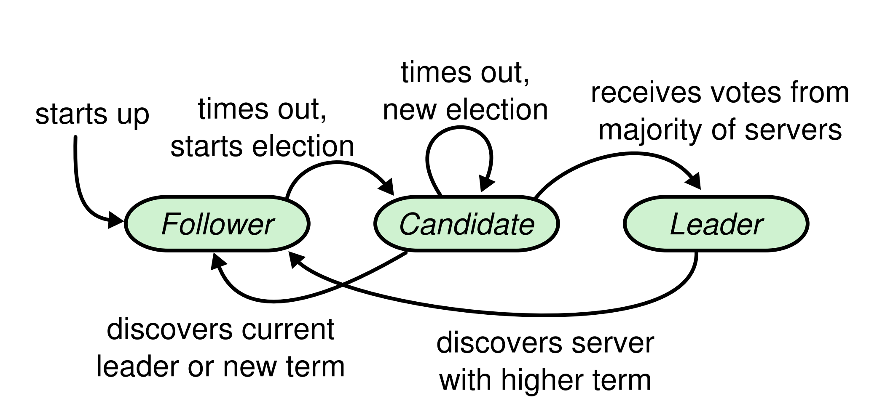
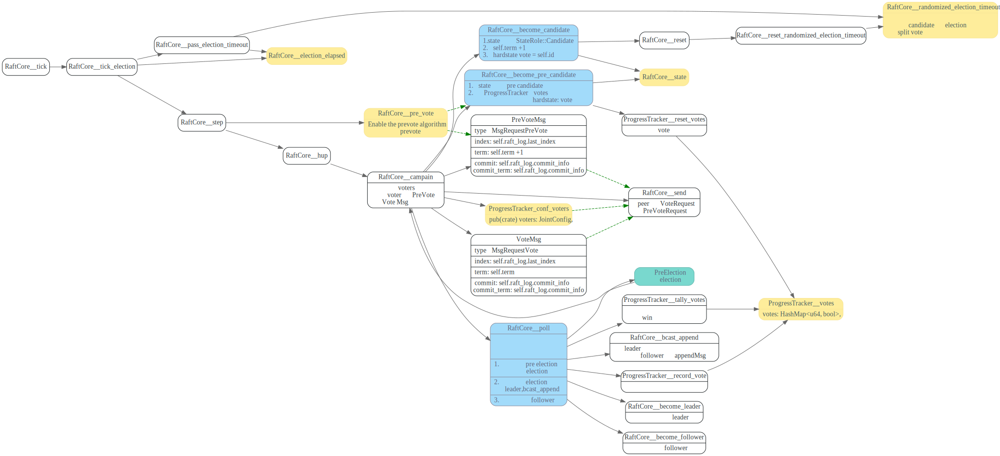
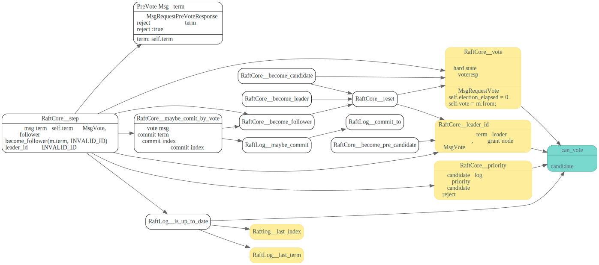

# Election

> * 只有日志足够新(按照term和index来比较)的candidate 能够当选为leader
> * 节点决定投给某个candidate后，不能再投给别人(节点在发出vote消息前，需要持久化自己的`vote_for`)。
> * candidate 先不增大自己term，先进行pre election，确保自己能当选, 然后再增加自己的term，发起真正的election.
> * 随机化选举超时时间，降低多个candidate同时发起election，导致split vote的概率。

<!-- toc -->



## Pre vote

raft-rs中新增了pre candidate角色, 可以跟配置`Config::pre_vote`来决定是否启用这个功能。
在正式开始election之前，先不增加自己的term, 是尝试pre candidate, 如果赢得pre election
才正式的将自己的term +1, 真正的发起选举。

prevote 可以避免在网络分区的情况避免反复的 election 打断当前 leader，触发新的选举造成可用性降低的问题

在prevote过程中，不会更改集群任何节点的hardstate，只是一次查询，查看pre candidate是否有当选的潜质。

## 发起election

follower节点在一段时间内没收到leader的heartbeat后，就会election timeout,  然后先发起pre election,
角色成为pre candidate, 先投自己一票，然后发pre vote消息给集群中的其他节点，进行pre election。

注意pre candidate不会更改自己的hard state vote,也不会更改自己的hardstate term，只是发的消息中term+1

赢得pre election后，将自己的term + 1, 角色成为candidate, 然后投自己一票，<b>更改自己的hard state vote</b>，然后发送Vote 请求给集群中
其他节点，进行election.

发送的pre vote消息和vote消息，会附带上candidate 的last index和term，其他节点据此来决定要不要给它投票。

同时也会附带上自己当前的commit index和commit term, 这样其他节点`maybe_commit_by_vote`，
尝试更新自己的commit index.

candidate使用`ProgressTracker::votes` HashMap，来存放voter 给自己的投票结果。(grant or reject)
`ProgressTracker::tally_votes` 会使用JointConfig来统计是否都得到了大部节点的投票。



## 处理投票请求

如果节点收到了<b>MsgVote</b>，且term比自己的大，节点就`become_follower`成为follower，并将自己的term设置和MsgVote.term, 并且将自己的`leader_id`设置为`INVALID_ID`

```rust
pub fn step(&mut self, m: Message) -> Result<()> {
      // 收到term比自己大的消息
      if m.term > self.term {
                if m.get_msg_type() == MessageType::MsgAppend
                    || m.get_msg_type() == MessageType::MsgHeartbeat
                    || m.get_msg_type() == MessageType::MsgSnapshot
                {
                    self.become_follower(m.term, m.from);
                } else {
                    self.become_follower(m.term, INVALID_ID);
                }
      }
}
```


如果节点已经给其他candidate投票了(hardstate中的vote)，会reject掉这个candidate的投票（但是不会reject PreVote)

为什么这个地方要自己的`leader_id == INVALID_ID`才会去投票？看了etcd项目的issues [8517](https://github.com/etcd-io/etcd/pull/9204) 解释
看完了也不知道为什么，没有对应的paper链接.

>This includes one theoretical logic change: A node that knows the
>leader of the current term will no longer grant votes, even if it has
>not yet voted in this term. It also adds a `m.Type == MsgPreVote`
>guard on the `m.Term > r.Term` check, which was previously thought to
>be incorrect (see #8517) but was actually just unclear.

需要注意的是对于MsgPreVote节点不会更改自己任何hard state, 节点发送的MsgPreVoteResp中的term
是MsgPreVote的term.

```rust
pub fn step(&mut self, m: Message) -> Result<()> {
//...
match m.get_msg_type() {
    MessageType::MsgRequestVote | MessageType::MsgRequestPreVote => {
        // We can vote if this is a repeat of a vote we've already cast...
        let can_vote = (self.vote == m.from) ||
            // ...we haven't voted and we don't think there's a leader yet in this term...
            (self.vote == INVALID_ID && self.leader_id == INVALID_ID) ||
            // ...or this is a PreVote for a future term...
            (m.get_msg_type() == MessageType::MsgRequestPreVote && m.term > self.term);
        // ...and we believe the candidate is up to date.
        if can_vote
            && self.raft_log.is_up_to_date(m.index, m.log_term)
            && (m.index > self.raft_log.last_index() || self.priority <= m.priority)
        {
               self.log_vote_approve(&m);
               let mut to_send =
                   new_message(m.from, vote_resp_msg_type(m.get_msg_type()), None);
               to_send.reject = false;
               to_send.term = m.term;
               self.r.send(to_send, &mut self.msgs);
               if m.get_msg_type() == MessageType::MsgRequestVote {
                   // Only record real votes.
                   self.election_elapsed = 0;
                   self.vote = m.from;
               }
        }
```


在`RaftLog::is_up_to_date`中把自己的`last_term`和`last_index`和candidate的做比较，如果candidate日志没自己的新，会reject candidate 的vote.

```rust
    pub fn is_up_to_date(&self, last_index: u64, term: u64) -> bool {
        term > self.last_term() || (term == self.last_term() && last_index >= self.last_index())
    }
```


只有对于MsgRequestVote, 投票时候，才会节点才会修改自己的vote, 重置自己的election_elapsed,
对于MsgPreVote 只是投票，并不会修改vote和`election_elapsed`。

```rust
if m.get_msg_type() == MessageType::MsgRequestVote {
    // Only record real votes.
    self.election_elapsed = 0;
    self.vote = m.from;
}
```

## 处理投票响应


如果在选举期间，candidate如果收到了term和自己term 相同的MsgAppend, MsgHeartbeat, MsgSnapshot,
说明已经有节点已经赢得了选举，成为了leader, candidate会转变为它的follower.

收到MsgPreVoteResp或MsgPreVoteResp后，candidate会将peer的投票结果保存在`ProgressTracker::votes` HashMap
中，然后`ProgressTracker::tally_votes`,根据自己在JointConfig中是否收到了大部分节点的投票，来判断是否赢得了选举。

如果选举失败，则转变为follower。

如果赢得了选举. PreCandidate 状态的会成为Candidate, 增大自己的term，发起真正的Election。 

Candidate状态的会变为真正的leader, 因为leader只能commit包含当前term的log entry，因此当选后，leader立刻广播发送AppendMsg，AppendMsg中的entries可能是空的。加快
commit log的速度。


